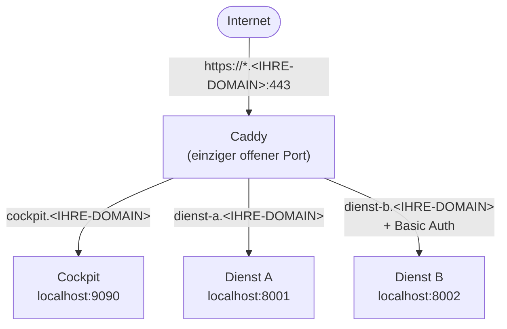

# Lab 04: Dienste sicher veröffentlichen mit Caddy als Reverse Proxy


## Einführung

### Aufgabe zum Erkenntnisgewinn

Bevor Sie mit der eigentlichen Konfiguration beginnen, führen Sie folgenden Schritt durch und beantworten Sie die anschließenden Fragen.

Cockpit ist ein webbasiertes Administrationswerkzeug für Linux-Server. Installieren Sie es auf Ihrem Server und rufen Sie es im Browser auf:

```bash
apt install -y cockpit
```

Öffnen Sie anschließend im Browser:

```
https://<IP-ADRESSE-IHRES-SERVERS>:9090
```

Der Browser wird eine Sicherheitswarnung anzeigen. Klicken Sie sich durch die Warnung und rufen Sie die Zertifikatsinformationen auf (je nach Browser über das Schloss-Symbol oder „Weitere Informationen").

**Leitfragen:**

- Von wem wurde das angezeigte Zertifikat ausgestellt? Handelt es sich um eine vertrauenswürdige Zertifizierungsstelle?
- Was würde passieren, wenn jemand zwischen Ihrem Browser und dem Server ein gefälschtes Zertifikat einsetzt – und Sie die Warnung trotzdem wegklicken?
- Sie sehen eine Login-Maske für Benutzername und Passwort. Wer könnte diese Eingaben mitlesen, wenn das Zertifikat nicht vertrauenswürdig ist?

Halten Sie Ihre Beobachtungen kurz fest. Sie werden am Ende dieser Übung die gleiche Oberfläche erneut aufrufen – dann jedoch mit einem gültigen, vertrauenswürdigen Zertifikat und ohne Browserwarnung.

[↑ Zum Inhaltsverzeichnis](#inhalt)

---

### Berufliche Aufgabenstellung

Der Server steht bereit und ist per SSH administrierbar. Die nächste Anforderung aus dem Betrieb lautet: Mehrere interne Dienste sollen über das Internet erreichbar gemacht werden – darunter das Administrationswerkzeug Cockpit sowie zwei weitere Webanwendungen. Jeder Dienst soll unter einem eigenen Domänennamen erreichbar sein, ausschließlich über HTTPS mit einem gültigen, vertrauenswürdigen Zertifikat.

Gleichzeitig gilt: Nicht jeder Dienst soll öffentlich zugänglich sein. Einer der beiden Zusatzdienste soll nur nach Eingabe eines Benutzernamens und Passworts erreichbar sein. Und der Server selbst soll nach außen so wenig Angriffsfläche bieten wie möglich – nur die wirklich benötigten Ports dürfen offen sein.

Die Lösung ist ein **Reverse Proxy**: Ein einziger Dienst nimmt alle eingehenden HTTPS-Anfragen entgegen und leitet sie intern an den jeweils zuständigen Dienst weiter. Als Reverse Proxy kommt **Caddy** zum Einsatz – er übernimmt dabei auch die Verwaltung der TLS-Zertifikate vollautomatisch über das Automatic Certificate Manegement Environment (ACME)- Protokoll. Caddy nutzt für die Umsetzung dieses Protokolls den Dienst Let's Encrypt.

[↑ Zum Inhaltsverzeichnis](#inhalt)

---

## Lernziele

- **Cockpit** installieren und den unsicheren Direktzugriff als Ausgangsproblem erkennen.
- Den Server mit **ufw** auf das notwendige Minimum absichern und den Zusammenhang mit iptables verstehen.
- **Caddy** installieren und als systemd-Dienst betreiben.
- Mehrere Dienste als **virtuelle Hosts** hinter einem Reverse Proxy bündeln.
- **Automatisches HTTPS** via Let's Encrypt ohne manuelle Zertifikatsverwaltung nutzen.
- Einen Dienst mit **Basic Authentication** zusätzlich schützen.

---

## Voraussetzungen

- Ein Linux-Server (Debian stable, aktuell Trixie) mit öffentlicher IPv4-Adresse, administrierbar per SSH
- Ein Domänenname mit DNS-Verwaltungszugriff
- Folgende DNS-A-Records zeigen bereits auf die IP-Adresse des Servers:
  - `cockpit.<IHRE-DOMAIN>`
  - `dienst-a.<IHRE-DOMAIN>`
  - `dienst-b.<IHRE-DOMAIN>`
- SSH-Zugriff mit Key-Authentifizierung (Ergebnis aus vorausgehender Laborübung Lab 03)

> **Hinweis:** Diese drei Einträge legen Sie analog zu Laborübung 03, Schritt 3.1 an – einmal pro Hostname. Alternativ deckt ein einzelner Wildcard-Eintrag (Name *, Typ A, Wert = Server-IP) alle drei Namen gleichzeitig ab. Prüfen Sie vorab mit dig cockpit.<IHRE-DOMAIN> bzw. Resolve-DnsName -Name cockpit.<IHRE-DOMAIN> -Server 8.8.8.8, ob die Namen bereits auflösen, bevor Sie neue Einträge anlegen – sonst entstehen unnötig doppelte oder widersprüchliche Records.

---

## Inhalt

- [Hintergrundwissen](#hintergrundwissen)
  - [Was ist ein Reverse Proxy?](#was-ist-ein-reverse-proxy)
  - [Was ist Caddy?](#was-ist-caddy)
  - [Was ist ufw und wie hängt es mit iptables zusammen?](#was-ist-ufw-und-wie-hängt-es-mit-iptables-zusammen)
- [Aufgaben](#aufgaben)
  - [Schritt 1: Firewall mit ufw einrichten](#schritt-1-firewall-mit-ufw-einrichten)
  - [Schritt 2: Caddy installieren](#schritt-2-caddy-installieren)
  - [Schritt 3: Cockpit ins Caddyfile einbinden](#schritt-3-cockpit-ins-caddyfile-einbinden)
  - [Schritt 4: Dienst A vorbereiten und ins Caddyfile einbinden](#schritt-4-dienst-a-vorbereiten-und-ins-caddyfile-einbinden)
  - [Schritt 5: Dienst B vorbereiten und mit Basic Authentication einbinden](#schritt-5-dienst-b-vorbereiten-und-mit-basic-authentication-einbinden)
  - [Schritt 6: Ergebnis im Browser überprüfen](#schritt-6-ergebnis-im-browser-überprüfen)
- [Rückblick und Zusammenfassung](#rückblick-und-zusammenfassung)
  - [Das vollständige Caddyfile](#das-vollständige-caddyfile)
  - [Reflexion](#reflexion)
- [Aufräumarbeiten](#aufräumarbeiten)
- [Weiterführende Ressourcen](#weiterführende-ressourcen)
- [Autoren und Urheberrecht](#autoren-und-urheberrecht)

---

## Hintergrundwissen

### Was ist ein Reverse Proxy?

Ein Reverse Proxy ist ein Dienst, der zwischen dem Internet und den eigentlichen Anwendungen sitzt. Eingehende Anfragen erreichen ausschließlich den Proxy – dieser entscheidet anhand des angefragten Hostnamens, an welchen internen Dienst er die Anfrage weiterleitet. Für den Client im Internet ist dabei nur der Proxy sichtbar. Die internen Dienste selbst sind von außen nicht direkt erreichbar.

Das ermöglicht es, viele Dienste hinter einer einzigen IP-Adresse und einem einzigen Port (443 für HTTPS) zu bündeln, ohne dass jeder Dienst ein eigenes Zertifikat verwalten oder nach außen exponiert sein muss.

### Was ist Caddy?

[Caddy](https://caddyserver.com/) ist ein moderner Webserver und Reverse Proxy, der sich durch drei Eigenschaften auszeichnet: eine sehr lesbare Konfigurationssprache (das sogenannte Caddyfile), automatisches HTTPS über das ACME-Protokoll (Let's Encrypt), und minimalen Betriebsaufwand. Caddy beantragt, erhält und erneuert TLS-Zertifikate vollständig selbständig – ohne Cronjobs, ohne manuelle Eingriffe.

### Was ist ufw und wie hängt es mit iptables zusammen?

Der Linux-Kernel enthält mit **netfilter** ein eingebautes Paketfiltersystem. **iptables** ist das klassische Kommandozeilenwerkzeug, um netfilter-Regeln zu verwalten – es ist mächtig, aber für einfache Szenarien unhandlich. **ufw** (*Uncomplicated Firewall*) ist ein vereinfachtes Frontend für iptables: Befehle wie `ufw allow https` werden intern in konkrete iptables-Regeln übersetzt. Die tatsächlich aktiven Regeln können jederzeit mit `iptables -L -n -v` eingesehen werden – ufw und iptables arbeiten auf derselben Regelgrundlage.

[↑ Zum Inhaltsverzeichnis](#inhalt)

---

## Aufgaben

### Schritt 1: Firewall mit ufw einrichten

Bevor weitere Dienste installiert werden, schränken wir den eingehenden Datenverkehr auf das notwendige Minimum ein. Cockpit läuft aktuell noch direkt auf Port 9090 – nach dieser Übung wird es ausschließlich über Caddy auf Port 443 erreichbar sein. Port 9090 wird dann von außen nicht mehr benötigt.

> Hinweis: Das Programm `ufw` ist vermutlich noch nicht installiert.

1. Setzen Sie die Standardregeln – alles ablehnen, nur explizit Erlaubtes durchlassen:

```bash
ufw default deny incoming
ufw default allow outgoing
```

2. SSH muss weiterhin erreichbar sein:

```bash
ufw allow ssh
```

3. HTTP und HTTPS werden von Caddy benötigt – HTTP nur für den automatischen Let's Encrypt Challenge-Prozess:

```bash
ufw allow http
ufw allow https
```

4. Aktivieren Sie die Firewall:

```bash
ufw enable
```

5. Überprüfen Sie den Status:

```bash
ufw status verbose
```

Erwartete Ausgabe:
```
Status: active
To                         Action      From
--                         ------      ----
22/tcp                     ALLOW IN    Anywhere
80/tcp                     ALLOW IN    Anywhere
443/tcp                    ALLOW IN    Anywhere
```

6. Optional: Sehen Sie sich an, welche iptables-Regeln ufw im Hintergrund angelegt hat:

```bash
iptables -L -n -v
# -L: Regeln auflisten | -n: IP-Adressen statt Hostnamen | -v: ausführliche Ausgabe (u. a. Paketzähler)
```

Sie erkennen darin die Regeln, die ufw aus Ihren Befehlen erzeugt hat – unter anderem die Erlaubnis für Port 22, 80 und 443 in der Kette `INPUT`.

> **Tipp zur Fehlerbehebung:** Wenn Sie nach `ufw enable` keinen SSH-Zugang mehr haben, hat SSH gefehlt. Nutzen Sie die Web-Konsole Ihres Anbieters (VNC/KVM) als Notfallzugang und ergänzen Sie die Regel mit `ufw allow ssh`.

[↑ Zum Inhaltsverzeichnis](#inhalt)

> **Hinweis für später:** Diese ufw-Regeln schützen zuverlässig native Host-Dienste (wie Cockpit). Sobald in Lab_05 Docker-Container ins Spiel kommen, gilt das nicht automatisch — Docker kann eigene Firewall-Regeln anlegen, die ufw umgehen. Mehr dazu in Lab_05.
---

### Schritt 2: Caddy installieren

1. Aktualisieren Sie die Paketlisten – darunter jetzt auch das neu hinzugefügte Caddy-Repository:

```bash
apt update
```

2. Installieren Sie Caddy:

```bash
apt install caddy -y
```

3. Überprüfen Sie Installation und Dienststatus:

```bash
caddy version
systemctl status caddy
```

Caddy wird automatisch als systemd-Dienst registriert und gestartet. Die Konfigurationsdatei liegt unter `/etc/caddy/Caddyfile`.


[↑ Zum Inhaltsverzeichnis](#inhalt)

---

### Schritt 3: Cockpit ins Caddyfile einbinden

Das Caddyfile ist die Konfigurationsdatei von Caddy. Sie beginnen mit dem einfachstmöglichen Eintrag – nur Domänenname, Zieldienst und Port. Das reicht bereits aus, damit Caddy ein Zertifikat bei Let's Encrypt anfordert und den Datenverkehr weiterleitet. Alle weiteren Dienste und Optionen kommen in den folgenden Schritten dazu.

Öffnen Sie die Konfigurationsdatei:

```bash
nano /etc/caddy/Caddyfile
```

Ersetzen Sie den gesamten vorhandenen Inhalt durch folgenden Block. Passen Sie den Domainnamen an Ihre Umgebung an:

```caddy
# Cockpit – Administrationsoberfläche
cockpit.<IHRE-DOMAIN> {
    reverse_proxy localhost:9090 {
        transport http {
            tls_insecure_skip_verify
        }
    }
}
```

> **Hinweis zu Cockpit:** Cockpit betreibt intern selbst einen HTTPS-Dienst mit einem selbst signierten Zertifikat auf Port 9090. Caddy muss dieses interne Zertifikat akzeptieren – daher `tls_insecure_skip_verify`. Diese Ausnahme gilt ausschließlich für die interne Verbindung auf `localhost`. Nach außen stellt Caddy ein vollständig vertrauenswürdiges Let's Encrypt-Zertifikat bereit, das der Browser ohne Warnung akzeptiert.

Speichern Sie die Datei (`Strg+O`, `Enter`, `Strg+X`), validieren und laden Sie:

```bash
caddy validate --config /etc/caddy/Caddyfile
systemctl reload caddy
```

Beobachten Sie die Logs, bis das Zertifikat für Cockpit ausgestellt ist:

```bash
journalctl -u caddy -f
```

Drücken Sie `Strg+C`, um die Ansicht zu beenden.

**Ergebnis im Browser verifizieren:**

Rufen Sie jetzt `https://cockpit.<IHRE-DOMAIN>` im Browser auf und vergleichen Sie bewusst mit dem, was Sie zu Beginn dieser Übung gesehen haben:

1. **Keine Sicherheitswarnung** – der Browser zeigt die Cockpit-Login-Maske direkt, ohne Unterbrechung durch eine Zertifikatswarnung.

2. **Zertifikat prüfen** – klicken Sie in der Adressleiste auf das Schloss-Symbol und rufen Sie die Zertifikatsinformationen auf. Sie sehen jetzt:
   - **Ausgestellt von:** Let's Encrypt
   - **Ausgestellt für:** `cockpit.<IHRE-DOMAIN>`
   - **Gültigkeitszeitraum:** 90 Tage ab heute (Let's Encrypt stellt Zertifikate mit 90 Tagen Laufzeit aus; Caddy erneuert sie automatisch vor Ablauf)

   Vergleichen Sie mit dem selbst signierten Zertifikat vom Anfang der Übung: Dort war als Aussteller der Server selbst eingetragen, keine anerkannte Zertifizierungsstelle – weshalb der Browser gewarnt hat. Jetzt bestätigt eine öffentlich vertrauenswürdige Stelle die Identität des Servers.

> **Tipp zur Fehlerbehebung:** Wenn das Zertifikat nicht ausgestellt wird:
> - Prüfen Sie die DNS-Auflösung: `dig cockpit.<IHRE-DOMAIN>`
> - Stellen Sie sicher, dass Port 80 in ufw offen ist: `ufw status`
> - Let's Encrypt hat Ratenlimits – prüfen Sie die Caddy-Logs auf genaue Fehlermeldungen, bevor Sie es erneut versuchen.

[↑ Zum Inhaltsverzeichnis](#inhalt)

---

### Schritt 4: Dienst A vorbereiten und ins Caddyfile einbinden

Cockpit läuft. Jetzt kommt der erste Zusatzdienst dazu. Für diese Übung simulieren wir ihn mit einem einfachen Python-HTTP-Server. In einer realen Umgebung würde hier eine echte Anwendung laufen – die Konfiguration von Caddy bliebe identisch.

**Dienst A vorbereiten:**

1. Erstellen Sie ein Verzeichnis und eine HTML-Seite:

```bash
mkdir -p /srv/dienst-a
```

```bash
nano /srv/dienst-a/index.html
```

Fügen Sie folgenden Inhalt ein, speichern Sie mit `Strg+O`, `Enter`, `Strg+X`:

```html
<!DOCTYPE html>
<html><body>
<h1>Dienst A</h1>
<p>Dieser Dienst ist oeffentlich ueber Caddy erreichbar.</p>
</body></html>
```

2. Starten Sie den Python-HTTP-Server im Hintergrund:

```bash
cd /srv/dienst-a && python3 -m http.server 8001 &
```

3. Prüfen Sie, ob der Dienst intern erreichbar ist:

```bash
curl http://localhost:8001
```

> **Hinweis:** Der Python-Server läuft nur bis zum nächsten Neustart. In einer Produktionsumgebung würde dieser Dienst als systemd-Unit oder Docker-Container betrieben.

**Dienst A ins Caddyfile einbinden:**

Öffnen Sie die Datei:

```bash
nano /etc/caddy/Caddyfile
```

Ergänzen Sie unterhalb des bestehenden Cockpit-Blocks den folgenden Eintrag:

```caddy
# Dienst A – öffentlich erreichbar
dienst-a.<IHRE-DOMAIN> {
    reverse_proxy localhost:8001
}
```

Das vollständige Caddyfile sieht jetzt so aus:

```caddy
# Cockpit – Administrationsoberfläche
cockpit.<IHRE-DOMAIN> {
    reverse_proxy localhost:9090 {
        transport http {
            tls_insecure_skip_verify
        }
    }
}

# Dienst A – öffentlich erreichbar
dienst-a.<IHRE-DOMAIN> {
    reverse_proxy localhost:8001
}
```

Speichern Sie (`Strg+O`, `Enter`, `Strg+X`), validieren und laden Sie:

```bash
caddy validate --config /etc/caddy/Caddyfile
systemctl reload caddy
```

Caddy fordert nun auch für `dienst-a.<IHRE-DOMAIN>` automatisch ein Zertifikat an. Rufen Sie `https://dienst-a.<IHRE-DOMAIN>` im Browser auf – die Seite sollte direkt und ohne Login laden.

[↑ Zum Inhaltsverzeichnis](#inhalt)

---

### Schritt 5: Dienst B vorbereiten und mit Basic Authentication einbinden

Als letzten Dienst kommt Dienst B dazu. Dieser soll nicht öffentlich zugänglich sein, sondern erst nach Eingabe von Benutzername und Passwort – gesichert durch **Basic Authentication**.

**Dienst B vorbereiten:**

1. Erstellen Sie ein Verzeichnis und eine HTML-Seite:

```bash
mkdir -p /srv/dienst-b
```

```bash
nano /srv/dienst-b/index.html
```

Fügen Sie folgenden Inhalt ein, speichern Sie mit `Strg+O`, `Enter`, `Strg+X`:

```html
<!DOCTYPE html>
<html><body>
<h1>Dienst B</h1>
<p>Dieser Dienst ist nur nach Authentifizierung erreichbar.</p>
</body></html>
```

2. Starten Sie den Python-HTTP-Server im Hintergrund:

```bash
cd /srv/dienst-b && python3 -m http.server 8002 &
```

3. Prüfen Sie, ob der Dienst intern erreichbar ist:

```bash
curl http://localhost:8002
```

**Basic-Auth-Hash generieren:**

Caddy speichert Passwörter nicht im Klartext, sondern als **bcrypt-Hash**. Generieren Sie diesen mit:

```bash
caddy hash-password --plaintext '<IHR-PASSWORT>'
```

Die Ausgabe ist ein Hash-String, der mit `$2a$` beginnt, z. B.:

```
$2a$14$Zkx19XLiW6VYouLHR5NmfOFU0z2GTNmpkT/5qqR7hx4IjWJPDhjvG
```

Notieren Sie den Hash. Öffnen Sie dann das Caddyfile:

```bash
nano /etc/caddy/Caddyfile
```

Ergänzen Sie unterhalb des Dienst-A-Blocks den folgenden Eintrag und ersetzen Sie den Platzhalter durch Ihren Hash:

```caddy
# Dienst B – nur nach Authentifizierung erreichbar
dienst-b.<IHRE-DOMAIN> {
    basicauth {                            # Für Caddy-Versionen vor 2.8.0
  # basic_auth {                           # Für Caddy-Versionen ab 2.8.0; siehe https://caddyserver.com/docs/caddyfile/directives/basic_auth
        # Benutzername: admin
        admin <HASH-AUS-OBIGEM-BEFEHL>
    }
    reverse_proxy localhost:8002
}
```

Das vollständige Caddyfile sieht jetzt so aus:

```caddy
# Cockpit – Administrationsoberfläche
cockpit.<IHRE-DOMAIN> {
    reverse_proxy localhost:9090 {
        transport http {
            tls_insecure_skip_verify
        }
    }
}

# Dienst A – öffentlich erreichbar
dienst-a.<IHRE-DOMAIN> {
    reverse_proxy localhost:8001
}

# Dienst B – nur nach Authentifizierung erreichbar
dienst-b.<IHRE-DOMAIN> {
    basicauth {                            # Für Caddy-Versionen vor 2.8.0
  # basic_auth {                           # Für Caddy-Versionen ab 2.8.0; siehe https://caddyserver.com/docs/caddyfile/directives/basic_auth
        admin <HASH-AUS-OBIGEM-BEFEHL>
    }
    reverse_proxy localhost:8002
}
```

Speichern Sie (`Strg+O`, `Enter`, `Strg+X`), validieren und laden Sie:

```bash
caddy validate --config /etc/caddy/Caddyfile
systemctl reload caddy
```

Rufen Sie `https://dienst-b.<IHRE-DOMAIN>` im Browser auf – ein Login-Dialog erscheint. Melden Sie sich mit Benutzername `admin` und dem gewählten Passwort an.

> **Sicherheitshinweis:** Basic Authentication überträgt Anmeldedaten Base64-kodiert. Ohne HTTPS wären diese trivial abfangbar und die Base64-codierte Zeichenfolge kann wieder in Benutzername und Passwort zurückgerechnet werden. Da Caddy HTTPS erzwingt und HTTP-Anfragen automatisch auf HTTPS weiterleitet, ist die Kombination aus Basic Auth und TLS hier sicher und praxistauglich.

[↑ Zum Inhaltsverzeichnis](#inhalt)

---

### Schritt 6: Ergebnis im Browser überprüfen

Rufen Sie nun alle drei Dienste im Browser auf und vergleichen Sie mit dem, was Sie zu Beginn dieser Übung gesehen haben.

**Cockpit:**
```
https://cockpit.<IHRE-DOMAIN>
```
Der Browser zeigt jetzt ein gültiges Zertifikat, ausgestellt von **Let's Encrypt**. Es erscheint keine Sicherheitswarnung mehr. Die Login-Maske ist dieselbe wie zuvor – aber die Eingabe von Benutzername und Passwort ist nun durch TLS geschützt.

**Dienst A:**
```
https://dienst-a.<IHRE-DOMAIN>
```
Die Seite lädt direkt, ohne Authentifizierung.

**Dienst B:**
```
https://dienst-b.<IHRE-DOMAIN>
```
Der Browser zeigt einen Login-Dialog. Melden Sie sich mit dem Benutzernamen `admin` und dem Passwort aus Schritt 5 an.

[↑ Zum Inhaltsverzeichnis](#inhalt)

---

## Rückblick und Zusammenfassung

### Was Sie erreicht haben

- **Cockpit** installiert und den unsicheren Direktzugriff mit selbst signiertem Zertifikat als konkretes Problem erlebt.
- Den Server mit **ufw** auf SSH, HTTP und HTTPS beschränkt und den Zusammenhang zwischen ufw und iptables nachvollzogen.
- **Caddy** als systemd-Dienst installiert und betrieben.
- Das Caddyfile **schrittweise aufgebaut**: zunächst nur Cockpit, dann Dienst A ergänzt, zuletzt Dienst B mit Basic Authentication hinzugefügt.
- Mit jedem Schritt ein neues **Let's Encrypt-Zertifikat** automatisch erhalten – ohne manuelle Eingriffe.
- Cockpit ist jetzt mit einem **vertrauenswürdigen Let's Encrypt-Zertifikat** erreichbar – die Browserwarnung vom Anfang dieser Übung ist verschwunden.

---

### Das vollständige Caddyfile

```caddy
# Cockpit – Administrationsoberfläche
cockpit.<IHRE-DOMAIN> {
    reverse_proxy localhost:9090 {
        transport http {
            tls_insecure_skip_verify
        }
    }
}

# Dienst A – öffentlich erreichbar
dienst-a.<IHRE-DOMAIN> {
    reverse_proxy localhost:8001
}

# Dienst B – nur nach Authentifizierung erreichbar
dienst-b.<IHRE-DOMAIN> {
    basic_auth {
        admin $2a$14$...IhrHashHier...
    }
    reverse_proxy localhost:8002
}
```

Auf einen Blick zusammengefasst, ist Caddy damit der **einzige** Dienst, den das Internet direkt erreicht – alle drei Backends bleiben ausschließlich auf `localhost` erreichbar und werden erst durch Caddy nach außen sichtbar gemacht:



---

### Reflexion

- Welchen konkreten Unterschied haben Sie beim Aufruf von Cockpit vor und nach dieser Übung im Browser bemerkt – und was bedeutet das für einen Benutzer, der die Warnung nicht versteht?
- Warum ist es sinnvoll, dass die Backend-Dienste (Ports 8001, 8002, 9090) nur auf `localhost` gebunden sind und nicht direkt von außen erreichbar sind?
- Was würde passieren, wenn jemand versucht, Dienst B direkt über `http://localhost:8002` aufzurufen – von außen, ohne Caddy?
- ufw erlaubt Port 80, obwohl alle Dienste über Port 443 erreichbar sind. Warum ist Port 80 trotzdem notwendig, und was passiert mit einer HTTP-Anfrage auf Port 80 nach der Caddy-Konfiguration?

[↑ Zum Inhaltsverzeichnis](#inhalt)

---

## Aufräumarbeiten (nur nach Rücksprache mit Referenten)

> **⚠️ Wichtig:** Führen Sie den vollständigen Rückbau unten **nur aus, wenn Sie den Lehrgang an dieser Stelle beenden**. Machen Sie mit Lab 05 und Lab 06 weiter, bleiben Dienst A, Dienst B und Caddy zwingend in Betrieb: Lab 06 migriert deren Caddy-Konfiguration in nginx-Server-Blöcke und ruft sie im Browser auf. Beachten Sie dabei, dass die Python-Testserver einen Server-Neustart nicht überleben (siehe Hinweis in Schritt 4) – starten Sie sie vor Lab 06 bei Bedarf erneut:
>
> ```bash
> cd /srv/dienst-a && python3 -m http.server 8001 &
> cd /srv/dienst-b && python3 -m http.server 8002 &
> ```

### Vollständiger Rückbau (nur bei Lehrgangsende)

1. Stoppen Sie die Python-Testserver:

```bash
kill $(lsof -t -i:8001) $(lsof -t -i:8002)
# $(lsof -t -i:8001): liefert die Prozess-ID auf Port 8001, analog für 8002
```

2. Entfernen Sie die Testinhalte:

```bash
rm -rf /srv/dienst-a /srv/dienst-b
```

3. Deaktivieren Sie Caddy:

```bash
systemctl stop caddy
systemctl disable caddy
```

4. Falls der Server nicht mehr benötigt wird: Löschen Sie ihn im Dashboard Ihres Cloud-Anbieters, um weitere Kosten zu vermeiden.

[↑ Zum Inhaltsverzeichnis](#inhalt)

---

## Weiterführende Ressourcen

- [Caddy Dokumentation](https://caddyserver.com/docs/) – vollständige Referenz aller Direktiven und Module
- [Caddy Caddyfile Konzepte](https://caddyserver.com/docs/caddyfile/concepts) – Erklärung der Grundstruktur des Caddyfiles
- [Let's Encrypt – Funktionsweise](https://letsencrypt.org/how-it-works/) – Hintergrundinformationen zum ACME-Protokoll und HTTP-01-Challenge
- [Mozilla SSL Configuration Generator](https://ssl-config.mozilla.org/) – Best-Practice TLS-Konfigurationen für verschiedene Servertypen
- [securityheaders.com](https://securityheaders.com) – Online-Tool zur Analyse der HTTP-Sicherheits-Header einer Domain
- [Cockpit Dokumentation](https://cockpit-project.org/documentation.html) – offizielle Dokumentation zur Einrichtung und Nutzung von Cockpit
- [ufw Manpage](https://manpages.debian.org/trixie/ufw/ufw.8.en.html) – vollständige Referenz aller ufw-Optionen

---

## Autoren und Urheberrecht

- Erstellt von: Michael Lotter, Florian Reichl
- Datum: 02/2026
- Version: v1.0


<p align="center">
<a href="Lab_03.md"></a>
<a href="Lab_05.md"></a>
</p>
