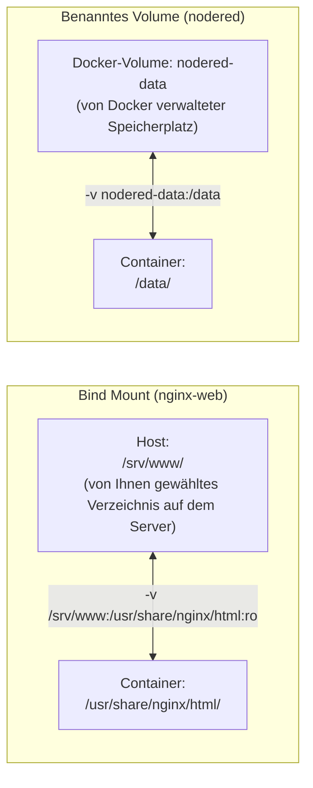

# Lab 05: Webdienste als Docker-Container bereitstellen


## Berufliche Aufgabenstellung

Der Server läuft, Caddy ist eingerichtet, und die ersten Dienste sind per HTTPS erreichbar. Die nächste Anforderung aus dem Betrieb: Zwei weitere Dienste sollen bereitgestellt werden – eine öffentliche **Unternehmenswebseite** und ein internes **Automatisierungs-Dashboard** auf Basis von Node-RED. Anstatt diese Dienste direkt auf dem Host zu installieren, sollen sie als **Docker-Container** betrieben werden.

Docker ist auf dem Server noch nicht installiert. Das Deployment erfolgt auf dem bestehenden Cloud-Server (z. B. Hetzner) – die Dienste werden hinter dem bereits konfigurierten Caddy als neue Subdomains eingehängt:

- `www.<IHRE-DOMAIN>` → Unternehmenswebseite (nginx)
- `dashboard.<IHRE-DOMAIN>` → Node-RED Automatisierungs-Dashboard

Beide Dienste sind über HTTPS erreichbar – Caddy übernimmt dabei, wie bereits in Lab 04 eingerichtet, automatisch die Zertifikatsverwaltung.

---

## Einführung

Docker erlaubt es, Dienste in **Containern** zu verpacken: isolierte, portable Laufzeitumgebungen, die einen Dienst zusammen mit all seinen Abhängigkeiten enthalten. Statt einen Webserver oder eine Anwendung direkt auf dem Host zu installieren, wird ein fertiges **Image** aus einer Registry geladen und als Container gestartet.

Im Vergleich zur direkten Installation auf dem Host stellt sich dabei eine wichtige Frage zur **Datenpersistenz**: Ein Container ist von Natur aus kurzlebig – wird er gelöscht oder aktualisiert, gehen alle Änderungen am Container-Dateisystem verloren. Docker löst dieses Problem mit **Volumes** und **Bind Mounts**, die Daten außerhalb des Containers speichern und so auch über Container-Neustarts oder Updates hinaus verfügbar halten.

> **Hinweis**: Eine Registry ist im Docker-Kontext ein zentraler Speicherort, von dem fertige Container-Images heruntergeladen (und bei eigenen Images auch hochgeladen) werden können. 
---

## Lernziele

- Docker auf einem Debian-Server installieren und konfigurieren
- Den Unterschied zwischen **Bind Mount** und **benanntem Volume** verstehen und praktisch anwenden
- Die Syntax von **`-p`** (Port-Mapping) und **`-v`** (Volume/Bind Mount) sicher anwenden
- Eigene Webinhalte über einen Bind Mount in einen Nginx-Container einbinden
- Node-RED-Daten dauerhaft in einem benannten Volume speichern
- Den bereits installierten Caddy um neue HTTPS-Subdomains erweitern
- Verstehen, warum Docker-Container standardmäßig **ufw umgehen** und wie Port-Bindings (`-p 127.0.0.1:host:container`) die Angriffsfläche eines Hosts minimieren
- Den Node-RED-Editor mit Authentifizierung (`adminAuth`) absichern

---

## Voraussetzungen

| Anforderung | Details |
|---|---|
| **Server** | Debian stable (aktuell Trixie), öffentliche IPv4-Adresse (aus Lab 03) |
| **Caddy** | Installiert und als systemd-Dienst aktiv (aus Lab 04) |
| **SSH-Zugriff** | Key-Authentifizierung |
| **DNS** | Verwaltungszugriff für Ihre Domain |

---

## Inhalt

- [Aufgaben](#aufgaben)
  - [Schritt 1: Docker installieren](#schritt-1-docker-installieren)
    - [1.1 Paketquellen vorbereiten](#11-paketquellen-vorbereiten)
    - [1.2 Docker-Repository einbinden](#12-docker-repository-einbinden)
    - [1.3 Docker installieren](#13-docker-installieren)
    - [1.4 Installation prüfen](#14-installation-prüfen)
    - [1.5 Docker-Netzwerk und ufw](#15-docker-netzwerk-und-ufw)
  - [Schritt 2: DNS-Einträge für die neuen Subdomains anlegen](#schritt-2-dns-einträge-für-die-neuen-subdomains-anlegen)
  - [Schritt 3: Unternehmenswebseite mit nginx-Container bereitstellen](#schritt-3-unternehmenswebseite-mit-nginx-container-bereitstellen)
    - [3.1 Webinhalte vorbereiten](#31-webinhalte-vorbereiten)
    - [3.2 Was ist ein Bind Mount?](#32-was-ist-ein-bind-mount)
    - [3.3 Nginx-Container starten](#33-nginx-container-starten)
    - [3.4 Webserver testen](#34-webserver-testen)
    - [3.5 Was passiert beim Container-Update?](#35-was-passiert-beim-container-update)
  - [Schritt 4: Node-RED-Container starten](#schritt-4-node-red-container-starten)
    - [4.1 Was ist ein benanntes Volume?](#41-was-ist-ein-benanntes-volume)
    - [4.2 Node-RED starten](#42-node-red-starten)
    - [4.3 Node-RED direkt testen](#43-node-red-direkt-testen)
    - [4.4 Was passiert beim Container-Update?](#44-was-passiert-beim-container-update)
    - [4.5 Node-RED-Editor mit Authentifizierung absichern](#45-node-red-editor-mit-authentifizierung-absichern)
  - [Schritt 5: Caddy für die neuen Subdomains konfigurieren](#schritt-5-caddy-für-die-neuen-subdomains-konfigurieren)
  - [Schritt 6: Ergebnis im Browser überprüfen](#schritt-6-ergebnis-im-browser-überprüfen)
    - [6.1 Laufende Container prüfen](#61-laufende-container-prüfen)
    - [6.2 Dienste im Browser aufrufen](#62-dienste-im-browser-aufrufen)
- [Reflexion und weiterführende Fragen](#reflexion-und-weiterführende-fragen)
- [Rückblick und Zusammenfassung](#rückblick-und-zusammenfassung)
- [Aufräumarbeiten](#aufräumarbeiten)
- [Autoren und Urheberrecht](#autoren-und-urheberrecht)

---

## Aufgaben

### Schritt 1: Docker installieren


Docker ist auf dem Server noch nicht vorhanden. 

#### _Variante A: „schnelle“ Installation_

**Die „schnelle“ Installation ist nur für Lab05 schnell. Später, in Lab08, benötigen wir die aktuelle Docker Version. Deshalb empfiehlt sich schon hier die Variante B.**

> Hinweis: Die aktuelle Version von Docker Stand September 2026 ist Version 29. Mit diesem Befehl installieren Sie in Debian Trixie die Docker-Version 26:
> 
> ```bash
> apt install docker.io docker-cli
> ```
#### _Variante B: Installationsempfehlung des Herstellers_

#### 1.1 Paketquellen vorbereiten

In diesem Schritt binden Sie das offizielle Docker-Repository als Paketquelle ein und installieren Docker
Falls ältere oder inoffizielle Docker-Pakete vorhanden sind, entfernen Sie diese zuerst:

```bash
apt remove -y docker.io docker-doc docker-compose docker-compose-v2 podman-docker containerd runc 2>/dev/null; true
# 2>/dev/null: Fehlermeldungen unterdrücken, falls ein Paket gar nicht installiert ist
# ; true: Befehl gilt immer als erfolgreich, damit ein Skript an dieser Stelle nicht abbricht
```

Installieren Sie die benötigten Hilfswerkzeuge:

```bash
apt install -y ca-certificates curl
```

#### 1.2 Docker-Repository einbinden

Laden Sie den GPG-Schlüssel des Docker-Projekts herunter. APT verwendet ihn, um die digitale Signatur jedes heruntergeladenen Docker-Pakets zu prüfen:

````bash
install -m 0755 -d /etc/apt/keyrings
curl -fsSL https://download.docker.com/linux/debian/gpg -o /etc/apt/keyrings/docker.asc
chmod a+r /etc/apt/keyrings/docker.asc
````

Tragen Sie das Docker-Repository als Paketquelle ein:
- Wechseln Sie in das Verzeichnis `/etc/apt/sources.list.d`
- Legen Sie die Datei `docker.list` an
- fügen Sie folgende zeile für das erforderliche Repostitory ein: `deb [arch=amd64 signed-by=/etc/apt/keyrings/docker.asc] https://download.docker.com/linux/debian trixie stable`


#### 1.3 Docker installieren

```bash
apt update
apt install -y docker-ce docker-ce-cli containerd.io
```

Die drei Pakete erfüllen unterschiedliche Aufgaben:

| Paket | Aufgabe |
|---|---|
| `docker-ce` | Docker Engine (Community Edition) – der Daemon, der Container und Images verwaltet |
| `docker-ce-cli` | Kommandozeilen-Schnittstelle (`docker`-Befehl) |
| `containerd.io` | Container-Laufzeitumgebung, auf der Docker aufbaut |

#### 1.4 Installation prüfen

```bash
docker version
docker run --rm hello-world
```

`docker run --rm hello-world` lädt ein kleines Test-Image herunter, startet es, zeigt eine Erfolgsmeldung und löscht den Container danach automatisch (`--rm`). Wenn Sie die Meldung „Hello from Docker!" sehen, ist die Installation erfolgreich.

#### 1.5 Docker-Netzwerk und ufw

Docker erstellt für Container ein internes Brückennetzwerk (`docker0`). Damit IP-Pakete von diesem Netzwerk an die Container weitergeleitet werden können, muss ufw das Forwarding erlauben. Prüfen Sie die aktuelle Einstellung:

```bash
grep DEFAULT_FORWARD_POLICY /etc/default/ufw
```
> **Hinweis:** Mit `grep` wird in der Datei `/etc/default/ufw`nach dem Texteintrag `DEFAULT_FORWARD_POLICY` gesucht und die gefundenen Zeilen angezeigt. 

Falls der Wert `DROP` ist, ändern Sie ihn  mit einem Texteditor auf `ACCEPT`.


> **Warum ist das nötig?**

> Wenn ufw `DEFAULT_FORWARD_POLICY=DROP` setzt, werden IP-Pakete, die über die Docker-Netzwerkbrücke weitergeleitet werden sollen, stillschweigend verworfen. Container können dann nicht mehr nach außen kommunizieren – z. B. keine DNS-Abfragen stellen oder Images herunterladen.

> **Wichtiger Sicherheitshinweis: Docker und ufw**
>
> ufw schützt **native Host-Dienste** zuverlässig (z. B. Cockpit aus Lab 04), da deren Traffic über die von ufw kontrollierte INPUT-Chain läuft. Docker-Container nutzen dagegen eine eigene, separate Chain (DOCKER-USER in FORWARD), auf die ufw keinen Einfluss hat. Ein Container, der mit -p <port>:<port> (ohne IP-Präfix) veröffentlicht wird, bindet den Port an 0.0.0.0 – also an alle Netzwerkschnittstellen des Hosts – und ist damit von jeder Quell-IP aus direkt aus dem Internet erreichbar, unabhängig davon, was ufw status anzeigt. In den folgenden Schritten wird deshalb durchgängig mit -p 127.0.0.1:<port>:<port> gearbeitet, um Container-Ports explizit auf die lokale Schnittstelle zu beschränken.

> **Hinweis:** Für die Installation auf dem lokalen Linux-Mint-Rechner (statt auf dem Server) – inklusive Rootless-Betrieb und Docker Compose – siehe das Zusatz-Lab [Lab_Docker_Rootless.md](Lab_Docker_Rootless.md).

[↑ Zum Inhaltsverzeichnis](#inhalt)

---

### Schritt 2: DNS-Einträge für die neuen Subdomains anlegen

Die neuen Dienste sollen unter eigenen Subdomains erreichbar sein. Legen Sie beim DNS-Anbieter zwei neue A-Records an, die auf die IPv4-Adresse Ihres Servers zeigen:

| Typ | Name | Wert | TTL |
|---|---|---|---|
| `A` | `www` | `<IPv4 Ihres Servers>` | `300` |
| `A` | `dashboard` | `<IPv4 Ihres Servers>` | `300` |

**Hinweis: Wildcard-Eintrag prüfen, bevor Sie neue A-Records anlegen**
> Falls in Ihrer DNS-Zone bereits ein Wildcard-Eintrag (Name `*`, Typ `A`) existiert, lösen automatisch *alle* Subdomains auf dieselbe IP auf – auch ohne dass Sie für die hier benötigten Namen eigene Einträge anlegen. Prüfen Sie das vorab mit einer frei erfundenen Subdomain:
>
> ```powershell
> powershell
> Resolve-DnsName -Name irgendwas-zufaelliges123.<IHRE-DOMAIN> -Server 8.8.8.8
> ```
> ```bash
> bash
>dig @8.8.8.8 irgendwas-zufaelliges123.<IHRE-DOMAIN>
>````
> Kommt hier eine IP-Adresse zurück, ist Ihre Zone bereits per Wildcard abgedeckt – Sie können diesen Schritt überspringen und direkt mit dem nächsten Schritt fortfahren. Kommt `NXDOMAIN` zurück, legen Sie die A-Records wie unten beschrieben einzeln an.

Prüfen Sie die Auflösung, bevor Sie mit Schritt 5 fortfahren:

```bash
dig www.<IHRE-DOMAIN> +short
dig dashboard.<IHRE-DOMAIN> +short
```

Beide Befehle sollten die IPv4-Adresse Ihres Servers ausgeben.

[↑ Zum Inhaltsverzeichnis](#inhalt)

---

### Schritt 3: Unternehmenswebseite mit nginx-Container bereitstellen

#### 3.1 Webinhalte vorbereiten

Legen Sie ein Verzeichnis auf dem Host für die Webseiten-Dateien an:

```bash
mkdir -p /srv/www
nano /srv/www/index.html
```

Fügen Sie folgenden Inhalt ein und passen Sie ihn frei an:

```html
<!DOCTYPE html>
<html lang="de">
<head>
  <meta charset="UTF-8">
  <title>Mein Unternehmen</title>
</head>
<body>
  <h1>Willkommen</h1>
  <p>Diese Seite läuft als Docker-Container hinter Caddy.</p>
</body>
</html>
```

Speichern mit `Strg+O`, `Enter`, beenden mit `Strg+X`.

#### 3.2 Was ist ein Bind Mount?

Wenn Sie einen Container starten, enthält er zunächst nur das Dateisystem des Images. Um eigene Dateien – in diesem Fall Ihre HTML-Seite – in den Container einzubinden, verwenden Sie einen **Bind Mount**: Das Verzeichnis `/srv/www` auf dem Host wird direkt in das Verzeichnis `/usr/share/nginx/html` im Container eingehängt. Der Container liest die Dateien unmittelbar vom Host-Dateisystem.

```
Host:                    Container:
/srv/www/           ←→   /usr/share/nginx/html/
  index.html                index.html
```

Im Unterschied zu einem **benannten Volume** (siehe Schritt 4) bestimmen Sie beim Bind Mount selbst, wo die Daten auf dem Host liegen. Docker verwaltet diesen Pfad nicht.

#### 3.3 Nginx-Container starten

```bash
docker run -d \
  --name nginx-web \
  --restart unless-stopped \
  -p 127.0.0.1:8080:80 \
  -v /srv/www:/usr/share/nginx/html:ro \
  nginx
```

**Erklärung der Optionen:**

| Option | Bedeutung |
|---|---|
| `-d` | Container läuft im Hintergrund (detached) |
| `--name nginx-web` | Eindeutiger Name für den Container |
| `--restart unless-stopped` | Container startet automatisch neu (siehe Hinweis unten) |
| `-p 127.0.0.1:8080:80` | Port-Mapping: Port 8080 nur auf der lokalen Schnittstelle (`127.0.0.1`) — leitet auf Port 80 im Container. Von außen nicht erreichbar, nur für Caddy/nginx auf demselben Host gedacht. |
| `-v /srv/www:/usr/share/nginx/html:ro` | Bind Mount: Host-Verzeichnis → Container-Verzeichnis, `:ro` = read-only |

> **Automatischer Neustart mit `--restart`**
> Diese Option ist wichtig, damit der nginx-Webserver nach einem Neustart unserer Linux-Servers ebenfalls automatisch gestartet wird.
>
> | Wert | Verhalten |
> |---|---|
> | `no` | Kein automatischer Neustart (Standardwert) |
> | `always` | Immer neu starten – auch nach manuellem `docker stop` |
> | `unless-stopped` | Neu starten, außer wenn der Container manuell gestoppt wurde |
> | `on-failure` | Nur neu starten, wenn der Container mit einem Fehler beendet wurde |
>
> Für Produktivdienste ist `unless-stopped` die empfohlene Wahl: Der Container startet nach einem Serverneustart automatisch, lässt sich aber für Wartungsarbeiten mit `docker stop` ohne unerwünschte Neustarts anhalten.

> **Syntax `-p <host-port>:<container-port>`**
> Die vollständige Syntax lautet `-p [host-ip:]host-port:container-port`. Ohne IP-Angabe (`-p 8080:80`) bindet Docker den Port auf **allen** Netzwerkschnittstellen des Hosts (`0.0.0.0`) – der Dienst wäre damit direkt aus dem Internet erreichbar, **unabhängig von ufw**: Docker trägt eigene Regeln in eine separate iptables-Chain (`DOCKER-USER`) ein, die vor den ufw-Regeln ausgewertet wird. Mit `-p 127.0.0.1:8080:80` wird der Port stattdessen nur an die lokale Schnittstelle gebunden – nginx im Container ist dann ausschließlich für Prozesse auf demselben Host erreichbar, etwa Caddy über `localhost:8080`, aber nicht aus dem Internet.

> **Syntax `-v <quelle>:<ziel>[:ro]`**
> Beim Bind Mount ist `<quelle>` ein Pfad auf dem **Host**, `<ziel>` ein Pfad **im Container**. Das optionale `:ro` macht den Mount read-only – der Container kann die Dateien lesen, aber nicht verändern. Dies schützt die Webinhalte, die ausschließlich vom Host aus gepflegt werden.

#### 3.4 Webserver testen

```bash
curl http://localhost:8080
```

Sie sollten den HTML-Inhalt Ihrer Seite sehen.

#### 3.5 Was passiert beim Container-Update?

Ablauf beim einem Software-Update:
- Stoppen des Containers
- Löschen des Containers – damit werden auch die **im Container** gespeicherten Daten gelöscht
- Laden des neuen Images von der Registry
- Starten eines neuen Containers auf Grundlage des neuen Images – die Daten, die über einen Bind mount **extern gespeichert** sind, bleiben so erhalten

Wenn nginx aktualisiert wird – Sie also den alten Container löschen und einen neuen aus einem neueren Image starten –, bleiben die Webinhalte in `/srv/www` vollständig erhalten. Sie liegen auf dem Host und werden durch den Bind Mount lediglich eingehängt. Der Container-Neustart hat keinen Einfluss auf das Host-Verzeichnis. Testen und verifizieren Sie das beschriebene Verhalten.

```bash
docker stop nginx-web && docker rm nginx-web   # laufenden Container stoppen und anschließend löschen (Container-Schicht geht verloren, Bind Mounts/Volumes bleiben erhalten)

docker pull nginx                              # Image vorab aus der Registry (Docker Hub) herunterladen, bevor der Container gestartet wird

docker run -d \                                # Container im Hintergrund (detached) starten
  --name nginx-web \                           # sprechender Name, damit der Container später leicht angesprochen werden kann (statt zufälliger ID)
  --restart unless-stopped \                   # Neustart-Policy: Container startet automatisch neu (z. B. nach Docker-Neustart oder Systemboot), außer er wurde manuell gestoppt
  -p 127.0.0.1:8080:80 \                       # Port-Mapping: nur lokal erreichbar (127.0.0.1), Host-Port 8080 → Container-Port 80. Der Container ist also nur über die Netzwerkschnittstelle des Hosts erreichbar, welche die Adresse 127.0.0.1 besitzt. Lässt man die IP-Adresse weg, so hört der Container auf allen Schnittstellen, also auch auf der Schnittstelle mit der öffentlichen IP-Adresse des Servers.
  -v /srv/www:/usr/share/nginx/html:ro \        # Bind Mount: Host-Verzeichnis wird read-only in den Container eingebunden, ersetzt die nginx-Standardseite
  nginx                                        # zu verwendendes Image (zuvor per pull geladen, daher kein erneuter Download nötig)
```

[↑ Zum Inhaltsverzeichnis](#inhalt)

---

### Schritt 4: Node-RED-Container starten

#### 4.1 Was ist ein benanntes Volume?

Node-RED speichert erstellte Flows, Einstellungen und installierte Erweiterungen im Verzeichnis `/data` des Containers. Diese Daten müssen auch dann erhalten bleiben, wenn der Container aktualisiert oder neu erstellt wird.

Dafür wird ein **benanntes Volume** verwendet: Sie vergeben einen Namen (`nodered-data`), und Docker legt das zugehörige Verzeichnis automatisch auf dem Host an – standardmäßig unter `/var/lib/docker/volumes/nodered-data/`. Den genauen Speicherort verwaltet Docker; Sie müssen ihn nicht selbst anlegen.

```
Docker-Volume:           Container:
nodered-data/       ←→   /data/
  flows.json               flows.json
  settings.js              settings.js
```

> **Bind Mount vs. benanntes Volume**
>
> | | Bind Mount | Benanntes Volume |
> |---|---|---|
> | Speicherort | Frei gewählter Pfad auf dem Host | Von Docker verwaltet (`/var/lib/docker/volumes/`) |
> | Anlegen | Pfad muss angegeben werden | Docker legt das Volume beim ersten Start automatisch an |
> | Portabilität | Pfad ist host-spezifisch | Volume kann mit `docker volume`-Befehlen verwaltet werden |
> | Typischer Einsatz | Konfigurationsdateien und Inhalte, die vom Host gepflegt werden | Anwendungsdaten (Flows, Datenbanken) |

Die beiden Speicherwege im direkten Vergleich – der entscheidende Unterschied ist, **wer den Host-seitigen Speicherort bestimmt**:



#### 4.2 Node-RED starten

```bash
docker run -d \
  --name nodered \
  --restart unless-stopped \
  -p 127.0.0.1:1880:1880 \
  -v nodered-data:/data \
  nodered/node-red
```

| Option | Bedeutung |
|---|---|
| `--restart unless-stopped` | Automatischer Neustart nach Serverneustart (siehe Schritt 3.3) |
| `-p 127.0.0.1:1880:1880` | Port 1880 — nur auf der lokalen Schnittstelle (`127.0.0.1`) — leitet auf Port 1880 im Container. Von außen nicht erreichbar; Zugriff ausschließlich über Caddy. |
| `-v nodered-data:/data` | Vergabe des Namens `nodered-data` wird verbunden mit dem Container-Verzeichnis `/data`|

Das Volume `nodered-data` existiert zu diesem Zeitpunkt noch nicht – Docker legt es beim ersten Start automatisch an. Prüfen Sie anschließend:

```bash
docker volume ls
docker volume inspect nodered-data
```

`docker volume inspect` zeigt unter `Mountpoint` den tatsächlichen Pfad auf dem Host, an dem Docker die Daten speichert.

#### 4.3 Node-RED direkt testen

```bash
curl http://localhost:1880
```

Sie sollten eine HTML-Antwort erhalten. Da der Port nur an `127.0.0.1` gebunden ist (siehe `-p 127.0.0.1:1880:1880` in Schritt 4.2), ist er von außen nicht erreichbar – unabhängig von ufw. Das ist wichtig: Docker-Container, die ohne IP-Präfix veröffentlicht werden (`-p 1880:1880`), würden ufw vollständig umgehen, da Docker eigene iptables-Regeln in einer separaten Chain (`DOCKER-USER`) anlegt, die ufw vorgelagert ist. Erst die explizite Bindung an `127.0.0.1` schließt diesen Zugriffsweg zuverlässig. Der Zugriff aus dem Internet soll ausschließlich über Caddy erfolgen.

> **Warum braucht Node-RED kein eigenes HTTPS?**
> Node-RED kommuniziert intern zwischen Container und Caddy ausschließlich über `localhost:1880` – eine lokale Verbindung auf dem Server, die nicht das Internet berührt. Die HTTPS-Verschlüsselung gegenüber dem Browser des Benutzers übernimmt vollständig Caddy: Er empfängt die verschlüsselte Anfrage auf Port 443, entschlüsselt sie und leitet sie unverschlüsselt an `localhost:1880` weiter. Node-RED selbst muss sich nicht um Zertifikate kümmern.

#### 4.4 Was passiert beim Container-Update?

Das benannte Volume bleibt beim Update des Containers vollständig erhalten:

```bash
docker stop nodered && docker rm nodered
docker pull nodered/node-red
docker run -d \
  --name nodered \
  --restart unless-stopped \
  -p 127.0.0.1:1880:1880 \
  -v nodered-data:/data \
  nodered/node-red
```

`nodered-data` besteht unabhängig vom Container. Es bleibt so lange bestehen, bis es mit `docker volume rm nodered-data` explizit gelöscht wird. Alle Flows und Einstellungen sind nach dem Update unverändert vorhanden.

---

#### 4.5 Node-RED-Editor mit Authentifizierung absichern

> **Warum dieser Schritt nicht optional ist**
> Der Node-RED-Editor erlaubt das Anlegen von `exec`-Nodes, die beliebige Shell-Befehle ausführen können. Ohne Authentifizierung kann jeder, der den Editor erreicht — auch versehentlich über einen falsch konfigurierten Port oder einen zukünftigen Konfigurationsfehler — Code auf dem Server ausführen. In der Praxis ist genau das ein verbreiteter Angriffsweg gegen öffentlich erreichbare Node-RED-Instanzen. Dieser Schritt ist daher fester Bestandteil der Übung, nicht optional.

Öffnen Sie die `settings.js` aus dem benannten Volume:

```bash
nano /var/lib/docker/volumes/nodered-data/_data/settings.js
```

Suchen Sie den auskommentierten Abschnitt `adminAuth` und aktivieren Sie ihn:

```javascript
adminAuth: {
    type: "credentials",
    users: [{
        username: "admin",
        password: "$2b$08$...",  // bcrypt-Hash des Passworts
        permissions: "*"
    }]
},
```

Den bcrypt-Hash für Ihr Passwort erzeugen Sie direkt im Container:

```bash
docker exec -it nodered node-red admin hash-pw
```
> **Was passiert hier**
> - Mit dem Docker-Befehel `docker exec -it` öffnen wir ein Linux-Terminal im Container
> - `nodered` ist der Name des gewählten Containers 
> - `node-red admin hash-pw` ist der NodeRed-Befehl um einen Hashert für ein gewähltes Passwort zu erzeugen

Starten Sie den Container nach der Änderung neu:

```bash
docker restart nodered
```

Prüfen Sie, dass die Absicherung greift:

Entweder Sie nutzen wieder den curl-Befehl und lassen sich den Fehlercode anzeigen. Oder Sie machen es sich einfach und installieren einen textbasierten Webbrowser, wie z. B. w3m.

```bash
apt install w3m
w3m localhost:1880/flows
```

oder

```bash
curl -s -o /dev/null -w "%{http_code}\n" http://localhost:1880/flows
```
Erwartung: `401` statt `200`. Erst danach mit Schritt 5 fortfahren.

[↑ Zum Inhaltsverzeichnis](#inhalt)

---

### Schritt 5: Caddy für die neuen Subdomains konfigurieren

Die Container laufen und sind intern über `localhost:8080` bzw. `localhost:1880` erreichbar. Erweitern Sie nun das Caddyfile um die beiden neuen Subdomains.

Öffnen Sie die Konfigurationsdatei:

```bash
nano /etc/caddy/Caddyfile
```

Fügen Sie am Ende der Datei die folgenden Blöcke hinzu:

```caddy
# Unternehmenswebseite
www.<IHRE-DOMAIN> {
    reverse_proxy localhost:8080
}

# Node-RED Dashboard
dashboard.<IHRE-DOMAIN> {
    reverse_proxy localhost:1880
}
```

Validieren und laden Sie die Konfiguration:

```bash
caddy validate --config /etc/caddy/Caddyfile
systemctl reload caddy
```

Caddy fordert nun automatisch TLS-Zertifikate für `www.<IHRE-DOMAIN>` und `dashboard.<IHRE-DOMAIN>` bei Let's Encrypt an.

> **Tipp zur Fehlerbehebung:** Die DNS-Einträge aus Schritt 2 müssen propagiert sein, bevor Caddy Zertifikate ausstellen kann. Beobachten Sie die Logs mit `journalctl -u caddy -f`.

[↑ Zum Inhaltsverzeichnis](#inhalt)

---

### Schritt 6: Ergebnis im Browser überprüfen

#### 6.1 Laufende Container prüfen (Linux-Server)

```bash
docker ps
```

Sie sollten zwei laufende Container sehen: `nginx-web` und `nodered`.

#### 6.2 Dienste im Browser aufrufen

Rufen Sie nachfolgende Adresse lokal im Browser auf Ihrem Notebook/PC auf:

```
https://www.<IHRE-DOMAIN>          →  Ihre Unternehmenswebseite
https://dashboard.<IHRE-DOMAIN>    →  Node-RED Editor (verlangt jetzt Login)
```

Beide Seiten müssen mit einem gültigen Let's Encrypt-Zertifikat geladen werden – ohne Sicherheitswarnung im Browser. Beim Aufruf von `dashboard.<IHRE-DOMAIN>` sollte zudem die Node-RED-Login-Maske erscheinen, bevor der Flow-Editor sichtbar wird (siehe Schritt 4.5).

[↑ Zum Inhaltsverzeichnis](#inhalt)

---

## Reflexion und weiterführende Fragen

**Zu Volumes und Bind Mounts:**

- Warum wird für die Webseite ein Bind Mount verwendet, für Node-RED-Daten aber ein benanntes Volume? Welche Anforderungen bestimmen diese Wahl?
- Was passiert, wenn Sie `docker rm nodered` ausführen? Was passiert zusätzlich, wenn Sie `docker volume rm nodered-data` ausführen?
- Wählen Sie einen beliebigen Dienst und begründen Sie eine sinnvolle Speicherstrategie.

**Zur Absicherung von Docker-Containern:**

- Warum schützt `ufw status` allein nicht zuverlässig vor einem öffentlich erreichbaren Docker-Container? Welche Rolle spielt die `DOCKER-USER`-Chain dabei?
- Was wäre der konkrete Unterschied im Risiko, wenn `nodered` ohne `adminAuth` betrieben würde und der Port versehentlich ***ohne** `127.0.0.1`-Präfix veröffentlicht wäre?

[↑ Zum Inhaltsverzeichnis](#inhalt)

---

## Rückblick und Zusammenfassung

### Was Sie erreicht haben

- **Docker** aus dem offiziellen Repository installiert und die Paketstruktur verstanden
- Den Unterschied zwischen **Bind Mount** und **benanntem Volume** verstanden und praktisch angewendet
- Die Syntax von **`-p`** (Port-Mapping) und **`-v`** (Volume/Bind Mount) sicher angewendet
- Nginx mit eigenem HTML-Inhalt über einen **Bind Mount** bereitgestellt
- Node-RED-Daten dauerhaft in einem **benannten Volume** gespeichert
- Den bereits installierten **Caddy** um zwei neue HTTPS-Subdomains erweitert
- Verstanden, warum **`localhost`** ausreicht und Container-IP-Adressen hier nicht benötigt werden
- Verstanden, warum **ufw Docker-Container nicht automatisch schützt** und Container-Ports konsequent auf `127.0.0.1` beschränkt
- Den **Node-RED-Editor mit `adminAuth` abgesichert**, um unautorisierte Codeausführung über `exec`-Nodes zu verhindern

### Zentrale Befehle dieser Übung

| Befehl | Bedeutung |
|---|---|
| `docker run -d --name <n>` | Container im Hintergrund starten und benennen |
| `docker run --restart unless-stopped` | Container nach Serverneustart automatisch starten |
| `docker run -p 127.0.0.1:<host>:<container>` | Port nur lokal binden – von außen nicht erreichbar, unabhängig von ufw |
| `docker run -v <pfad>:<ziel>:ro` | Bind Mount (read-only) einbinden |
| `docker run -v <name>:<ziel>` | Benanntes Volume einbinden (wird ggf. automatisch angelegt) |
| `docker ps` | Laufende Container anzeigen |
| `docker volume ls` | Vorhandene Volumes anzeigen |
| `docker volume inspect <name>` | Speicherort und Details eines Volumes anzeigen |
| `docker stop <n> && docker rm <n>` | Container stoppen und löschen |
| `docker pull <image>` | Aktuelles Image herunterladen |
| `docker restart <n>` | Container neu starten |
| `docker exec -it nodered node-red admin hash-pw` | bcrypt-Hash für Node-RED-`adminAuth` erzeugen |

[↑ Zum Inhaltsverzeichnis](#inhalt)

---

## Aufräumarbeiten (nur nach Rücksprache mit den Referenten)

> **⚠️ Wichtig:** Führen Sie diesen Rückbau **nur aus, wenn Sie den Lehrgang an dieser Stelle beenden**. Die Container `nginx-web` und `nodered`, das Volume `nodered-data` und das Verzeichnis `/srv/www` werden in Lab 06/07 (vhost-Migration, Docker-Netzwerke) und in Lab 09 (Compose-Migration von `nodered`) zwingend weiterverwendet.

### Vollständiger Rückbau (nur bei Lehrgangsende)

```bash
# Container stoppen und löschen
docker stop nginx-web nodered
docker rm nginx-web nodered

# Volume löschen (Achtung: alle Node-RED-Daten gehen verloren)
docker volume rm nodered-data

# Webinhalte löschen
rm -rf /srv/www

# Caddy-Konfiguration: die hinzugefügten Blöcke für www und dashboard entfernen
nano /etc/caddy/Caddyfile
caddy validate --config /etc/caddy/Caddyfile
systemctl reload caddy
```

[↑ Zum Inhaltsverzeichnis](#inhalt)

## Autoren und Urheberrecht

- Erstellt von: Michael Lotter, Florian Reichl
- Datum: 02/2026
- Version: v1.0


<p align="center">
<a href="Lab_04.md"></a>
<a href="Lab_06.md"></a>
</p>
