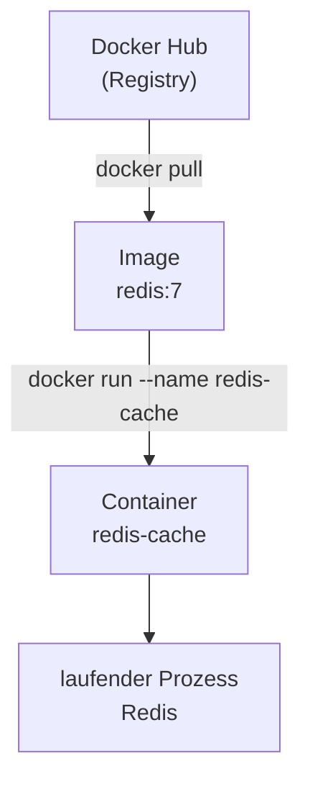
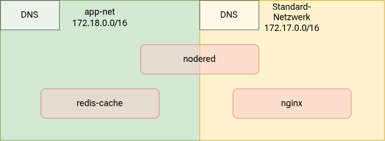

# Lab 07: Vom transparenten Proxy zur transparenten Netzwerktrennung (ISO/IEC 27001)


## Berufliche Aufgabenstellung

Das Unternehmen bereitet sich weiterhin auf die Zertifizierung nach ISO/IEC 27001 vor. Im vorangegangenen Lab wurde bereits nachgewiesen, dass die Zertifikatsverwaltung mit nginx und dem nativen ACME-Modul explizit konfiguriert und damit auditierbar dokumentiert ist. Nun steht die zweite Feststellung des externen Pentests im Fokus: **Control A.8.22 (Segregation of Networks)** verlangt eine erkennbare, begründete Trennung zusammengehöriger Dienste in eigene Netzwerksegmente.

Bisher laufen sämtliche Docker-Container im selben, nicht weiter unterteilten Standardnetzwerk; mehrere Backend-Dienste auf dem Server sind direkt über Port-Nummer erreichbar, obwohl das nicht erforderlich wäre. (Der Prozess, der den Webserver betreibt, könnte z. B. auf eine Datenbank zugreifen, in der Logging-Daten gespeichert sind, obwohl das nicht vorgesehen ist.) Das Betriebsteam erhält nun den Auftrag, zusammengehörige Container-Dienste bewusst in eigenen Docker-Netzwerken zu bündeln und von anderen Diensten zu trennen. Zusätzlich soll eine einfache, manuell gepflegte Lastverteilung über mehrere Container-Instanzen eines Dienstes eingerichtet werden.

---

## Einführung

In diesem Lab lernen Sie, wie Sie mit **benutzerdefinierten Docker-Netzwerken** zusammengehörige Dienste gezielt bündeln und von anderen Diensten isolieren – genau das, was Control A.8.22 verlangt. Sie legen ein eigenes Netzwerk an, verbinden bestehende Container nachträglich damit und starten einen neuen Dienst, der **ausschließlich für andere Container** erreichbar ist – nicht für den Host, nicht für das Internet. 

## Lernziele

- Ein eigenes Docker-Netzwerk anlegen und seine Eigenschaften verstehen
- Einen laufenden Container nachträglich an ein zusätzliches Netzwerk anbinden
- Einen Dienst ohne Host-Port-Exposition starten und nur innerhalb eines Docker-Netzwerks verfügbar machen
- Die Namensauflösung innerhalb und außerhalb eines Docker-Netzwerks praktisch nachvollziehen
- IP-Vergabe und Routing in Docker-Netzwerken verstehen
- Die technische Umsetzung den ISO-27001-Controls A.8.20 und A.8.22 zuordnen

## Voraussetzungen

| Anforderung | Details |
|---|---|
| **Server** | Debian stable (aktuell Trixie), öffentliche IPv4-Adresse (aus Lab 03) |
| **nginx** | Mit ACME-Modul als Reverse Proxy aktiv (aus Lab 06) |
| **Docker** | Installiert und betriebsbereit (aus Lab 05) |
| **Node-RED** | Container `nodered` mit `-p 127.0.0.1:1880:1880` aktiv (aus Lab 05) |
| **DNS** | Bestehende A-Records aus Lab 03–06, zusätzlich ein neuer A-Record `demo.<IHRE-DOMAIN>` (oder Wildcard-Eintrag) |
| **SSH-Zugriff** | Key-Authentifizierung |

---

## Inhalt

- [Hintergrundwissen](#hintergrundwissen)
  - [Docker-Netzwerke als Bündelungskonzept](#docker-netzwerke-als-bündelungskonzept)
  - [ISO-27001-Control A.8.22: Segregation of Networks](#iso-27001-control-a822-segregation-of-networks)
- [Aufgaben](#aufgaben)
  - [Schritt 1: Eigenes Docker-Netzwerk anlegen und Dienste bewusst bündeln](#schritt-1-eigenes-docker-netzwerk-anlegen-und-dienste-bewusst-bündeln)
    - [1.1 Eigenes Netzwerk anlegen](#11-eigenes-netzwerk-anlegen)
    - [1.2 Bestehenden Container zusätzlich anbinden](#12-bestehenden-container-zusätzlich-anbinden)
    - [1.3 Neuen, rein internen Dienst starten](#13-neuen-rein-internen-dienst-starten)
    - [1.4 Namensauflösung innerhalb des Netzwerks prüfen](#14-namensauflösung-innerhalb-des-netzwerks-prüfen)
    - [1.5 Gegenprobe: Auflösung außerhalb von app-net](#15-gegenprobe-auflösung-außerhalb-von-app-net)
    - [1.6 Port-Check auf dem Host](#16-port-check-auf-dem-host)
    - [1.7 Hintergrund: IP-Vergabe und Routing in Docker-Netzwerken](#17-hintergrund-ip-vergabe-und-routing-in-docker-netzwerken)
- [Reflexion und weiterführende Fragen](#reflexion-und-weiterführende-fragen)
- [Rückblick und Zusammenfassung](#rückblick-und-zusammenfassung)
- [Aufräumarbeiten](#aufräumarbeiten)
- [Autoren und Urheberrecht](#autoren-und-urheberrecht)

---

## Hintergrundwissen

### Docker-Netzwerke als Bündelungskonzept

Im Default-Bridge-Netzwerk von Docker können sich grundsätzlich alle Container gegenseitig erreichen – unabhängig davon, ob sie inhaltlich zusammengehören. Ein eigenes, benutzerdefiniertes Netzwerk dient der bewussten **Bündelung zusammengehöriger Dienste** und der **Abgrenzung** gegenüber allem, was nicht dazugehört – genau das, was Control A.8.22 verlangt. In einer späteren Übung werden Sie dieses Prinzip in größerem Maßstab wiederverwenden: eine zeitbasierte Datenbank (z. B. InfluxDB), ein Connector-Dienst und eine Visualisierung (z. B. Grafana) werden dann gemeinsam in einem eigenen Netzwerk laufen, ohne dass die Datenbank selbst von außen erreichbar sein muss. In diesem Lab üben Sie das Prinzip bereits an einem kleinen Beispiel.

### ISO-27001-Control A.8.22: Segregation of Networks

Control A.8.22 verlangt eine erkennbare Trennung von Netzwerken, um die Ausbreitung von Sicherheitsvorfällen zu begrenzen und den Zugriff auf sensible Dienste zu kontrollieren. Im Kontext von Docker-Containern bedeutet das: Container, die nicht miteinander kommunizieren müssen, sollten auch nicht im selben Netzwerk liegen. Ein benutzerdefiniertes Docker-Netzwerk mit bewusst ausgewählten Mitgliedern ist die technische Umsetzung dieser Anforderung – dokumentiert durch die `docker network`-Befehle und nachvollziehbar durch `docker network inspect`.

[↑ Zum Inhaltsverzeichnis](#inhalt)

---

## Aufgaben

### Schritt 1: Eigenes Docker-Netzwerk anlegen und Dienste bewusst bündeln

Bisher waren alle Container über `-p <host-port>:<container-port>` für den Host (und damit für nginx) erreichbar. In diesem Schritt lernen Sie das Gegenteil: einen Dienst, der **ausschließlich für andere Container** erreichbar sein soll – nicht für den Host, nicht für das Internet.

#### 1.1 Eigenes Netzwerk anlegen

```bash
docker network create app-net
```

Damit legen Sie ein eigenes, benutzerdefiniertes Docker-Netzwerk namens `app-net` an. Container, die diesem Netzwerk beitreten, können sich gegenseitig über ihren Containernamen erreichen – Docker betreibt dafür intern einen eigenen DNS-Server pro Netzwerk.

#### 1.2 Bestehenden Container zusätzlich anbinden

```bash
docker network connect app-net nodered
```

`nodered` läuft bereits (aus Lab 05) mit `-p 127.0.0.1:1880:1880` im Standard-Netzwerk – darüber bleibt er für nginx auf dem Host erreichbar, aber weiterhin nicht direkt aus dem Internet. Mit diesem Befehl bekommt `nodered` ein zweites Standbein: Er gehört jetzt **gleichzeitig** zwei Netzwerken an. Ein Container kann beliebig vielen Netzwerken angehören, ohne neu erstellt werden zu müssen.

#### 1.3 Neuen, rein internen Dienst starten

```bash
docker run -d \
  --name redis-cache \
  --restart unless-stopped \
  --network app-net \
  redis:7
```

| Element | Bedeutung |
|---|---|
| `redis:7` | Das **Image** – der Bauplan für die Redis-Software, Version 7. Wird von Docker Hub geladen. |
| `--name redis-cache` | Der Name, den der daraus erstellte **Container** bekommt. Innerhalb von `app-net` ist das zugleich der Hostname, unter dem dieser Container per DNS auffindbar ist. |
| `--network app-net` | Der Container wird direkt bei seiner Erstellung diesem Netzwerk zugewiesen – im Unterschied zu `nodered`, der nachträglich per `network connect` hinzugefügt wurde. |
| (kein `-p`) | Bewusst weggelassen: Es gibt keinen Host-Port. Der Container ist außerhalb von `app-net` nicht erreichbar – nicht vom Host, nicht aus dem Internet. |

> **Image, Container, Software – was ist hier eigentlich was?**
> Diese drei Begriffe werden leicht vermischt:
> - **Image** (`redis:7`): ein unveränderlicher Bauplan, der auf Docker Hub liegt.
> - **Container** (`redis-cache`): die laufende, konkrete Instanz, die aus diesem Bauplan erzeugt wurde – mit eigenem Namen und eigenem Lebenszyklus.
> - **Software** (Redis): das Programm, das innerhalb dieses Containers tatsächlich läuft – eine In-Memory-Datenbank, die in der Praxis meist als schneller Zwischenspeicher (Cache) vor einer langsameren Hauptdatenbank eingesetzt wird.
>
> Es gibt in diesem Abschnitt also nur **einen** Container: `redis-cache`.
> 
> „Redis“ und „redis-cache“ meinen praktisch dasselbe Ding – einmal als Produktname, einmal als der konkrete Name, den dieser eine Container in Ihrer Umgebung trägt.



> **Vorgriff:** In einer späteren Übung übernehmen eine Zeitreihendatenbank (z. B. InfluxDB), ein Connector-Dienst und eine Visualisierung (z. B. Grafana) genau dieses Muster – mehrere zusammenspielende Container in einem eigenen Netzwerk, von denen nur die Visualisierung nach außen erreichbar sein muss. `redis-cache` steht hier stellvertretend für diesen späteren Datenhaltungsdienst – nicht als sinnvoller Produktiv-Cache für `nodered`, sondern als einfaches Beispiel-Image für das Bündelungsprinzip.

#### 1.4 Namensauflösung innerhalb des Netzwerks prüfen

Wir testen jetzt die Namensauflösung. Dazu legen wir einen Container an, der nach der Namensauflösung sofort wieder gelöscht wird.

Der Container wird mit `--network app-net` an das app-net angeschlossen. Es wird eine kleine Version von Debian Trxie gestartet. In dieser wird der Befehl `getent hosts redis-cache` ausgeführt. Wenn alles klaptt, sollte man die IP-Adresse des Hosts `redis-cache` sehen:

```bash
docker run --rm --network app-net debian:trixie-slim getent hosts redis-cache
```

| Element | Bedeutung |
|---|---|
| `debian:trixie-slim` | Das **Image** – dieselbe schlanke Debian-Basis wie in Lab 08. Hier nicht als Basis für ein eigenes Image, sondern nur als schnell startendes Test-Werkzeug, das die nötigen Bordmittel (`getent`) bereits mitbringt. |
| (kein `--name`) | Der daraus gestartete Container bekommt einen von Docker zufällig vergebenen Namen – unwichtig, da er sich gleich wieder selbst löscht. |
| `--rm` | Der Container wird sofort nach Beendigung des Befehls automatisch gelöscht. Er existiert nur für die Dauer dieses einen Aufrufs. |
| `getent hosts redis-cache` | Der Befehl, der **innerhalb** des Test-Containers ausgeführt wird. `getent hosts <name>` fragt: „Welche IP-Adresse gehört zu diesem Namen?" – gefragt wird hier nach dem Namen des **Redis-Containers**. |

> **Achtung bei der Eingabe:** Die Datenbank heißt `hosts` (mit „s" am Ende). `getent host redis-cache` (ohne „s") führt zu einer Fehlermeldung, weil `host` keine gültige Datenbank ist – das ist ein Tippfehler, kein Problem der Namensauflösung selbst.

Die Ausgabe zeigt die interne IP-Adresse von `redis-cache`, z. B.:

```
172.18.0.3      redis-cache
```

#### 1.5 Gegenprobe: Auflösung außerhalb von `app-net`

```bash
docker run --rm debian:trixie-slim getent hosts redis-cache
```

Dieser Befehl liefert **keine** Auflösung. Der einzige, aber entscheidende Unterschied zum vorherigen Befehl: Hier fehlt `--network app-net`. Ohne diese Angabe verwendet Docker automatisch das Standard-Bridge-Netzwerk – ein komplett anderes Netzwerk als `app-net`, mit einem eigenen, separaten internen DNS. `redis-cache` ist dort nicht bekannt, weil er ausschließlich Mitglied von `app-net` ist.

> **Bildlich:** `app-net` ist ein Konferenzraum mit eigenem internen Telefonbuch. `redis-cache` (und zeitweise `nodered`) sitzen in diesem Raum und stehen im Telefonbuch. Ein Test-Container ohne `--network app-net` betritt diesen Raum gar nicht – er bleibt im Foyer (Standard-Bridge-Netz) mit einem eigenen, anderen Telefonbuch, in dem `redis-cache` schlicht nicht eingetragen ist.

#### 1.6 Port-Check auf dem Host

```bash
ss -tlnp | grep 6379
```
>**Hinweis:** Der Befehl Socket Statistics `ss` zeigt aktive Verbindungen. Der `grep`-Befehl filter die Zeilen heraus, in denen 6379 steht. Das ist der Standard-Port für Redis.

Die Ausgabe sollte **leer** sein. Im Unterschied zu den Containern aus Lab 05 (die bewusst über `-p 127.0.0.1:<port>:<port>` veröffentlicht wurden) ist hier gar kein Host-Port nötig – `redis-cache` muss ausschließlich für `nodered` erreichbar sein, und das funktioniert vollständig innerhalb von `app-net`, ohne dass der Host überhaupt einen offenen Port dafür braucht.

> **Warum trotzdem mindestens ein Dienst sichtbar bleiben muss:** `app-net` selbst macht nach außen gar nichts sichtbar. Die einzige Verbindung zur Außenwelt bleibt `nodered` – er gehört weiterhin zusätzlich dem Standard-Netzwerk an und ist dort über `-p 127.0.0.1:1880:1880` für nginx erreichbar (aus Lab 05). `nodered` fungiert damit als Brücke zwischen beiden Welten: lokal erreichbar über sein Host-Port-Mapping (für den Reverse Proxy), nach innen verbunden mit `redis-cache` über `app-net`. `redis-cache` selbst braucht diese Brücke nicht – er muss nur von `nodered` aus erreichbar sein, nicht von irgendwo sonst.

Die Netzwerk-Zugehörigkeiten aus diesem Schritt im Überblick – `nodered` ist Mitglied beider Netzwerke und damit die einzige Brücke zwischen ihnen, `redis-cache` ausschließlich Mitglied von `app-net`:



#### 1.7 Hintergrund: IP-Vergabe und Routing in Docker-Netzwerken

Die IP-Adresse `172.18.0.3`, die in Schritt 1.4 für `redis-cache` aufgetaucht ist, kam nicht von irgendwoher – sie wurde Docker beim Anlegen von `app-net` automatisch aus einem eigenen Adresspool zugewiesen. Jedes Docker-Netzwerk bekommt dabei ein eigenes Subnetz; das Standard-Netzwerk `bridge` belegt meist `172.17.0.0/16`, eigene Netzwerke wie `app-net` erhalten automatisch das nächste freie Subnetz (z. B. `172.18.0.0/16`).

Innerhalb eines solchen Netzwerks greift **Switching auf Layer 2**: Alle Container eines Netzwerks hängen an derselben virtuellen Linux-Bridge und liegen im selben Subnetz. Die Namensauflösung (Containername → IP), die Sie in 1.4 mit `getent hosts` genutzt haben, übernimmt dabei der eingebaute Docker-DNS-Server.

Zwischen zwei eigenständigen, unterschiedlichen Netzwerken gibt es **kein automatisches Routing** – sie sind grundsätzlich voneinander isoliert. Genau das war in 1.5 zu sehen: Ohne `--network app-net` landet ein Container im Standard-Netzwerk, einem komplett anderen Adressbereich mit eigenem, separaten DNS. Nur ein Container, der – wie `nodered` – Mitglied in beiden Netzwerken ist, kann zwischen ihnen vermitteln.

Folgende Befehle helfen, sich jederzeit einen Überblick über die vorhandenen Docker-Netzwerke und ihre IP-Vergabe zu verschaffen:

| Befehl | Bedeutung |
|---|---|
| `docker network ls` | Alle Netzwerke anzeigen, inkl. der Standardnetze `bridge`, `host` und `none` |
| `docker network create <name>` | Eigenes Netzwerk anlegen |
| `docker network rm <name>` | Netzwerk löschen (nur möglich, wenn keine Container mehr verbunden sind) |
| `docker network inspect <name>` | Vollständige Details zu einem Netzwerk: Subnetz, IPAM-Konfiguration, verbundene Container |
| `docker network connect <netz> <container>` | Laufenden Container zusätzlich an ein Netzwerk anhängen |
| `docker network disconnect <netz> <container>` | Container aus einem Netzwerk entfernen |
| `docker network prune` | Alle nicht genutzten (verwaisten) Netzwerke aufräumen |

#### 1.8 Überblick über die Netze

Zunächst ein Überblick über alle vorhandenen Netzwerke – auch über die von Docker immer automatisch angelegten Standardnetze, in deren Liste `app-net` erst nach dem Anlegen in Schritt 1.1 auftaucht:

```bash
docker network ls
```

oder umfängliche Netzwerkinformationen im json-Format

```bash
docker network inspect app-net 
```


[↑ Zum Inhaltsverzeichnis](#inhalt)

---

## Reflexion und weiterführende Fragen

**Zu Docker-Netzwerken**

- Was unterscheidet die Situation von `redis-cache` von den Containern aus Lab 05, die über `-p` veröffentlicht wurden? Welches Risiko wird durch das Fehlen eines Host-Ports konkret reduziert?
- Wie würde sich das Vorgehen ändern, wenn statt zwei künftig drei oder vier zusammenspielende Dienste in einem Netzwerk gebündelt werden müssten?
- Warum reicht für Control A.8.22 nicht allein die technische Netzwerktrennung, sondern auch eine dokumentierte Begründung, welche Dienste zusammengehören?

---

## Rückblick und Zusammenfassung

### Was Sie erreicht haben

- Ein eigenes Docker-Netzwerk angelegt und einen Dienst bewusst ohne Host-Port-Exposition gebündelt
- Einen bestehenden Container nachträglich an ein zusätzliches Netzwerk angebunden
- Die Namensauflösung innerhalb und außerhalb eines Docker-Netzwerks praktisch nachvollzogen
- IP-Vergabe und Routing in Docker-Netzwerken verstanden
- Die technischen Maßnahmen den ISO-27001-Controls A.8.20 und A.8.22 zugeordnet

### Zentrale Befehle dieser Übung

| Befehl | Bedeutung |
|---|---|
| `docker network ls` | Alle Netzwerke anzeigen, inkl. Standardnetze |
| `docker network create <name>` | Eigenes Docker-Netzwerk anlegen |
| `docker network inspect <name>` | Subnetz, IPAM-Konfiguration und verbundene Container eines Netzwerks anzeigen |
| `docker network connect <netz> <container>` | Laufenden Container zusätzlich an ein Netzwerk anhängen |
| `docker network disconnect <netz> <container>` | Container aus einem Netzwerk entfernen |
| `docker run --network <netz>` | Container von Anfang an einem bestimmten Netzwerk zuweisen |
| `getent hosts <name>` | Namensauflösung innerhalb eines Containers prüfen |

---

## Aufräumarbeiten

```bash

# Bündelungs-Demo entfernen
docker stop redis-cache
docker rm redis-cache
docker network disconnect app-net nodered
docker network rm app-net

nginx -t
systemctl reload nginx
```

## Autoren und Urheberrecht

- Erstellt von: Michael Lotter, Florian Reichl
- Datum: 09/2026
- Version: v1.0


<p align="center">
<a href="Lab_06.md"></a>
<a href="Lab_08.md"></a>
</p>
