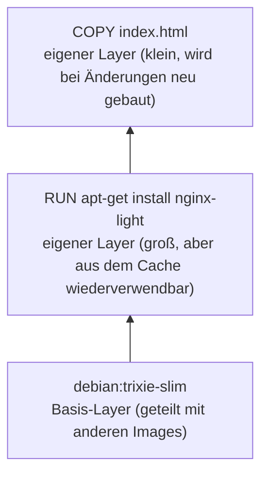

# Lab 08: Eigene Docker-Images mit Dockerfile bauen


## Berufliche Aufgabenstellung

Die Vorbereitung auf die Zertifizierung nach ISO/IEC 27001 geht in die nächste Runde. Parallel dazu meldet sich die Fachabteilung mit einem konkreten Auftrag: Im Firmengebäude sollen künftig Umgebungsdaten (zunächst Temperaturen) erfasst und den Mitarbeitenden über ein einfaches **Messdaten-Portal** im Browser zugänglich gemacht werden. Die Daten sollen später von Sensoren per MQTT angeliefert, gesammelt und in einer Zeitreihendatenbank abgelegt werden – der Aufbau dieser Datenpipeline ist für die nächste Übung (Lab 09) eingeplant.

Bei der Sichtung der Betriebsprozesse hat der Auditor allerdings eine Lücke festgehalten: Für **fertige Fremd-Images** (nginx, Node-RED, Redis) existiert ein nachvollziehbarer Bezugsweg über Docker Hub – für **eigenentwickelte Dienste** fehlt dagegen ein wiederholbarer, dokumentierter Erstellungsprozess. Control **A.8.9 (Configuration Management)** verlangt, dass die Konfiguration eines Dienstes als kontrollierte Information vorliegt; Control **A.8.32 (Change Management)** verlangt, dass jede Änderung nachvollziehbar als neue, identifizierbare Version ausgeliefert wird. Ein „auf dem Server zusammengefrickelter" Container, dessen Innenleben niemand rekonstruieren kann, erfüllt beides nicht.

Das Betriebsteam erhält daher den Auftrag, das Messdaten-Portal als **eigenes Docker-Image** zu liefern: gebaut aus einem versionierten **Dockerfile**, mit eindeutigen Tags versehen und gegen eine Wegwerf-Testdatenbank verprobt – so, dass jede Version jederzeit identisch reproduziert werden kann.

---

## Einführung

In Lab 05 und Lab 06 haben Sie ausschließlich fertige Images von Docker Hub verwendet – `nginx`, `nodered/node-red`, `redis`, `nginxdemos/hello`. In diesem Lab wechseln Sie die Perspektive: vom Nutzer fremder Baupläne zum Autor eigener. Sie schreiben Ihr erstes **Dockerfile**, bauen daraus mit `docker build` ein Image, verstehen das dahinterliegende **Schichtenmodell** (Layer und Build-Cache) und lernen, warum Konfiguration über **Umgebungsvariablen** ins Image gehört – Geheimnisse wie Zugangs-Token dagegen niemals. Das Ergebnis ist das Messdaten-Portal in zwei Ausbaustufen: `portal:1.0` als statische Vorschau und `portal:2.0` als konfigurierbare Anwendung, die ihre Messwerte live aus einer InfluxDB-Testinstanz liest.

## Lernziele

- Den Unterschied zwischen **Image** und **Container** sowie das Schichtenmodell (Layer, Build-Cache) erklären
- Ein eigenes Image mit einem **Dockerfile** bauen: `FROM`, `COPY`, `RUN`, `ENV`, `WORKDIR`, `EXPOSE`, `USER`, `CMD`
- Software innerhalb eines Dockerfiles selbst per `apt install` einrichten und von einem fertigen Anwendungsimage abgrenzen
- `docker build`, Tagging (`name:tag`), `docker images`, `docker history` und `docker rmi` / `docker image prune` anwenden
- Den **Build-Kontext** verstehen und mit `.dockerignore` begrenzen
- Best Practices anwenden: kleine Basis-Images, Cache-freundliche Layer-Reihenfolge, Container als **Non-Root-Benutzer**
- Eine Anwendung über **Umgebungsvariablen** konfigurierbar machen und gegen einen Test-Container verproben
- `docker logs` und `docker ps -a` zur Fehlersuche einsetzen

## Voraussetzungen

| Anforderung | Details |
|---|---|
| **Server** | Debian stable (aktuell Trixie), öffentliche IPv4-Adresse (aus Lab 03) |
| **Docker** | Installiert und betriebsbereit (aus Lab 05) |
| **nginx** | Mit ACME-Modul als Reverse Proxy aktiv (aus Lab 06) – wird in diesem Lab nicht verändert |
| **SSH-Zugriff** | Key-Authentifizierung |

---

## Inhalt

- [Hintergrundwissen](#hintergrundwissen)
  - [Vom Bauplan-Nutzer zum Bauplan-Autor](#vom-bauplan-nutzer-zum-bauplan-autor)
  - [Das Schichtenmodell: Images bestehen aus Layern](#das-schichtenmodell-images-bestehen-aus-layern)
  - [Anwendungsimage oder Betriebssystem-Image als Basis?](#anwendungsimage-oder-betriebssystem-image-als-basis)
  - [Anatomie eines Dockerfiles](#anatomie-eines-dockerfiles)
  - [Repository, Tag und die Falle mit latest](#repository-tag-und-die-falle-mit-latest)
  - [Vom Legacy-Builder zu BuildKit](#vom-legacy-builder-zu-buildkit)
- [Aufgaben](#aufgaben)
  - [Schritt 1: Build-Werkzeug installieren](#schritt-1-build-werkzeug-installieren)
  - [Schritt 2: Das erste eigene Image (Portal v1)](#schritt-2-das-erste-eigene-image-portal-v1)
    - [2.1 Projektverzeichnis und Startseite anlegen](#21-projektverzeichnis-und-startseite-anlegen)
    - [2.2 Das Dockerfile schreiben](#22-das-dockerfile-schreiben)
    - [2.3 Das Image bauen](#23-das-image-bauen)
    - [2.4 Einen Container aus dem eigenen Image starten](#24-einen-container-aus-dem-eigenen-image-starten)
  - [Schritt 3: Layer, Build-Cache und Tags verstehen](#schritt-3-layer-build-cache-und-tags-verstehen)
    - [3.1 Layer sichtbar machen](#31-layer-sichtbar-machen)
    - [3.2 Den Build-Cache beobachten](#32-den-build-cache-beobachten)
    - [3.3 Ein zweites Tag vergeben](#33-ein-zweites-tag-vergeben)
    - [3.4 Den Build-Kontext begrenzen mit .dockerignore](#34-den-build-kontext-begrenzen-mit-dockerignore)
  - [Schritt 4: Test-Datenbank bereitstellen und mit Messwerten füllen](#schritt-4-test-datenbank-bereitstellen-und-mit-messwerten-füllen)
    - [4.1 Netzwerk und InfluxDB-Container starten](#41-netzwerk-und-influxdb-container-starten)
    - [4.2 Testdaten einspielen](#42-testdaten-einspielen)
    - [4.3 Testdaten abfragen](#43-testdaten-abfragen)
  - [Schritt 5: Eine konfigurierbare Anwendung (Portal v2)](#schritt-5-eine-konfigurierbare-anwendung-portal-v2)
    - [5.1 Den Anwendungscode anlegen](#51-den-anwendungscode-anlegen)
    - [5.2 Das Dockerfile für v2](#52-das-dockerfile-für-v2)
    - [5.3 Bauen, starten, prüfen](#53-bauen-starten-prüfen)
  - [Schritt 6: Fehlersuche mit docker logs](#schritt-6-fehlersuche-mit-docker-logs)
  - [Schritt 7: Bilanz und Aufräumen von Images](#schritt-7-bilanz-und-aufräumen-von-images)
- [Reflexion und weiterführende Fragen](#reflexion-und-weiterführende-fragen)
- [Rückblick und Zusammenfassung](#rückblick-und-zusammenfassung)
- [Aufräumarbeiten](#aufräumarbeiten)
- [Autoren und Urheberrecht](#autoren-und-urheberrecht)

---

## Hintergrundwissen

### Vom Bauplan-Nutzer zum Bauplan-Autor

In Lab 06 haben Sie die Begriffe bereits sauber getrennt: Ein **Image** ist der unveränderliche Bauplan, ein **Container** die daraus erzeugte, laufende Instanz. Bisher stammten alle Baupläne von Docker Hub. Ein **Dockerfile** ist nun die Anleitung, nach der Docker einen solchen Bauplan selbst erstellt: eine einfache Textdatei mit Anweisungen, die – Zeile für Zeile abgearbeitet – aus einem Basis-Image ein neues Image erzeugen. Weil das Dockerfile eine gewöhnliche Textdatei ist, kann es versioniert, geprüft und auditiert werden – genau die Eigenschaft, die die Aufgabenstellung verlangt.

### Das Schichtenmodell: Images bestehen aus Layern

Ein Image ist kein monolithisches Abbild, sondern ein Stapel aufeinanderliegender, **schreibgeschützter Schichten (Layer)**. Jede Anweisung im Dockerfile, die das Dateisystem verändert (`FROM`, `RUN`, `COPY`), erzeugt einen eigenen Layer. Beim Start eines Containers legt Docker lediglich eine dünne, beschreibbare Schicht obenauf – deshalb starten Container so schnell, und deshalb teilen sich zehn Container aus demselben Image den Speicherplatz des Images.

Für Sie als Autor hat das eine praktische Konsequenz: Docker merkt sich einmal gebaute Layer im **Build-Cache**. Ändert sich eine Dockerfile-Zeile (oder eine Datei, die sie kopiert) nicht, wird der Layer beim nächsten Build nicht neu erstellt, sondern aus dem Cache übernommen. Ändert sich dagegen eine Zeile, müssen **sie und alle folgenden** neu gebaut werden. Die Reihenfolge der Anweisungen entscheidet also darüber, wie schnell Ihre Builds sind – selten Geändertes gehört nach oben, häufig Geändertes nach unten.

### Anwendungsimage oder Betriebssystem-Image als Basis?

Für ein Dockerfile gibt es grundsätzlich zwei Ausgangspunkte: ein **Anwendungsimage** wie `nginx` – von den Software-Autoren selbst gepflegt, vorkonfiguriert und startklar – oder ein **Betriebssystem-Image** wie `debian:trixie-slim`, auf dem Sie die benötigte Software selbst per `apt install` einrichten. Anwendungsimages sparen Arbeit, verbergen aber, welche Pakete in welcher Version tatsächlich enthalten sind. Der Betriebssystem-Weg macht in Ihrem Dockerfile explizit sichtbar, was installiert wird – genau die Nachvollziehbarkeit, die Control A.8.9 aus der Aufgabenstellung verlangt. In diesem Lab bauen Sie Portal v1 deshalb bewusst auf `debian:trixie-slim` auf und installieren nginx selbst per `apt`; Portal v2 zeigt zum Vergleich den anderen Weg mit dem vorkonfigurierten Anwendungsimage `python:3.12-slim-trixie`.

### Anatomie eines Dockerfiles

| Anweisung | Bedeutung |
|---|---|
| `FROM` | Basis-Image, auf dem aufgebaut wird – immer die erste Anweisung |
| `RUN` | Führt einen Befehl **während des Builds** aus (z. B. Pakete installieren) und legt das Ergebnis als Layer ab |
| `COPY` | Kopiert Dateien aus dem Build-Kontext in das Image |
| `WORKDIR` | Setzt das Arbeitsverzeichnis für alle folgenden Anweisungen |
| `ENV` | Setzt eine Umgebungsvariable mit Vorgabewert – beim Start per `-e` überschreibbar |
| `EXPOSE` | **Dokumentiert**, auf welchem Port die Anwendung lauscht – öffnet selbst keinen Port |
| `USER` | Legt fest, unter welchem Benutzer alle folgenden Anweisungen und der Container laufen |
| `CMD` | Der Befehl, der **beim Start des Containers** ausgeführt wird – genau einer pro Image |
| `ENTRYPOINT` | Ein „festverdrahteter" Startbefehl; `CMD` liefert dann nur noch Standardargumente dazu. In diesem Lab nicht benötigt |

Der wichtigste Unterschied für Einsteiger: `RUN` passiert **einmal beim Bauen**, `CMD` **bei jedem Containerstart**.

### Repository, Tag und die Falle mit latest

Ein Image-Name wie `portal:2.0` besteht aus dem **Repository** (`portal`) und dem **Tag** (`2.0`). Das Tag ist eine frei wählbare Versionsbezeichnung – technisch nur ein Etikett, das auf eine Image-ID zeigt. Fehlt das Tag, ergänzt Docker automatisch `latest`. Das ist tückisch: `latest` ist **kein Versprechen**, dass es sich um die neueste Version handelt, sondern nur ein Tag wie jedes andere, das jemand (oder niemand) pflegt. Für die in der Aufgabenstellung geforderte Nachvollziehbarkeit nach A.8.32 gilt deshalb: Eigene Images bekommen **explizite, unveränderliche Versions-Tags** – `latest` ist höchstens ein zusätzlicher Komfort-Verweis.

### Vom Legacy-Builder zu BuildKit

`docker build` gibt es seit den Anfängen von Docker. Der ursprüngliche, eingebaute Builder gilt inzwischen als veraltet (deprecated); sein Nachfolger **BuildKit** baut schneller, parallelisiert unabhängige Schritte und zeigt eine übersichtlichere Ausgabe. BuildKit wird über das Plugin **Buildx** bereitgestellt, das Docker in seiner offiziellen Installationsanleitung standardmäßig mitinstalliert – in Lab 05 haben Sie es bewusst weggelassen, weil es dort noch nicht gebraucht wurde. Das holen Sie jetzt nach.

> **Hinweis:** Im Repository dieses Kurses liegt unter `docker/cockpit/Dockerfile` ein weiterführendes Beispiel – ein Image, das systemd und Cockpit in einem Container betreibt. Es ist als Anschauungsobjekt für Fortgeschrittene gedacht (systemd im Container ist ein Sonderfall) und **nicht** Gegenstand dieser Übung.

[↑ Zum Inhaltsverzeichnis](#inhalt)

---

## Aufgaben

### Schritt 1: Build-Werkzeug installieren

Das Docker-Repository ist seit Lab 05 eingebunden – es fehlt nur das Buildx-Plugin:

```bash
apt update
apt install -y docker-buildx-plugin
docker buildx version
```

> **Was passiert hier?**  
> `docker build` würde auch ohne dieses Plugin funktionieren, dann aber mit dem veralteten Legacy-Builder und einer entsprechenden `DEPRECATED`-Warnung. Mit installiertem Buildx-Plugin verwendet `docker build` automatisch BuildKit – Sie müssen an Ihrer Arbeitsweise nichts ändern.

[↑ Zum Inhaltsverzeichnis](#inhalt)

---

### Schritt 2: Das erste eigene Image (Portal v1)

Die erste Ausbaustufe des Portals ist bewusst minimal: eine statische HTML-Seite, ausgeliefert von einem nginx, das Sie selbst aus einem Debian-Basis-Image heraus einrichten. So bleibt der Kopf frei für das eigentlich Neue – das Dockerfile und den Build-Vorgang.

#### 2.1 Projektverzeichnis und Startseite anlegen

```bash
mkdir -p /srv/portal
cd /srv/portal
nano index.html
```

```html
<!DOCTYPE html>
<html lang="de">
<head><meta charset="UTF-8"><title>Messdaten-Portal</title></head>
<body>
  <h1>Messdaten-Portal</h1>
  <p>Version 1 &ndash; die Anbindung an die Messdatenbank folgt.</p>
</body>
</html>
```

#### 2.2 Das Dockerfile schreiben

```bash
nano Dockerfile
```

```dockerfile
FROM debian:trixie-slim

RUN apt-get update && \
    apt-get install -y --no-install-recommends nginx-light && \
    rm -rf /var/lib/apt/lists/*

COPY index.html /var/www/html/index.html

EXPOSE 80

CMD ["nginx", "-g", "daemon off;"]
```

| Zeile | Bedeutung |
|---|---|
| `FROM debian:trixie-slim` | Basis-Image: ein schlankes Debian 13 (Trixie) ohne Dokumentation, man-pages und ähnlichen Ballast – die `-slim`-Variante der offiziellen Debian-Images |
| `RUN apt-get update && apt-get install ... && rm -rf ...` | Installiert nginx selbst, statt ein fertiges nginx-Image zu verwenden – dazu gleich mehr |
| `COPY index.html ...` | Kopiert Ihre Startseite an die Stelle, an der das Debian-Paket `nginx-light` sein Standard-Wurzelverzeichnis erwartet |
| `EXPOSE 80` | Dokumentiert, dass die Anwendung im Container auf Port 80 lauscht |
| `CMD ["nginx", "-g", "daemon off;"]` | Startet nginx im Vordergrund – ohne diese Zeile würde der Hauptprozess sofort beendet und damit wird auch der Container beendet |

> **Warum `apt-get` statt `apt`?**  
> In Schritt 1 und in allen bisherigen Labs haben Sie stets `apt` verwendet – die neuere, für die **interaktive Nutzung am Terminal** gedachte Oberfläche mit übersichtlicherer, teils farbiger Ausgabe. `apt-get` (zusammen mit `apt-cache`) ist das ältere, „rohere" Geschwisterwerkzeug: Sein Kommandozeilen-Interface und Ausgabeformat gelten als stabil und sind explizit für den Einsatz in **Skripten** gedacht – `apt` weist in seiner eigenen Dokumentation ausdrücklich darauf hin, sich nicht für Skripte zu eignen, weil sich Verhalten und Ausgabe zwischen Versionen ändern dürfen. Ein Dockerfile ist im Kern ein Skript, das bei jedem Build exakt reproduzierbar ablaufen soll – genau die Nachvollziehbarkeit, die schon die Aufgabenstellung dieses Labs verlangt. Deshalb verwenden alle Dockerfiles in diesem Kurs `apt-get`, während jede interaktive, host-seitige Installation – wie eben in Schritt 1 dieses Labs – bei `apt` bleibt.

> **⚠️ Wichtig:** `EXPOSE` öffnet **keinen** Port. Es ist reine Dokumentation für Menschen und Werkzeuge. Ob und wie ein Container-Port auf dem Host erreichbar wird, entscheidet nach wie vor ausschließlich das `-p`-Flag beim Start (bzw. später `ports:` in Docker Compose).

> **Warum `nginx-light` statt `nginx`?**  
> Debian bietet nginx in drei Paketvarianten an: `nginx-light` (Kernfunktionen, für dieses Lab ausreichend), `nginx-full` (zusätzliche Module, z. B. für erweiterte SSL-Konfigurationen) und `nginx-extras` (noch mehr Module, u. a. Lua-Skripting). Da das Portal nur eine statische Datei ausliefert, genügt die schlankste Variante – ein weiteres Beispiel für „nur installieren, was tatsächlich gebraucht wird". `--no-install-recommends` verstärkt diesen Effekt: APT installiert dann nur zwingend benötigte, aber keine lediglich empfohlenen Zusatzpakete.

> **⚠️ Wichtig: `apt-get update` und `apt-get install` in derselben Zeile**  
> Docker cacht jede Dockerfile-Zeile als eigenen Layer. Stünden `apt-get update` und `apt-get install nginx-light` in getrennten `RUN`-Anweisungen, könnte Docker bei einem späteren Rebuild die `update`-Zeile unverändert aus dem Cache übernehmen, obwohl sich die tatsächlich verfügbaren Paketversionen im Repository längst geändert haben – Sie würden dann ein veraltetes Paket installieren, ohne es zu bemerken. Beide Befehle stehen deshalb in einer einzigen `RUN`-Zeile, verbunden mit `&&`.

> **Warum `rm -rf /var/lib/apt/lists/*` in derselben Zeile?**  
> Jede Anweisung erzeugt einen eigenen, unveränderlichen Layer. Würden Sie das Aufräumen der heruntergeladenen Paketlisten in einer eigenen, späteren `RUN`-Anweisung vornehmen, blieben die Dateien im vorherigen Layer trotzdem vollständig gespeichert – im sichtbaren Dateisystem des Containers wären sie zwar verschwunden, im Image selbst würden sie aber weiterhin Platz belegen. Erst die Bereinigung **innerhalb derselben** `RUN`-Anweisung, in der die Dateien entstanden sind, reduziert tatsächlich die Image-Größe.

Anders als bei einem fertigen Anwendungsimage wie `nginx:trixie` müssen Sie hier selbst ein `CMD` angeben: Das Basis-Image `debian:trixie-slim` kennt nginx nicht und bringt daher auch kein passendes `CMD` mit. `nginx -g "daemon off;"` überschreibt dabei nur eine einzige Konfigurationsoption – nginx soll im Vordergrund bleiben, statt wie gewohnt als Dienst im Hintergrund zu arbeiten (daemon).

#### 2.3 Das Image bauen

```bash
docker build -t portal:1.0 .
```

| Element | Bedeutung |
|---|---|
| `docker build` | Baut ein Image nach den Anweisungen eines Dockerfiles |
| `-t portal:1.0` | Vergibt Repository-Name und Tag (*t* wie *tag*): Repository `portal`, Version `1.0` |
| `.` | Der **Build-Kontext**: das Verzeichnis, dessen Inhalt Docker für den Build bereitgestellt wird – hier das aktuelle Verzeichnis. Nur Dateien aus dem Kontext können mit `COPY` ins Image gelangen |

Prüfen Sie das Ergebnis:

```bash
docker images
```

In der Liste erscheint jetzt neben den bekannten Fremd-Images Ihr eigenes: `portal` mit dem Tag `1.0`.

#### 2.4 Einen Container aus dem eigenen Image starten

Ein selbst gebautes Image verhält sich beim Start exakt wie ein fremdes:

```bash
docker run -d --name portal --restart unless-stopped -p 127.0.0.1:8000:80 portal:1.0
# -d: im Hintergrund | --name: Containername | --restart: Neustart-Policy | -p: nur lokal gebundener Host-Port:Container-Port
# (ausführlich erklärt in Lab 05, Schritt 3.3)
curl http://localhost:8000
```

Die Antwort ist Ihre eigene Startseite. Das Portal bleibt – wie alle Backend-Dienste seit Lab 05 – bewusst nur an `127.0.0.1` gebunden; die Veröffentlichung über nginx und eine eigene Subdomain folgt in Lab 08, wenn das Portal echte Daten zeigt.

[↑ Zum Inhaltsverzeichnis](#inhalt)

---

### Schritt 3: Layer, Build-Cache und Tags verstehen

#### 3.1 Layer sichtbar machen

```bash
docker history portal:1.0
```

Die Ausgabe zeigt den Schichtenstapel von oben (neueste Schicht) nach unten (Basis): Ganz oben liegt Ihre `COPY`-Zeile als hauchdünner Layer (wenige hundert Byte), darunter der deutlich größere `RUN`-Layer mit der nginx-Installation, und ganz unten die Schichten von `debian:trixie-slim` selbst. Das Basis-Image wurde dabei nicht kopiert, sondern wird **geteilt** – jedes weitere Image auf Basis von `debian:trixie-slim` nutzt dieselben unteren Schichten mit.



#### 3.2 Den Build-Cache beobachten

Bauen Sie das Image erneut, ohne etwas zu ändern:

```bash
docker build -t portal:1.0 .
```

Der Build ist praktisch sofort fertig – alle Schritte sind mit `CACHED` markiert. Ändern Sie nun eine Kleinigkeit an der Startseite:

```bash
nano index.html    # z. B. den Text um "(Testbetrieb)" ergänzen
docker build -t portal:1.0 .
```

> **Was passiert hier?**  
> Der `FROM`-Layer **und** der `RUN`-Layer mit der nginx-Installation kommen weiterhin aus dem Cache – nur die `COPY`-Anweisung wird neu ausgeführt, weil Docker erkannt hat, dass sich die kopierte Datei geändert hat. Bei einem Basis-Image, das Sie selbst mit `apt install` befüllen, ist das besonders wertvoll: Der aufwändige Installationsschritt wird nicht bei jeder Kleinigkeit wiederholt. Genau dieses Verhalten machen Sie sich in Schritt 5 zunutze, indem Sie selten Geändertes (Abhängigkeiten) **vor** häufig Geändertem (Anwendungscode) kopieren.

Der laufende Container zeigt übrigens weiterhin die alte Seite: Er wurde aus dem alten Image erzeugt, und ein Image-Neubau ändert bestehende Container nicht. Das Update-Muster kennen Sie aus Lab 05: stoppen, löschen, neu erstellen – hier noch nicht nötig, das erledigt Schritt 5.

#### 3.3 Ein zweites Tag vergeben

```bash
docker tag portal:1.0 portal:latest
docker images
```

`portal:1.0` und `portal:latest` erscheinen als zwei Zeilen – aber mit **derselben IMAGE ID**. Ein Tag ist nur ein Etikett; es existiert weiterhin genau ein Image. Belegt wird dadurch auch kein zusätzlicher Speicherplatz.

#### 3.4 Den Build-Kontext begrenzen mit .dockerignore

Beim Build überträgt Docker den **kompletten** Inhalt des Build-Kontexts an den Build-Prozess – auch Dateien, die nie per `COPY` verwendet werden. Eine `.dockerignore`-Datei schließt Unerwünschtes aus, nach demselben Prinzip wie eine `.gitignore`:

```bash
nano .dockerignore
```

```
.git
*.md
__pycache__/
*.pyc
.env
```

> **⚠️ Wichtig:** In den Build-Kontext gehören **niemals Geheimnisse**. Eine versehentlich mitkopierte `.env`-Datei mit Zugangsdaten landet sonst als Layer im Image – und ist dort für jeden auslesbar, der das Image in die Finger bekommt, selbst wenn die Datei in einem späteren Layer wieder „gelöscht" wird. Der Eintrag `.env` ist hier also kein Platzhalter, sondern eine Versicherung; in Lab 08 werden Sie eine solche Datei tatsächlich verwenden.

[↑ Zum Inhaltsverzeichnis](#inhalt)

---

### Schritt 4: Test-Datenbank bereitstellen und mit Messwerten füllen

Die zweite Ausbaustufe des Portals soll echte Messwerte aus einer Zeitreihendatenbank anzeigen. Die produktive Datenpipeline entsteht erst in Lab 08 – zum Entwickeln und Testen genügt eine **Wegwerf-Instanz** von InfluxDB: ohne Volume (die Testdaten dürfen vergänglich sein) und ohne Host-Port (das Muster von `redis-cache` aus Lab 06, Schritt 7).

#### 4.1 Netzwerk und InfluxDB-Container starten

Erzeugen Sie zunächst ein eigenes Netzwerk für die Testumgebung und ein Zugriffs-Token:

```bash
docker network create portal-test
openssl rand -hex 32    # Erzeugen: 32 Zufallsbytes | Umwandeln: als Hexadezimalzeichen ausgeben
```

> **⚠️ Wichtig:** Notieren Sie sich die Ausgabe von `openssl rand` – sie ist Ihr `<TOKEN>` für dieses **und** das nächste Lab. Ersetzen Sie in allen folgenden Befehlen `<TOKEN>` durch diesen Wert (und `<SICHERES-PASSWORT>` durch ein selbst gewähltes Passwort).

```bash
docker run -d --name influxdb --network portal-test \
  -e DOCKER_INFLUXDB_INIT_MODE=setup \
  -e DOCKER_INFLUXDB_INIT_USERNAME=admin \
  -e DOCKER_INFLUXDB_INIT_PASSWORD='<SICHERES-PASSWORT>' \
  -e DOCKER_INFLUXDB_INIT_ORG=alp \
  -e DOCKER_INFLUXDB_INIT_BUCKET=iot \
  -e DOCKER_INFLUXDB_INIT_ADMIN_TOKEN='<TOKEN>' \
  influxdb:2
docker logs influxdb
```

| Element | Bedeutung |
|---|---|
| `influxdb:2` | Offizielles Image der Zeitreihendatenbank InfluxDB, Hauptversion 2 |
| `DOCKER_INFLUXDB_INIT_MODE=setup` | Weist das Image an, sich beim ersten Start selbst einzurichten, statt auf eine interaktive Einrichtung zu warten |
| `..._ORG=alp` / `..._BUCKET=iot` | **Organisation** und **Bucket** – InfluxDBs Begriffe für Mandant und Datenbehälter. Diese Namen verwenden Sie in Lab 08 unverändert weiter |
| `..._ADMIN_TOKEN='<TOKEN>'` | Das Zugriffs-Token, mit dem sich Anwendungen (gleich: Ihr Portal) an der API anmelden |
| `--network portal-test` / kein `-p` | Nur innerhalb des Test-Netzwerks erreichbar – kein Host-Port, keine Angriffsfläche (vgl. Lab 06, Schritt 7.6) |

In der `docker logs`-Ausgabe können Sie den Setup-Ablauf nachvollziehen.

#### 4.2 Testdaten einspielen

Das Image bringt das Kommandozeilenwerkzeug `influx` mit, das Sie – wie `mysql` in einem Datenbank-Container – per `docker exec` aufrufen. Spielen Sie drei Temperaturwerte mit gestaffelten Zeitstempeln ein:

```bash
docker exec influxdb influx write --org alp --bucket iot --token '<TOKEN>' --precision s \
  "umwelt temp=20.8 $(date -d '-10 min' +%s)"
docker exec influxdb influx write --org alp --bucket iot --token '<TOKEN>' --precision s \
  "umwelt temp=21.5 $(date -d '-5 min' +%s)"
docker exec influxdb influx write --org alp --bucket iot --token '<TOKEN>' --precision s \
  "umwelt temp=21.9 $(date +%s)"
```

> **Was passiert hier?**  
> `umwelt temp=21.9 1752855000` ist InfluxDBs *Line Protocol*: Ein Datenpunkt besteht aus dem **Measurement** (`umwelt`, vergleichbar mit einem Tabellennamen), einem oder mehreren **Fields** (`temp=21.9`, die eigentlichen Messwerte) und einem **Zeitstempel**. Die Zeitstempel erzeugt hier `date` per Command Substitution `$(...)` – sie liegen 10 Minuten, 5 Minuten und 0 Minuten zurück, damit drei unterscheidbare Punkte entstehen.

#### 4.3 Testdaten abfragen

```bash
docker exec influxdb influx query --org alp --token '<TOKEN>' \
  'from(bucket:"iot") |> range(start: -1h)'
```

Die Ausgabe zeigt Ihre drei Punkte. Die Abfragesprache heißt **Flux**; die Zeile liest sich wörtlich: „Aus dem Bucket `iot` alle Punkte der letzten Stunde." Mehr Flux brauchen Sie in diesem Kurs nicht zu schreiben – aber genau diese Abfrage (leicht erweitert) wird gleich Ihr Portal stellen.

[↑ Zum Inhaltsverzeichnis](#inhalt)

---

### Schritt 5: Eine konfigurierbare Anwendung (Portal v2)

Version 2 des Portals ist eine kleine Python-Anwendung: Sie fragt die letzten Temperaturwerte über die HTTP-API von InfluxDB ab und rendert sie als Tabelle. Bewusst ohne Datenbank-Bibliothek – Sie sollen sehen, dass hinter „Anbindung an InfluxDB" nichts weiter steckt als ein HTTP-Aufruf mit Token, den Sie genauso mit `curl` absetzen könnten.

#### 5.1 Den Anwendungscode anlegen

Die statische Startseite hat ausgedient:

```bash
cd /srv/portal
rm index.html
nano requirements.txt
```

In der Datei `requirements.txt` tragen Sie bitte folgenden Text ein (Erklärung siehe unten):

```
flask~=3.1
requests~=2.32
```

`requirements.txt` ist die Standarddatei, über die Python-Projekte ihre Abhängigkeiten deklarieren: Sie listet die Bibliotheken, die das Programm zur Laufzeit benötigt, mit Versionsvorgabe. Installiert werden diese Bibliotheken nicht durch die Datei selbst, sondern erst gleich in Schritt 5.2 durch den Befehl `pip install -r requirements.txt` im Dockerfile – die Datei ist lediglich die Einkaufsliste, `pip` erledigt die eigentliche Installation. Für dieses Portal sind das **Flask** (ein minimaler Webserver für Python) und **requests** (HTTP-Aufrufe). Die Schreibweise `~=3.1` erlaubt Korrektur-Updates, verhindert aber Versionssprünge – wieder ein Stück Reproduzierbarkeit.

```bash
nano app.py
```

```python
import csv
import io
import os

import requests
from flask import Flask

app = Flask(__name__)

# Konfiguration aus Umgebungsvariablen - mit Vorgabewerten fuer alles
# Unkritische. Das Token hat bewusst KEINEN Vorgabewert: Fehlt es,
# bricht der Start sofort ab (Fail fast statt raetselhafter Fehler spaeter).
INFLUX_URL = os.environ.get("INFLUX_URL", "http://influxdb:8086")
INFLUX_ORG = os.environ.get("INFLUX_ORG", "alp")
INFLUX_BUCKET = os.environ.get("INFLUX_BUCKET", "iot")
INFLUX_TOKEN = os.environ["INFLUX_TOKEN"]

# Die Flux-Abfrage: die letzten 10 Temperaturwerte aus 24 Stunden
FLUX_QUERY = f'''
from(bucket: "{INFLUX_BUCKET}")
  |> range(start: -24h)
  |> filter(fn: (r) => r._measurement == "umwelt" and r._field == "temp")
  |> sort(columns: ["_time"], desc: true)
  |> limit(n: 10)
'''


@app.route("/health")
def health():
    return "ok"


@app.route("/")
def index():
    try:
        antwort = requests.post(
            f"{INFLUX_URL}/api/v2/query?org={INFLUX_ORG}",
            headers={"Authorization": f"Token {INFLUX_TOKEN}",
                     "Content-Type": "application/json"},
            json={"query": FLUX_QUERY, "dialect": {"annotations": []}},
            timeout=5,
        )
        antwort.raise_for_status()
    except requests.RequestException as fehler:
        return f"<h1>Messdaten-Portal</h1><p>Datenbank nicht erreichbar: {fehler}</p>", 502

    zeilen = ""
    for datensatz in csv.DictReader(io.StringIO(antwort.text)):
        zeilen += f"<tr><td>{datensatz['_time']}</td><td>{datensatz['_value']} &deg;C</td></tr>"

    return f"""<!DOCTYPE html>
<html lang="de">
<head><meta charset="UTF-8"><title>Messdaten-Portal</title></head>
<body>
  <h1>Messdaten-Portal</h1>
  <p>Letzte Temperaturwerte aus Bucket <code>{INFLUX_BUCKET}</code>:</p>
  <table border="1"><tr><th>Zeitpunkt</th><th>Temperatur</th></tr>{zeilen}</table>
</body>
</html>"""


if __name__ == "__main__":
    app.run(host="0.0.0.0", port=8000)
```

> **Was passiert hier?**  
> Die Anwendung besteht aus vier Teilen: **(1)** Die Konfiguration kommt vollständig aus Umgebungsvariablen – dieselbe App läuft damit unverändert gegen die Testdatenbank von eben und gegen die Produktions-Datenbank aus Lab 08. **(2)** `/health` ist eine Mini-Route, die nur „ok" antwortet – praktisch, um mit `curl` zu prüfen, ob die App überhaupt läuft, unabhängig von der Datenbank. **(3)** Die Hauptroute `/` schickt die Flux-Abfrage als HTTP-POST an die InfluxDB-API (Anmeldung per `Authorization: Token ...`-Header) und fängt Verbindungsfehler sauber ab. **(4)** InfluxDB antwortet mit CSV-Text; `csv.DictReader` zerlegt ihn zeilenweise, und aus den Spalten `_time` und `_value` entsteht die HTML-Tabelle.
>
> `host="0.0.0.0"` bedeutet: Die App lauscht im Container auf allen Adressen. Das ist in Containern der Normalfall – die Zugriffskontrolle übernimmt wie gewohnt das Port-Mapping (`-p 127.0.0.1:...`), nicht die Anwendung.

#### 5.2 Das Dockerfile für v2

Überschreiben Sie das Dockerfile:

```bash
nano Dockerfile
```

```dockerfile
FROM python:3.12-slim-trixie

WORKDIR /app

# Erst die Abhaengigkeiten - dieser Layer bleibt im Cache,
# solange sich requirements.txt nicht aendert
COPY requirements.txt .
RUN pip install --no-cache-dir -r requirements.txt

# Erst danach der Anwendungscode, der sich haeufiger aendert
COPY app.py .

# Vorgabewerte - beim Start per -e ueberschreibbar. Das Token hat
# bewusst KEINEN Vorgabewert und steht NIE im Image
ENV INFLUX_URL=http://influxdb:8086 \
    INFLUX_ORG=alp \
    INFLUX_BUCKET=iot

RUN useradd --create-home --shell /usr/sbin/nologin portal
USER portal

EXPOSE 8000

CMD ["python", "app.py"]
```

Hier sind nun alle wichtigen Anweisungen aus dem Hintergrundwissen versammelt:

| Abschnitt | Bedeutung |
|---|---|
| `FROM python:3.12-slim-trixie` | Offizielles Python-Image in der `slim`-Variante auf Basis von Debian 13 (Trixie) – ein fertiges Anwendungsimage, im Gegensatz zum Betriebssystem-Ansatz von Portal v1. Klein halten lohnt sich trotzdem: weniger Download, weniger Angriffsfläche |
| `WORKDIR /app` | Arbeitsverzeichnis anlegen und wechseln – alle folgenden `COPY`/`RUN`/`CMD` beziehen sich darauf |
| `COPY requirements.txt` + `RUN pip install` **vor** `COPY app.py` | Die Cache-Lektion aus Schritt 3.2, angewandt: Ändern Sie später nur `app.py`, bleibt der teure `pip install`-Layer im Cache und der Build dauert Sekunden statt Minuten |
| `ENV ...` | Vorgabewerte für die unkritische Konfiguration. Die Werte passen absichtlich exakt zur Testumgebung aus Schritt 4 **und** zum Compose-Stack in Lab 08 |
| `RUN useradd ...` + `USER portal` | Ab hier läuft alles – insbesondere der `CMD` – als unprivilegierter Benutzer `portal` statt als root. Bricht jemand über eine Lücke in der App aus, landet er ohne Root-Rechte im Container |
| `CMD ["python", "app.py"]` | Der Startbefehl in der *Exec-Form* (JSON-Liste): Der Prozess wird direkt gestartet, ohne Shell dazwischen, und empfängt so Signale (z. B. beim `docker stop`) sauber selbst |

> **⚠️ Wichtig:** Warum steht `INFLUX_TOKEN` **nicht** im `ENV`-Block? Alles, was per `ENV` gesetzt wird, ist Teil des Images – und damit für jeden lesbar, der `docker history` oder `docker inspect` auf das Image anwendet. Geheimnisse werden deshalb erst **zur Laufzeit** injiziert (`-e` beim `docker run`, später `.env` in Compose). Das ist dieselbe Trennung, die ISO 27001 mit Control **A.5.17 (Authentication Information)** verlangt: Zugangsdaten sind kein Bestandteil auslieferbarer Artefakte.

#### 5.3 Bauen, starten, prüfen

```bash
docker build -t portal:2.0 .
docker stop portal && docker rm portal
docker run -d --name portal --restart unless-stopped \
  --network portal-test \
  -p 127.0.0.1:8000:8000 \
  -e INFLUX_TOKEN='<TOKEN>' \
  portal:2.0
```

```bash
curl http://localhost:8000/health
curl http://localhost:8000
```

Die erste Abfrage antwortet mit `ok`, die zweite mit der HTML-Tabelle – darin die drei Testwerte aus Schritt 4.2.

> **Warum findet die App den Hostnamen `influxdb`?**  
> Beide Container sind Mitglieder von `portal-test`, und in einem benutzerdefinierten Docker-Netzwerk ist der Containername zugleich der DNS-Name – exakt der Mechanismus, den Sie in Lab 06 (Schritt 7.4) mit `getent hosts` untersucht haben. Der Vorgabewert `http://influxdb:8086` aus dem Dockerfile passt deshalb ohne weitere Konfiguration.

Werfen Sie noch zwei prüfende Blicke in den laufenden Container:

```bash
docker logs portal
docker exec portal id
```

`docker logs` zeigt die Startmeldung von Flask, `id` bestätigt, dass der Prozess als Benutzer `portal` läuft – nicht als root.

> **Hinweis:** Flask warnt in den Logs, sein eingebauter Server sei ein *development server*. Für dieses Lab (eine interne Anwendung mit einer Handvoll Aufrufen hinter einem Reverse Proxy) ist das vertretbar; in einem echten Produktivsystem würde man der App einen richtigen Anwendungsserver wie `gunicorn` vorschalten – eine der Reflexionsfragen greift das auf.

[↑ Zum Inhaltsverzeichnis](#inhalt)

---

### Schritt 6: Fehlersuche mit docker logs

Provozieren Sie nun bewusst den Fehlerfall, gegen den die App sich mit „Fail fast" wehrt – ein Start **ohne** Token:

```bash
docker run -d --name portal-defekt --network portal-test portal:2.0
docker ps
```

Der neue Container taucht in `docker ps` **nicht** auf. Wo ist er hin?

```bash
docker ps -a
```

`docker ps` zeigt nur laufende Container; erst `-a` (*all*) listet auch beendete – und dort steht `portal-defekt` mit dem Status `Exited (1)`. Der Exit-Code ungleich 0 signalisiert einen Fehler. Die Ursache verrät das Log:

```bash
docker logs portal-defekt
```

Am Ende des Python-Tracebacks steht die entscheidende Zeile: `KeyError: 'INFLUX_TOKEN'` – die App hat den Start verweigert, weil das Pflicht-Token fehlt.

> **Tipp zur Fehlerbehebung:** Diese Dreierkette – `docker ps -a` (läuft er überhaupt noch?), Exit-Code lesen, `docker logs` (was war das Letzte, das er gesagt hat?) – ist das Standardvorgehen bei jedem Container, der „einfach nicht da ist". Sie funktioniert auch bei beendeten Containern: Die Logs bleiben erhalten, bis der Container gelöscht wird.

Räumen Sie den Übungspatienten weg:

```bash
docker rm portal-defekt
```

[↑ Zum Inhaltsverzeichnis](#inhalt)

---

### Schritt 7: Bilanz und Aufräumen von Images

Verschaffen Sie sich einen Überblick über den Bestand:

```bash
docker images
```

Vergleichen Sie die Größen: Obwohl beide Images auf Debian 13 (Trixie) basieren, unterscheiden sie sich deutlich – `portal:2.0` (Python-Laufzeit plus Bibliotheken) ist ein Vielfaches größer als `portal:1.0` (schlankes nginx). Der Unterschied liegt nicht an der Distribution, sondern daran, wie viel Software pro Image tatsächlich installiert ist: einmal ein einzelnes, bewusst schlankes nginx-Paket, einmal eine komplette Python-Laufzeit mit Abhängigkeiten. Genau das macht `docker history` sichtbar – und genau deshalb ist die Wahl, was Sie in ein Image installieren, die größte einzelne Stellschraube für dessen Größe. Kleinere Images bedeuten schnellere Verteilung und weniger enthaltene Software, die Sicherheitslücken haben könnte.

Durch die wiederholten Builds sind außerdem **verwaiste Layer** entstanden – Zwischenstände, auf die kein Tag mehr zeigt (in `docker images -a` als `<none>` sichtbar). Sie belegen nur noch Platz:

```bash
docker image prune    # entfernt alle Layer ohne Tag ("dangling images"), nach Rueckfrage
```

Entfernen Sie zum Abschluss das Komfort-Tag aus Schritt 3.3:

```bash
docker rmi portal:latest
docker images
```

> **Was passiert hier?**  
> `docker rmi` hat hier nur das **Etikett** entfernt – `portal:1.0` (dieselbe IMAGE ID!) existiert weiter, ebenso `portal:2.0`. Ein Image verschwindet erst dann wirklich, wenn sein letztes Tag gelöscht wird und kein Container es mehr verwendet.

[↑ Zum Inhaltsverzeichnis](#inhalt)

---

## Reflexion und weiterführende Fragen

**Zum Dockerfile und Schichtenmodell:**

- Warum steht `COPY requirements.txt` mit dem `pip install` **vor** `COPY app.py` – und was würde sich an den Build-Zeiten ändern, wenn man die Reihenfolge umdreht?
- `EXPOSE 8000` und `-p 127.0.0.1:8000:8000` wirken auf den ersten Blick redundant. Welche grundverschiedenen Aufgaben haben die beiden?
- Was genau würde ein Auditor aus dem Dockerfile für die Controls A.8.9 und A.8.32 ablesen können, das er einem laufenden Container nicht ansieht?
- Portal v1 installiert nginx selbst per `apt install` auf einem Betriebssystem-Image, Portal v2 verwendet das vorkonfigurierte Anwendungsimage `python:3.12-slim-trixie`. Welche Vor- und Nachteile hat jeder der beiden Ansätze für die Nachvollziehbarkeit nach Control A.8.9?

**Zu Konfiguration und Geheimnissen:**

- Warum wäre `ENV INFLUX_TOKEN=abc123` im Dockerfile ein schwerer Fehler – und über welche zwei Docker-Befehle könnte ein Angreifer das Token dann auslesen?
- Die App stürzt ohne Token sofort ab, statt mit einem Vorgabewert weiterzulaufen. Warum ist dieses „Fail fast" im Betrieb die sicherere Variante?

**Zum Betrieb:**

- Der Flask-Entwicklungsserver genügt hier. Was würde sich in einem Produktivsystem ändern (Stichwort `gunicorn`) – und welche Zeile des Dockerfiles wäre davon betroffen?
- Die Test-InfluxDB lief bewusst ohne Volume. Was wäre anders gewesen, wenn sie eines gehabt hätte – und warum wäre das für eine Wegwerf-Testinstanz sogar hinderlich?

---

## Rückblick und Zusammenfassung

### Was Sie erreicht haben

- Das Buildx-Plugin installiert und `docker build` mit BuildKit verwendet
- Zwei eigene Images gebaut: `portal:1.0` (nginx selbst per `apt install` auf `debian:trixie-slim` eingerichtet) und `portal:2.0` (Python-Anwendung auf dem vorkonfigurierten Image `python:3.12-slim-trixie`)
- Das Schichtenmodell mit `docker history` untersucht und den Build-Cache gezielt ausgenutzt
- Tags als Etiketten verstanden (`docker tag`, `docker rmi`) und den Build-Kontext mit `.dockerignore` begrenzt
- Eine Wegwerf-Testdatenbank (InfluxDB) ohne Volume und ohne Host-Port betrieben und per Line Protocol befüllt
- Die Anwendung über Umgebungsvariablen konfigurierbar gemacht – Geheimnisse konsequent außerhalb des Images gehalten
- Den Container als Non-Root-Benutzer betrieben und Startfehler systematisch mit `docker ps -a` und `docker logs` diagnostiziert

### Zentrale Befehle dieser Übung

| Befehl | Bedeutung |
|---|---|
| `docker build -t <name>:<tag> .` | Image aus dem Dockerfile im aktuellen Verzeichnis bauen |
| `docker images` | Lokale Images mit Repository, Tag, ID und Größe auflisten |
| `docker history <image>` | Schichten eines Images anzeigen |
| `docker tag <quelle> <ziel>` | Zusätzliches Tag (Etikett) auf dasselbe Image setzen |
| `docker rmi <image>` | Tag entfernen bzw. Image löschen |
| `docker image prune` | Verwaiste Layer ohne Tag aufräumen |
| `docker ps -a` | Auch beendete Container anzeigen (inkl. Exit-Code) |
| `docker logs <container>` | Ausgaben eines (auch beendeten) Containers lesen |
| `docker exec <container> influx write/query` | Daten in InfluxDB schreiben/abfragen |
| `openssl rand -hex 32` | Kryptografisch zufälliges Token erzeugen |

> **Vertiefung (optional):** In [Lab_07_ausbau.md](Lab_07_ausbau.md) übertragen Sie das apt-install-Muster dieses Labs eigenständig auf einen zeitgesteuerten Backup-Container – als offene Übungsaufgabe mit Musterlösung.

---

## Aufräumarbeiten

Die Testumgebung dieses Labs wird abgebaut – die Bauergebnisse bleiben:

```bash
# Testumgebung entfernen
docker stop portal influxdb
docker rm portal influxdb
docker network rm portal-test

# Optional: Image der Test-Datenbank entfernen (wird in Lab 08 erneut geladen)
docker rmi influxdb:2
```

> **⚠️ Wichtig:** Löschen Sie **nicht** das Verzeichnis `/srv/portal` (Dockerfile, `app.py`, `requirements.txt`, `.dockerignore`) und **nicht** das Image `portal:2.0` – beides wird in Lab 08 in den Compose-Stack integriert. Heben Sie außerdem Ihr `<TOKEN>` auf; es wird dort wiederverwendet.

[↑ Zum Inhaltsverzeichnis](#inhalt)

## Autoren und Urheberrecht

- Erstellt von: Michael Lotter, Florian Reichl
- Datum: 07/2026
- Version: v1.0


<p align="center">
<a href="Lab_07.md"></a>
<a href="Lab_09.md"></a>
</p>
