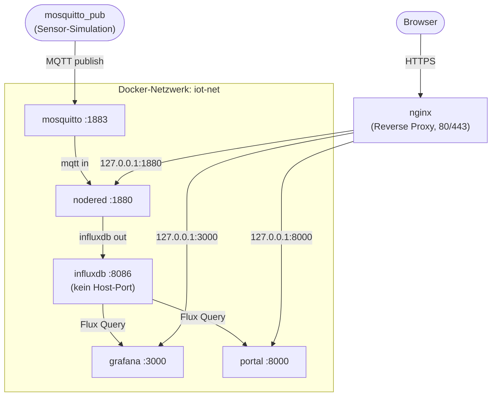

# Lab 09: Multi-Container-Anwendungen mit Docker Compose verwalten


## Berufliche Aufgabenstellung

Die Zertifizierung nach ISO/IEC 27001 rückt näher: Im Rahmen der Stufe-1-Auditierung (Dokumentationsprüfung) verlangt der Auditor einen Nachweis über die **dokumentierte Betriebs- und Netzarchitektur** der Container-Dienste. Das Ergebnis der Prüfung fällt gemischt aus: Die Dienste wurden bislang mit einzelnen, händisch eingetippten `docker run`-Befehlen aufgebaut – der tatsächliche Zustand der Umgebung „lebt" in der Shell-History und im Gedächtnis des Betriebsteams, nirgendwo sonst. Für Control **A.5.37 (Documented Operating Procedures)** verlangt der Auditor eine **schriftliche, versionierbare Beschreibung** des Betriebs; für Control **A.8.22 (Segregation of Networks)**, das in Lab 07 bereits am Beispiel eines einzelnen Containers demonstriert wurde, verlangt er nun den Nachweis im **produktiven Maßstab**.

Zeitgleich liefert die Fachabteilung die in Lab 08 angekündigte Anforderung aus: Das Messdaten-Portal soll nun tatsächlich mit Daten arbeiten. Die komplette Pipeline soll entstehen – ein MQTT-Broker nimmt Sensordaten entgegen, Node-RED sammelt und leitet sie weiter, InfluxDB speichert sie, Grafana visualisiert sie, und das eigene Portal aus Lab 08 macht die aktuellen Werte zugänglich. Genau das Muster, das in Lab 07 als „Vorgriff" angekündigt wurde: mehrere zusammenspielende Dienste in einem eigenen Netzwerksegment, von denen nur die Visualisierung nach außen sichtbar sein muss.

Das Betriebsteam entscheidet sich, diese Anforderung nicht mit weiteren einzelnen `docker run`-Befehlen umzusetzen, sondern mit **Docker Compose**: Der gesamte Stack wird in einer einzigen, lesbaren Datei deklariert – die Datei selbst wird zum Audit-Nachweis. Zugangsdaten und Token werden dabei zentral und mit eingeschränkten Dateirechten in einer `.env`-Datei geführt, wie es Control **A.5.17 (Authentication Information)** verlangt.

---

## Einführung

Bisher haben Sie jeden Container-Dienst mit einem eigenen, oft mehrzeiligen `docker run`-Befehl gestartet – nachzuschlagen allenfalls in Ihrer Shell-History. In diesem Lab lernen Sie mit **Docker Compose** den Wechsel von der imperativen zur deklarativen Arbeitsweise: Sie beschreiben in einer `compose.yaml`, welche Dienste es geben soll, wie sie vernetzt sind und welche Daten sie dauerhaft speichern – und Docker Compose sorgt dafür, dass dieser Zielzustand hergestellt wird. Als durchgehendes Beispiel bauen Sie eine kleine, aber vollständige IoT-Datenpipeline: **Mosquitto** (MQTT-Broker) nimmt Sensordaten entgegen, **Node-RED** leitet sie weiter, **InfluxDB** speichert sie, **Grafana** visualisiert sie, und Ihr **Portal** aus Lab 08 zeigt die aktuellen Werte im Browser. Dabei migrieren Sie auch den bestehenden Node-RED-Container aus Lab 05 verlustfrei in den neuen Stack – die beste Gelegenheit, den Unterschied zwischen einem von Compose verwalteten und einem extern angelegten Volume in der Praxis zu erleben.

## Lernziele

- `docker-compose-plugin` installieren und `docker compose` als CLI-Subcommand nutzen
- Den Aufbau einer `compose.yaml` verstehen: `services`, `networks`, `volumes`, `ports`, `environment`, `depends_on`, `restart`
- Einen bestehenden, imperativ erzeugten Container verlustfrei in einen Compose-Stack migrieren (`external`-Volume)
- Geheimnisse über eine `.env`-Datei und Variablen-Substitution aus der Compose-Datei heraushalten
- `docker compose up/down/ps/logs/exec/config` sicher im Alltag anwenden
- Ein selbst gebautes Image (aus Lab 08) über die `build:`-Direktive in einen Compose-Stack integrieren
- Eine MQTT → Node-RED → InfluxDB → Grafana/Portal-Pipeline aufbauen und Ende-zu-Ende testen
- Die deklarative Datei als auditierbare Umsetzung der Controls A.5.37 und A.8.22 einordnen

## Voraussetzungen

| Anforderung | Details |
|---|---|
| **Server** | Debian stable (aktuell Trixie), öffentliche IPv4-Adresse (aus Lab 03) |
| **nginx** | Mit ACME-Modul als Reverse Proxy aktiv (aus Lab 06) |
| **Docker** | Installiert (aus Lab 05), inklusive Buildx-Plugin (aus Lab 08) |
| **Node-RED** | Container `nodered` mit Volume `nodered-data` und aktivierter `adminAuth` (aus Lab 05), `dashboard`-vhost (aus Lab 06) |
| **Portal** | Verzeichnis `/srv/portal` (Dockerfile, `app.py`, `requirements.txt`, `.dockerignore`) und `<TOKEN>` (aus Lab 08) |
| **DNS** | Bestehende A-Records, zusätzlich neue A-Records `grafana.<IHRE-DOMAIN>` und `portal.<IHRE-DOMAIN>` |
| **SSH-Zugriff** | Key-Authentifizierung |

> **Tipp zur Fehlerbehebung:** Falls Sie die Aufräumarbeiten aus Lab 05 vollständig ausgeführt haben (Volume `nodered-data` gelöscht), richten Sie den Node-RED-Container einmalig gemäß Lab 05, Schritt 4.2/4.5 neu ein, bevor Sie mit diesem Lab fortfahren.

---

## Inhalt

- [Hintergrundwissen](#hintergrundwissen)
  - [Imperativ vs. deklarativ](#imperativ-vs-deklarativ)
  - [Anatomie einer compose.yaml](#anatomie-einer-composeyaml)
  - [.env und Variablen-Substitution](#env-und-variablen-substitution)
  - [MQTT in Kürze](#mqtt-in-kürze)
  - [Die Ziel-Architektur im Überblick](#die-ziel-architektur-im-überblick)
  - [Compose, Swarm, Kubernetes](#compose-swarm-kubernetes)
  - [depends_on regelt Reihenfolge, nicht Bereitschaft](#depends_on-regelt-reihenfolge-nicht-bereitschaft)
- [Aufgaben](#aufgaben)
  - [Schritt 1: Compose-Plugin installieren](#schritt-1-compose-plugin-installieren)
  - [Schritt 2: Projekt anlegen, erster Dienst: Mosquitto](#schritt-2-projekt-anlegen-erster-dienst-mosquitto)
  - [Schritt 3: InfluxDB und die .env-Datei](#schritt-3-influxdb-und-die-env-datei)
  - [Schritt 4: Node-RED migrieren und Flow bauen](#schritt-4-node-red-migrieren-und-flow-bauen)
  - [Schritt 5: Grafana einrichten und veröffentlichen](#schritt-5-grafana-einrichten-und-veröffentlichen)
  - [Schritt 6: Portal per build: integrieren](#schritt-6-portal-per-build-integrieren)
  - [Schritt 7: Betrieb und Audit-Nachweis](#schritt-7-betrieb-und-audit-nachweis)
- [Reflexion und weiterführende Fragen](#reflexion-und-weiterführende-fragen)
- [Rückblick und Zusammenfassung](#rückblick-und-zusammenfassung)
- [Aufräumarbeiten](#aufräumarbeiten)
- [Autoren und Urheberrecht](#autoren-und-urheberrecht)

---

## Hintergrundwissen

### Imperativ vs. deklarativ

Ein `docker run`-Befehl mit einem Dutzend Flags ist **imperativ**: Er beschreibt eine Abfolge von Schritten, die einmal ausgeführt werden. Ob und wie diese Schritte später rekonstruiert werden können, hängt davon ab, ob jemand sie sich notiert hat. Eine `compose.yaml` ist **deklarativ**: Sie beschreibt den gewünschten Zielzustand – „diese Dienste, in diesem Netz, mit diesen Volumes" – und Docker Compose vergleicht diesen Zielzustand bei jedem `docker compose up` mit der Realität und gleicht ab. Die Datei selbst wird damit zur Dokumentation: Genau das, was Control A.5.37 verlangt.

### Anatomie einer compose.yaml

Die wichtigsten Top-Level-Schlüssel:

| Schlüssel | Bedeutung |
|---|---|
| `services:` | Die einzelnen Container-Dienste, je einer als Unterschlüssel |
| `networks:` | Selbst definierte Netzwerke (analog zu `docker network create` aus Lab 06) |
| `volumes:` | Benannte Volumes, die von Compose verwaltet – oder als `external: true` nur referenziert – werden |

Ein Hinweis zu älteren Beispielen im Internet: Viele zeigen noch einen Schlüssel `version: "3.8"` am Dateianfang. Dieser ist inzwischen **obsolet** und wird von aktuellem Docker Compose ignoriert – in diesem Lab lassen Sie ihn bewusst weg.

Der **Projektname** eines Compose-Stacks entspricht standardmäßig dem Namen des Verzeichnisses, in dem die `compose.yaml` liegt. Legen Sie den Stack z. B. unter `/srv/iot/` an, erhalten die Container automatisch Namen wie `iot-mosquitto-1`, `iot-nodered-1` – nicht mehr die von Ihnen frei gewählten Namen aus `docker run --name`. Für den Zugriff verwenden Sie deshalb ab jetzt in aller Regel `docker compose exec <servicename>` statt `docker exec <containername>`.

### .env und Variablen-Substitution

Eine `.env`-Datei im selben Verzeichnis wie die `compose.yaml` wird automatisch eingelesen. Innerhalb der `compose.yaml` setzen Sie mit `${VARIABLENNAME}` an die Stelle, an der der Wert eingesetzt werden soll – die Zugangsdaten selbst tauchen in der Compose-Datei nirgends im Klartext auf. Wie schon bei der `.dockerignore` in Lab 07 gilt: Diese Datei gehört niemals in ein Repository und sollte restriktive Dateirechte haben (`chmod 600`).

### MQTT in Kürze

MQTT ist ein schlankes **Publish/Subscribe-Protokoll**: Ein zentraler **Broker** nimmt Nachrichten entgegen, die unter einem **Topic** (einem hierarchischen Namen wie `sensoren/raum1`) veröffentlicht werden, und leitet sie an alle Teilnehmer weiter, die genau dieses Topic abonniert haben. Sensoren müssen dabei nichts über die Empfänger ihrer Daten wissen – sie veröffentlichen nur unter einem Topic; wer die Daten weiterverarbeitet (hier: Node-RED), entscheidet sich unabhängig davon, was es abonniert. Genau diese Entkopplung macht MQTT für Sensordaten so verbreitet.

### Die Ziel-Architektur im Überblick

Bevor Sie den Stack Schritt für Schritt aufbauen, hier das Zielbild: Alle fünf Dienste leben gemeinsam im Netzwerk `iot-net`. Innerhalb dieses Netzwerks kommunizieren sie über ihre Servicenamen (Docker-DNS, wie in Lab 06 gelernt) – nach außen sichtbar wird davon nur, was nginx explizit als vhost veröffentlicht:



`mosquitto` und `influxdb` haben bewusst keinen nginx-vhost – sie sind ausschließlich innerhalb von `iot-net` erreichbar, exakt das Muster aus Lab 06, Schritt 7, jetzt im produktiven Maßstab.

### Compose, Swarm, Kubernetes

Docker Compose orchestriert Dienste auf **einem** Host – für dieses Lab genau richtig. Sollen Dienste über mehrere Hosts verteilt, automatisch skaliert oder bei Ausfall eines Hosts automatisch verlagert werden, kommen Werkzeuge wie **Docker Swarm** oder **Kubernetes** zum Einsatz – beide deutlich komplexer und Gegenstand vertiefender Kurse, nicht dieses Labs.

### depends_on regelt Reihenfolge, nicht Bereitschaft

`depends_on` sorgt dafür, dass ein Dienst erst **gestartet** wird, nachdem ein anderer gestartet wurde – es prüft aber nicht, ob dieser andere Dienst bereits **betriebsbereit** ist. InfluxDB kann also durchaus schon laufen, aber sein Setup-Prozess noch nicht abgeschlossen haben, während Node-RED bereits Verbindungsversuche startet. In diesem Lab genügt das (Node-RED versucht es einfach erneut); ein produktives System würde zusätzlich mit `healthcheck:` und `condition: service_healthy` arbeiten – ein Ausblick, den eine der Reflexionsfragen aufgreift.

[↑ Zum Inhaltsverzeichnis](#inhalt)

---

## Aufgaben

### Schritt 1: Compose-Plugin installieren

Das Docker-Repository ist seit Lab 05 eingebunden:

```bash
apt update
apt install -y docker-compose-plugin
docker compose version
```

> **`docker-compose` vs. `docker compose`**  
> Docker Compose v1 war ein eigenständiges Programm mit Bindestrich (`docker-compose`). Seit Version 2 ist Compose ein Subcommand der Docker-CLI ohne Bindestrich (`docker compose`) – für Linux Mint wurde diese Unterscheidung bereits in `Lab_Docker_Rootless.md` behandelt, hier auf dem Server gilt dasselbe.

[↑ Zum Inhaltsverzeichnis](#inhalt)

---

### Schritt 2: Projekt anlegen, erster Dienst: Mosquitto

Legen Sie das Projektverzeichnis an – der Name des Verzeichnisses (`iot`) wird gleich der Projektname des Compose-Stacks:

```bash
mkdir -p /srv/iot/mosquitto
cd /srv/iot
nano mosquitto/mosquitto.conf
```

```ini
listener 1883
allow_anonymous true
persistence false
```

> **⚠️ Wichtig:** Das offizielle Mosquitto-2.x-Image verweigert ohne eigene Konfigurationsdatei jede Verbindung außer von `localhost` innerhalb des Containers – die klassische Stolperfalle beim ersten Kontakt mit Mosquitto. Mit dieser Konfiguration lauscht der Broker auf Port 1883 und lässt Verbindungen ohne Login zu. `allow_anonymous true` ist hier vertretbar, weil der Broker ausschließlich im internen Netz `iot-net` sowie lokal auf `127.0.0.1` erreichbar ist – eine der Reflexionsfragen greift auf, wie sich das für einen von außen erreichbaren Broker ändern müsste.

```bash
nano compose.yaml
```

```yaml
services:
  mosquitto:
    image: eclipse-mosquitto:2
    restart: unless-stopped
    ports:
      - "127.0.0.1:1883:1883"     # nur lokal: fuer mosquitto_pub-Tests vom Host
    volumes:
      - ./mosquitto/mosquitto.conf:/mosquitto/config/mosquitto.conf:ro
    networks:
      - iot-net

networks:
  iot-net:
```

| Zeile | Bedeutung |
|---|---|
| `image: eclipse-mosquitto:2` | Offizielles Mosquitto-Image, Hauptversion 2 |
| `restart: unless-stopped` | Das Compose-Pendant zum `--restart`-Flag aus Lab 05 |
| `ports:` | Genau wie `-p` bei `docker run`: `Host:Container` – hier nur lokal gebunden |
| `volumes:` (Bind Mount) | Ihre Konfigurationsdatei wird als Datei in den Container gemountet, `:ro` = read-only |
| `networks:` | Der Dienst wird Mitglied des unten definierten Netzwerks `iot-net` |
| `networks: iot-net:` (Top-Level) | Legt das benutzerdefinierte Netzwerk an – das Pendant zu `docker network create app-net` aus Lab 06 |

Starten Sie den Stack und prüfen Sie das Ergebnis:

```bash
docker compose up -d
docker compose ps
```

Testen Sie den Broker mit einem lokal installierten MQTT-Client:

```bash
apt install -y mosquitto-clients
```

Damit installieren Sie die Programme (Befehle) `mosquitto_sub` und `mosquitto_pub`.

Mit `mosquitto_sub -h 127.0.0.1 -t 'sensoren/#' &` abonnieren Sie alles Nachrichten vom Host 127.0.0.1, deren Topic mit `sensoren/` beginnt. Das Programm läuft im Hintergrund und gibt die Nachrichten in Ihrem Terminal aus.

Mit `mosquitto_pub -h 127.0.0.1 -t sensoren/raum1 -m '{"temp": 21.5}'` schicken Sie die Nachricht `{"temp": 21.5}` mit dem Topic `sensoren/raum1` an den Message Broker unter der IP-Adresse 127.0.0.1.

Mit `kill %1` stoppen Sie das `mosquitto_sub`-Programm von gerade eben.

> **Was passiert hier?**  
> `mosquitto_sub` abonniert im Hintergrund (`&`) das Topic-Muster `sensoren/#` (die Raute steht für „alle Unter-Topics"), `mosquitto_pub` veröffentlicht eine einzelne Nachricht unter `sensoren/raum1`. Erscheint die Nachricht in der Konsole, funktioniert der Broker. `kill %1` beendet den zuletzt im Hintergrund gestarteten Prozess wieder.

[↑ Zum Inhaltsverzeichnis](#inhalt)

---

### Schritt 3: InfluxDB und die .env-Datei

Legen Sie zunächst die zentrale Konfigurationsdatei für Geheimnisse an:

```bash
nano .env
```

```ini
INFLUX_PASSWORD=<SICHERES-PASSWORT>
INFLUX_TOKEN=<TOKEN-AUS-LAB-07>
GRAFANA_ADMIN_PASSWORD=<SICHERES-PASSWORT>
```

```bash
chmod 600 .env
```

> **⚠️ Wichtig:** Verwenden Sie für `INFLUX_TOKEN` exakt das Token, das Sie sich in Lab 07, Schritt 4.1 notiert haben – Ihr Portal-Image erwartet dieses Token, um sich später bei InfluxDB anzumelden. `chmod 600` beschränkt die Lese- und Schreibrechte auf den Eigentümer der Datei – die technische Umsetzung von Control A.5.17.

Ergänzen Sie die `compose.yaml` um InfluxDB:

```bash
nano compose.yaml
```

Die neue Datei sollte so aussehen:

```yaml
services:
  mosquitto:
    image: eclipse-mosquitto:2
    restart: unless-stopped
    ports:
      - "127.0.0.1:1883:1883"     # nur lokal: fuer mosquitto_pub-Tests vom Host
    volumes:
      - ./mosquitto/mosquitto.conf:/mosquitto/config/mosquitto.conf:ro
    networks:
      - iot-net

  influxdb:
    image: influxdb:2
    restart: unless-stopped
    environment:
      DOCKER_INFLUXDB_INIT_MODE: setup
      DOCKER_INFLUXDB_INIT_USERNAME: admin
      DOCKER_INFLUXDB_INIT_PASSWORD: ${INFLUX_PASSWORD}
      DOCKER_INFLUXDB_INIT_ORG: alp
      DOCKER_INFLUXDB_INIT_BUCKET: iot
      DOCKER_INFLUXDB_INIT_ADMIN_TOKEN: ${INFLUX_TOKEN}
    volumes:
      - influxdb-data:/var/lib/influxdb2
      - influxdb-config:/etc/influxdb2
    networks:
      - iot-net

networks:
  iot-net:

volumes:
  influxdb-data:
  influxdb-config:
```


Prüfen Sie zunächst, wie Compose Ihre Datei mit eingesetzten `.env`-Werten tatsächlich interpretiert, bevor Sie etwas starten:

```bash
docker compose config
```

Starten Sie anschließend nur den neu hinzugekommenen Dienst:

```bash
docker compose up -d
docker compose logs influxdb
docker compose exec influxdb influx ping
```

> **Was passiert hier?**  
> `docker compose up -d` erstellt ausschließlich Dienste, die neu sind oder sich geändert haben – `mosquitto` bleibt unangetastet, weil sich an seiner Definition nichts geändert hat. `docker compose config` ist Ihr Freund bei jeder Unsicherheit: Es zeigt die vollständig aufgelöste Konfiguration, inklusive der eingesetzten `${...}`-Werte, ohne etwas zu verändern.

Beachten Sie: Für InfluxDB gibt es bewusst **keinen** `ports:`-Eintrag.

```bash
ss -tlnp | grep 8086
```

Die Ausgabe ist leer – dasselbe Muster wie bei `redis-cache` in Lab 06, Schritt 7.6, diesmal aber produktiv eingesetzt: InfluxDB muss ausschließlich für andere Container in `iot-net` erreichbar sein, nicht für den Host oder das Internet.

> **Hinweis:** Die `DOCKER_INFLUXDB_INIT_*`-Umgebungsvariablen wirken nur beim allerersten Start auf einem leeren Volume. Führen Sie später versehentlich `docker compose down -v` aus und starten neu, beginnt die Einrichtung von vorn.

[↑ Zum Inhaltsverzeichnis](#inhalt)

---

### Schritt 4: Node-RED migrieren und Flow bauen

Der bestehende Node-RED-Container aus Lab 05 soll Teil des Stacks werden – ohne dass seine gespeicherten Flows verloren gehen.

```bash
docker stop nodered && docker rm nodered
docker volume ls    # nodered-data ist weiterhin vorhanden
```

> **Was passiert hier?**  
> `docker rm` löscht nur den **Container** – das benannte Volume `nodered-data` bleibt unabhängig davon bestehen, exakt wie in Lab 05 (Schritt 4.4) besprochen: Volumes sind vom Lebenszyklus einzelner Container entkoppelt. Genau das machen Sie sich jetzt zunutze.

Ergänzen Sie die `compose.yaml`:

```yaml
  nodered:
    image: nodered/node-red
    restart: unless-stopped
    ports:
      - "127.0.0.1:1880:1880"   # unveraendert: dashboard-vhost aus Lab 06 funktioniert weiter
    volumes:
      - nodered-data:/data
    networks:
      - iot-net
    depends_on:
      - mosquitto
      - influxdb
```

Ergänzen Sie im Top-Level-`volumes:`-Block:

```yaml
volumes:
  influxdb-data:
  influxdb-config:
  nodered-data:
    external: true      # von Docker Compose NICHT verwaltet - existiert bereits aus Lab 05
```

> **⚠️ Wichtig:** `external: true` weist Compose an, das Volume **nicht selbst anzulegen**, sondern ein bereits bestehendes gleichen Namens zu verwenden. Ohne diesen Zusatz würde Compose versuchen, ein neues, leeres Volume namens `iot_nodered-data` anzulegen – und Ihre bisherigen Node-RED-Flows wären scheinbar verschwunden.

```bash
docker compose up -d
```

Rufen Sie `https://dashboard.<IHRE-DOMAIN>` auf: Der Login-Bildschirm der `adminAuth` aus Lab 05 erscheint unverändert – der beste Beweis, dass die Migration die gespeicherten Daten unangetastet gelassen hat.

**Flow einrichten** (Text-Anleitung, da keine Screenshots vorliegen):

1. Melden Sie sich im Node-RED-Editor an. Öffnen Sie über das Menü (☰-Symbol oben rechts) „Palette verwalten", wechseln Sie zum Reiter „Installieren", suchen Sie nach `node-red-contrib-influxdb` und klicken Sie auf „Installieren".
2. Ziehen Sie aus der Palette (Kategorie „network"/„Netzwerk") einen **mqtt in**-Node auf die Arbeitsfläche.
   - Öffnen Sie ihn per Doppelklick und legen Sie über das +-Symbol neben „Server“ einen neuen Broker an:
   - Name und Server beide `mosquitto` nennen, Port `1883` – der Containername `mosquitto` funktioniert hier als Hostname, weil Node-RED und Mosquitto Mitglieder desselben Docker-Netzwerks `iot-net` sind (Docker-DNS, wie in Lab 06, Schritt 7.4 erklärt). Speichern Sie den Broker.
   - Es erscheinen „Eigenschaften“. Tragen Sie das Topic `sensoren/raum1` ein, QoS `1`, Ausgabe „Ein analysiertes (parsed) JSON-Objekt“.
   - Mit „Fertig" bzw. „Done" übernehmen.
4. Ziehen Sie aus der Kategorie „storage" einen **influxdb out**-Node auf die Arbeitsfläche. Legen Sie über das Stift-Symbol einen neuen Server an: Version `2.0`, URL `http://influxdb:8086`, Token `<TOKEN-AUS-LAB-07>`. Tragen Sie im Node selbst Organisation `alp`, Bucket `iot` und Measurement `umwelt` ein.
5. Ziehen Sie zusätzlich einen **debug**-Node auf die Arbeitsfläche (Kategorie „common").
6. Verbinden Sie den Ausgang des mqtt-in-Nodes sowohl mit dem influxdb-out-Node als auch mit dem debug-Node. Klicken Sie auf „Deploy" (rot, oben rechts). Der mqtt-in-Node sollte darunter „connected" anzeigen.

Testen Sie die Pipeline Ende-zu-Ende:

```bash
for t in 20.8 21.2 21.5 21.9 22.3; do
  mosquitto_pub -h 127.0.0.1 -t sensoren/raum1 -m "{\"temp\": $t}"
  sleep 2
done
```

Im Debug-Fenster von Node-RED (Käfer-Symbol, rechte Seitenleiste) erscheinen die fünf geparsten JSON-Objekte. Prüfen Sie anschließend, ob die Werte tatsächlich in InfluxDB angekommen sind:

```bash
docker compose exec influxdb influx query --org alp --token "<TOKEN-AUS-LAB-07>" \
  'from(bucket:"iot") |> range(start: -15m)'
```

Jetzt müsste man mindestens 5 Zeilen mit Zeitstempeln, den Temperaturen aus der `for`-Schleife (oben) und weiteren Daten im Terminal sehen.

> **Was passiert hier?**  
> Der mqtt-in-Node liefert das Payload-JSON `{"temp": 21.5}` bereits als geparstes Objekt; der influxdb-out-Node übernimmt dessen Eigenschaften 1:1 als Fields – daraus entsteht im Measurement `umwelt` das Field `temp`, genau der Name, den Ihr Portal (Lab 07) und Grafana (Schritt 5) abfragen.

[↑ Zum Inhaltsverzeichnis](#inhalt)

---

### Schritt 5: Grafana einrichten und veröffentlichen

Ergänzen Sie die `compose.yaml`:

```yaml
  grafana:
    image: grafana/grafana-oss
    restart: unless-stopped
    ports:
      - "127.0.0.1:3000:3000"
    environment:
      GF_SECURITY_ADMIN_USER: admin
      GF_SECURITY_ADMIN_PASSWORD: ${GRAFANA_ADMIN_PASSWORD}
      GF_SERVER_ROOT_URL: https://grafana.<IHRE-DOMAIN>
    volumes:
      - grafana-data:/var/lib/grafana
    networks:
      - iot-net
    depends_on:
      - influxdb
```

Top-Level-`volumes:` ergänzen:

```yaml
  grafana-data:
```

```bash
docker compose up -d
```

> **Was passiert hier?**  
> `GF_SERVER_ROOT_URL` teilt Grafana die öffentlich sichtbare Adresse mit, unter der es über den Reverse Proxy erreichbar sein wird. Ohne diese Angabe erzeugt Grafana intern Links und Redirects, die auf `localhost:3000` zeigen – hinter einem Reverse Proxy führt das zu fehlerhaften Weiterleitungen.

Prüfen Sie den DNS-Eintrag (Wildcard aus Lab 06):

```bash
dig grafana.<IHRE-DOMAIN> +short
```

Legen Sie den nginx-vhost an:

```bash
nano /etc/nginx/conf.d/grafana.conf
```

```nginx
server {
    listen 80;
    listen 443 ssl;
    server_name grafana.<IHRE-DOMAIN>;

    acme_certificate letsencrypt;
    ssl_certificate $acme_certificate;
    ssl_certificate_key $acme_certificate_key;
    ssl_certificate_cache max=2;

    location / {
        proxy_pass http://127.0.0.1:3000;
        proxy_set_header Host $host;
        proxy_set_header X-Real-IP $remote_addr;
        proxy_http_version 1.1;
        proxy_set_header Upgrade $http_upgrade;
        proxy_set_header Connection "upgrade";
    }
}
```

```bash
nginx -t
systemctl reload nginx
```

Rufen Sie `https://grafana.<IHRE-DOMAIN>` auf und melden Sie sich mit `admin` und dem Passwort aus Ihrer `.env`-Datei an. Richten Sie die Datenquelle ein: „Connections" → „Data sources" → „Add data source" → **InfluxDB** auswählen, Query Language **Flux**, URL `http://influxdb:8086`, Organization `alp`, Token aus Ihrer `.env`, Default Bucket `iot` → „Save & test".

Legen Sie ein einfaches Dashboard an: „Dashboards" → „New" → „Add visualization" → die zuvor angelegte Datenquelle wählen, als Query:

```
from(bucket: "iot")
  |> range(start: v.timeRangeStart, stop: v.timeRangeStop)
  |> filter(fn: (r) => r._measurement == "umwelt")
```

Speichern Sie das Dashboard. Senden Sie parallel mit `mosquitto_pub` weitere Werte und beobachten Sie, wie die Kurve nach einem Refresh aktualisiert wird.

[↑ Zum Inhaltsverzeichnis](#inhalt)

---

### Schritt 6: Portal per build: integrieren

Bisher haben alle Dienste ein fertiges `image:` referenziert. Für Ihr eigenes Portal aus Lab 07 verwenden Sie stattdessen die **`build:`-Direktive** – Compose baut das Image dann selbst aus dem Dockerfile.

Verschieben Sie das Portal-Projekt in den Stack:

```bash
mv /srv/portal /srv/iot/portal
```

> **Was passiert hier?**  
> Damit liegt der gesamte Stack – Konfiguration, Geheimnisse und der Bauplan des eigenen Dienstes – unter einem gemeinsamen Wurzelverzeichnis `/srv/iot/`. Ein einziger Ordner beschreibt damit vollständig, was auditiert werden muss.

Ergänzen Sie die `compose.yaml`:

```yaml
  portal:
    build: ./portal              # statt image: - Compose baut aus dem Dockerfile von Lab 07
    restart: unless-stopped
    ports:
      - "127.0.0.1:8000:8000"
    environment:
      INFLUX_TOKEN: ${INFLUX_TOKEN}
    networks:
      - iot-net
    depends_on:
      - influxdb
```

> **Was passiert hier?**  
> `INFLUX_URL`, `INFLUX_ORG` und `INFLUX_BUCKET` kommen unverändert aus den `ENV`-Vorgabewerten des Images (Lab 07, Schritt 5.2: `http://influxdb:8086`, `alp`, `iot`) – diese Werte passen exakt zu diesem Stack, ohne dass Sie sie hier wiederholen müssten. Ausschließlich das Geheimnis `INFLUX_TOKEN` wird zur Laufzeit aus der `.env`-Datei injiziert.

```bash
docker compose up -d --build
docker compose ps
curl http://localhost:8000
```

Die Tabelle zeigt jetzt die echten, per MQTT eingespeisten Messwerte.

> **`up -d` vs. `up -d --build`**  
> `docker compose up -d` startet Dienste und baut dabei nur Images, die noch **gar nicht** existieren. Ändern Sie später den Anwendungscode in `portal/app.py`, müssen Sie explizit `--build` angeben, damit Compose das Image neu baut – sonst läuft unverändert die alte Version weiter.

Legen Sie den vhost für das Portal an:

```bash
nano /etc/nginx/conf.d/portal.conf
```

```nginx
server {
    listen 443 ssl;
    server_name portal.<IHRE-DOMAIN>;

    acme_certificate letsencrypt;
    ssl_certificate $acme_certificate;
    ssl_certificate_key $acme_certificate_key;
    ssl_certificate_cache max=2;

    location / {
        proxy_pass http://127.0.0.1:8000;
        proxy_set_header Host $host;
        proxy_set_header X-Real-IP $remote_addr;
    }
}
```

```bash
nginx -t
systemctl reload nginx
```

**Ende-zu-Ende-Probe:** Senden Sie einen weiteren Messwert per `mosquitto_pub` und rufen Sie anschließend sowohl `https://portal.<IHRE-DOMAIN>` als auch `https://grafana.<IHRE-DOMAIN>` im Browser auf – beide zeigen dieselbe zugrundeliegende Datenquelle aus zwei unterschiedlichen Blickwinkeln.

[↑ Zum Inhaltsverzeichnis](#inhalt)

---

### Schritt 7: Betrieb und Audit-Nachweis

Verschaffen Sie sich einen Überblick über den laufenden Stack:

```bash
docker compose ps
docker compose logs -f nodered      # mit Strg+C beenden
docker compose exec influxdb influx ping
```

Prüfen Sie, dass Daten einen Neustart des Stacks überleben:

```bash
docker compose down
docker compose up -d
docker compose exec influxdb influx query --org alp --token "<TOKEN-AUS-LAB-07>" \
  'from(bucket:"iot") |> range(start: -1h)'
```

Die zuvor gesendeten Messwerte sind weiterhin vorhanden – `docker compose down` entfernt nur Container und Netzwerk, niemals automatisch die Volumes.

Verschaffen Sie sich abschließend einen Gesamtüberblick über die Port-Situation:

```bash
ss -tlnp
```

| Port | Zuständigkeit | Öffentlich erreichbar? |
|---|---|---|
| 22 | SSH | Ja |
| 80 / 443 | nginx (Reverse Proxy) | Ja |
| 127.0.0.1:1880 | Node-RED (Editor + Dashboard) | Nein – nur über nginx-vhost |
| 127.0.0.1:1883 | Mosquitto (nur für lokale Tests) | Nein |
| 127.0.0.1:3000 | Grafana | Nein – nur über nginx-vhost |
| 127.0.0.1:8000 | Portal | Nein – nur über nginx-vhost |
| 8086 (InfluxDB) | – | **Gar kein Host-Port** |

> **Der Audit-Nachweis:** Diese Tabelle, die `compose.yaml` selbst und die restriktiven Rechte der `.env`-Datei (`ls -l .env` → `-rw-------`) sind zusammen genau das, was der Auditor in der Aufgabenstellung gefordert hat: eine dokumentierte, nachvollziehbare Netzsegmentierung (A.8.22) in einer versionierbaren Datei (A.5.37), mit sauber getrennter Verwaltung der Zugangsdaten (A.5.17).

[↑ Zum Inhaltsverzeichnis](#inhalt)

---

## Reflexion und weiterführende Fragen

**Zur ISO-27001-Vorbereitung:**

- Was genau sieht ein Auditor in `compose.yaml`, das er in der Shell-History niemals sehen würde?
- Welche der drei Controls (A.5.37, A.8.22, A.5.17) betrifft die `.env`-Datei am unmittelbarsten – und warum reicht `chmod 600` allein nicht als vollständige Antwort für ein Audit?

**Zur Migration und zu Volumes:**

- Warum bleibt `nodered-data` dauerhaft `external: true`, während `influxdb-data` und `grafana-data` von Compose selbst verwaltet werden? Was wäre der Nachteil, `nodered-data` ebenfalls als „normales" Compose-Volume anzulegen?
- Was wäre passiert, wenn Sie den `nodered`-Container gelöscht hätten, **bevor** Sie sich vergewissert hätten, dass das Volume noch existiert?

**Zu Betrieb und Robustheit:**

- `depends_on` garantiert nur die Startreihenfolge, nicht die Bereitschaft. Was könnte beim Kaltstart des gesamten Stacks schiefgehen, wenn Node-RED vor InfluxDB fertig ist – und wie würde ein `healthcheck:` mit `condition: service_healthy` das lösen?
- `allow_anonymous true` beim MQTT-Broker ist hier vertretbar. Was würde sich ändern, wenn dieser Broker zusätzlich über das Internet erreichbar sein müsste – welchen nächsten Härtungsschritt würden Sie vorschlagen (Stichwort `password_file`)?
- Das Portal-Token in der `.env`-Datei ist ein Admin-Token mit vollen Rechten auf InfluxDB. Welches Least-Privilege-Prinzip würde ein produktives System stattdessen umsetzen?

**Zum Vorgriff aus Lab 06:**

- Lab 06 hatte eine Zeitreihen-Datenbank, einen Connector und eine Visualisierung in einem eigenen Netz angekündigt, mit nur der Visualisierung nach außen. Ist dieses Versprechen eingelöst – wo gibt es Abweichungen (z. B. das Portal als zusätzlicher, zweiter exponierter Dienst)?
- Was würde fehlen, um diesen Stack auf mehrere Server zu verteilen? Was ändert sich dabei konzeptionell?

---

## Rückblick und Zusammenfassung

### Was Sie erreicht haben

- Das Compose-Plugin installiert und `docker compose` als deklaratives Werkzeug eingesetzt
- Eine `compose.yaml` von einem einzelnen Dienst (Mosquitto) bis zu einem vollständigen Fünf-Dienste-Stack ausgebaut
- Zugangsdaten konsequent über eine rechteeingeschränkte `.env`-Datei und Variablen-Substitution verwaltet
- Den bestehenden Node-RED-Container aus Lab 05 verlustfrei migriert, inklusive Umgang mit einem `external`-Volume
- Einen MQTT-Broker, einen Node-RED-Flow, InfluxDB und Grafana zu einer funktionierenden IoT-Pipeline verbunden
- Das eigene Portal-Image aus Lab 07 über die `build:`-Direktive in den Stack integriert
- Zwei Dienste (Grafana, Portal) gezielt über nginx veröffentlicht, alle anderen bewusst intern gehalten
- Die Netzsegmentierung und Dokumentation den ISO-27001-Controls A.5.37, A.8.22 und A.5.17 zugeordnet

### Zentrale Befehle dieser Übung

| Befehl | Bedeutung |
|---|---|
| `docker compose up -d [--build]` | Stack (im Hintergrund) starten, optional mit Neubau eigener Images |
| `docker compose down [-v]` | Container und Netzwerk stoppen und entfernen, optional inkl. Volumes |
| `docker compose ps` | Status aller Dienste des Stacks anzeigen |
| `docker compose logs [-f] <service>` | Logs eines Dienstes anzeigen, optional fortlaufend |
| `docker compose exec <service> <befehl>` | Befehl in einem laufenden Dienst-Container ausführen |
| `docker compose config` | Vollständig aufgelöste Konfiguration (inkl. `.env`-Werte) anzeigen |
| `docker compose version` | Installierte Compose-Version prüfen |
| `mosquitto_pub` / `mosquitto_sub` | MQTT-Nachrichten veröffentlichen bzw. abonnieren |

---

## Aufräumarbeiten

Dieser Stack ist das Arbeitsergebnis des Labs – es empfiehlt sich, ihn **weiterlaufen zu lassen**. Falls ein vollständiger Rückbau gewünscht ist:

```bash
cd /srv/iot
docker compose down            # Container + Netzwerk iot-net entfernen
docker compose down -v         # zusaetzlich: influxdb-/grafana-Volumes entfernen (nodered-data bleibt: external!)
rm /etc/nginx/conf.d/grafana.conf /etc/nginx/conf.d/portal.conf
nginx -t
systemctl reload nginx
rm -rf /srv/iot
apt remove -y mosquitto-clients
```

> **Hinweis:** `docker compose down -v` entfernt niemals als `external: true` deklarierte Volumes – `nodered-data` bleibt in jedem Fall erhalten, sofern Sie es nicht ausdrücklich mit `docker volume rm nodered-data` löschen.

[↑ Zum Inhaltsverzeichnis](#inhalt)

## Autoren und Urheberrecht

- Erstellt von: Michael Lotter, Florian Reichl
- Datum: 07/2026
- Version: v1.0


<p align="center">
<a href="Lab_08.md"></a>
<a href="README.md"></a>
</p>
