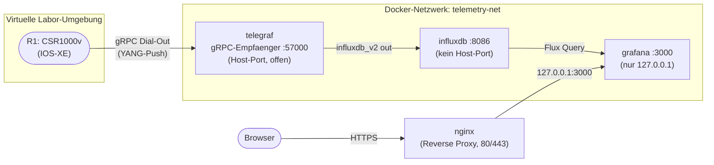

# Lab 10: Eigene Monitoring-Pipeline für Netzwerktelemetrie


## Berufliche Aufgabenstellung

Das Netzwerk-Team betreibt inzwischen mehrere Router und Dienste, hat aber keinerlei laufenden Überblick über deren tatsächliche Auslastung. Störungen und Kapazitätsengpässe fallen bislang erst auf, wenn Nutzer sich beschweren oder ein Gerät bereits spürbar überlastet ist. Die bisherigen Werkzeuge helfen dabei nur bedingt: **SNMP**-Polling fragt in festen Intervallen einzelne Werte ab und ist damit für viele Kennzahlen oder kurze Intervalle zu träge. Ein klassisches Netzwerk-Monitoring-System fragt CPU- oder Interface-Zähler häufig nur alle 5 Minuten ab, sodass ein kurzer CPU-Peak oder ein kurzzeitiger Interface-Flap unbemerkt bleibt. **Syslog** liefert nur Ereignisse, keine kontinuierlichen Messreihen.
Die Geschäftsführung erteilt daher den Auftrag, für die Netzwerkinfrastruktur eine **eigene Monitoring-Pipeline** aufzubauen: 
Betriebsdaten wie z. B. CPU-Auslastung und Schnittstellenauslastung sollen laufend erhoben, zentral gesammelt, dauerhaft gespeichert und für das Team sichtbar dargestellt werden – die Grundlage für Kapazitätsplanung und frühzeitige Störungserkennung.

Als erste Datenquelle dient ein virtueller Router in einer virtualisierten Netzwerklabor-Umgebung, der seine Betriebsdaten über **YANG-basierte Streaming Telemetry** laufend selbst an einen Empfänger sendet. Vor der Bereitstellung im realen Netzwerk wird der Ansatz so zunächst als Prototyp in dieser virtualisierten Umgebung erprobt. Sie bauen die vollständige Kette **Daten erheben → Daten sammeln → Daten speichern → Daten darstellen** dafür auf – mit Telegraf, InfluxDB und Grafana als containerisierten Diensten auf Ihrem eigenen Linux-Server (aus Lab 03).

---

## Einführung

Sie kennen die Grundstruktur **Erheben → Sammeln → Speichern → Darstellen** bereits aus Lab 09, dort mit simulierten Sensordaten über MQTT. In diesem Lab ersetzen Sie die Datenquelle durch eine echte Netzwerkkomponente: einen virtuellen Router, der seine Kennzahlen über sein YANG-Datenmodell aktiv an einen Empfänger "pusht", statt klassisch abgefragt zu werden. Empfängerseitig bauen Sie **Telegraf** (Sammler), **InfluxDB** (Zeitreihendatenbank) und **Grafana** (Darstellung) nach demselben Muster wie in Lab 06/09 als containerisierte, zusammengehörige Dienste in einem eigenen Docker-Netzwerk auf.

Wie in den vorigen Labs betreiben Sie InfluxDB und Telegraf dabei konsequent als Container auf Ihrem eigenen Linux-Server (aus Lab 03) statt als native Betriebssystem-Pakete – das in diesem Kurs etablierte Muster.

## Lernziele

- Model-Driven Telemetry (MDT) als Alternative zu SNMP-Polling, Syslog und gerätespezifischen CLI-Abfragen konzeptionell einordnen
- Den Unterschied zwischen **Dial-In**- und **Dial-Out**-Telemetrie erklären und begründen, welche Variante hier zum Einsatz kommt
- InfluxDB und Telegraf als Container installieren und in Betrieb nehmen
- Eine Telegraf-Konfiguration über die InfluxDB-Oberfläche erzeugen und um das plattformspezifische Input-Plugin `cisco_telemetry_mdt` ergänzen
- Auf einem virtuellen CSR1000v-Router in Ihrer Labor-Umgebung YANG-Dienste aktivieren und Dial-Out-Abonnements für CPU- und Schnittstellendaten konfigurieren
- Einen konkreten YANG-Xpath anhand von Modul, Container und Leaf selbst herleiten.
- Ein Grafana-Dashboard für CPU- und Schnittstellenauslastung aus den gesammelten Telemetriedaten aufbauen
- Die eigene Pipeline als zusammengehörige Dienste in einem eigenen Docker-Netzwerk bündeln – Anwendung des Prinzips aus Lab 07 auf einen neuen Anwendungsfall

## Voraussetzungen

| Anforderung | Details |
|---|---|
| **Virtuelle Labor-Umgebung** | Eigene Instanz einer virtuellen Netzwerklabor-Umgebung (z. B. Cisco Modeling Labs, CML) mit einem laufenden Router-Node vom Typ **CSR1000v**. Wichtig: Cisco IOS-XE unterstützt YANG/NETCONF grundsätzlich – nur bringen schlanke Referenz-Images wie **IOSv und IOSvL2 die dafür nötigen YANG-Management-Prozesse gar nicht erst mit** (sie sind bewusst auf einfache Routing-/Switching-Labs zugeschnitten, ohne dieses Subsystem). Für dieses Lab kommt daher nur ein vollständiges IOS-XE-Image wie **CSR1000v** (bzw. neuer: Cat8000v) infrage.  |
| **Erreichbarkeit** | Der virtuelle Router muss den Empfänger-Server per gRPC (TCP) erreichen können. Hier über ein NAT-Gateway der Labor-Umgebung (in CML: "External Connector") |
| **Server** | Ihr Linux-Server (aus Lab 03), öffentliche IPv4-Adresse, Docker mit Compose-Plugin (aus Lab 05/09) |
| **nginx** | Mit ACME-Modul als Reverse Proxy aktiv. Notwendig für die Grafana-Veröffentlichung.|
| **DNS** | Neuer A-Record `telemetry.<IHRE-DOMAIN>` für Grafana, wenn nicht über Wildcard gelöst.|
| **SSH-Zugriff** | Key-Authentifizierung, inklusive der Möglichkeit, einen SSH-Tunnel aufzubauen. Notwendig um temporär die Initialkonfiguration auf der WebUI von InfluxDB vorzunehmen (Schritt 4) |

---

## Inhalt

- [Hintergrundwissen](#hintergrundwissen)
  - [Von SNMP zu Model-Driven Telemetry](#von-snmp-zu-model-driven-telemetry)
  - [YANG, NETCONF und Streaming Telemetry: Grundbegriffe](#yang-netconf-und-streaming-telemetry-grundbegriffe)
  - [Dial-In vs. Dial-Out](#dial-in-vs-dial-out)
  - [Die Ziel-Architektur im Überblick](#die-ziel-architektur-im-überblick)
- [Aufgaben](#aufgaben)
  - [Schritt 1: Virtuelle Maschine für die Pipeline bereitstellen](#schritt-1-virtuelle-maschine-für-die-pipeline-bereitstellen)
  - [Schritt 2: InfluxDB und Telegraf installieren](#schritt-2-influxdb-und-telegraf-installieren)
  - [Schritt 3: InfluxDB-Dienst starten](#schritt-3-influxdb-dienst-starten)
  - [Schritt 4: Telegraf-Konfiguration über die InfluxDB-Oberfläche erzeugen](#schritt-4-telegraf-konfiguration-über-die-influxdb-oberfläche-erzeugen)
  - [Schritt 5: Telegraf-Konfiguration bearbeiten und Dienst starten](#schritt-5-telegraf-konfiguration-bearbeiten-und-dienst-starten)
  - [Schritt 6: YANG-Dienste auf dem Router aktivieren](#schritt-6-yang-dienste-auf-dem-router-aktivieren)
  - [Schritt 7: Abonnements für CPU-Auslastung und Schnittstellenstatistik konfigurieren](#schritt-7-abonnements-für-cpu-auslastung-und-schnittstellenstatistik-konfigurieren)
  - [Schritt 8: Dashboards in Grafana erstellen](#schritt-8-dashboards-in-grafana-erstellen)
- [Rückblick und Zusammenfassung](#rückblick-und-zusammenfassung)
- [Autoren und Urheberrecht](#autoren-und-urheberrecht)

---

## Hintergrundwissen

### Von SNMP zu Model-Driven Telemetry

Die bisher naheliegenden Monitoring-Werkzeuge haben für einen laufenden Überblick über Netzwerkgeräte alle einen strukturellen Nachteil: **SNMP**-Polling fragt in festen Intervallen einzelne Werte ab und ist damit für viele Kennzahlen oder kurze Intervalle zu träge ("too slow"). **Syslog** liefert nur Ereignisse und Meldungen, aber keine kontinuierliche Messreihe ("incomplete"). Gerätespezifische CLI-Befehle sind zwar informativ, aber auch gerätespezifisch formatiert und für automatisierte Auswertung ungeeignet.

**Model-Driven Telemetry (MDT)** dreht das Grundprinzip um: Der Router **sendet** ("pusht") Daten selbstständig und laufend an einen oder mehrere Empfänger. Ein ständiges Nachfragen ("pullen") kann entfallen. Welche Daten dabei übertragen werden, beschreibt nicht mehr eine herstellerspezifische OID-Liste oder ein CLI-Ausgabeformat, sondern ein **YANG-Datenmodell**: eine strukturierte, hierarchische Beschreibung der auf dem Gerät verfügbaren Betriebsdaten.

### YANG, NETCONF und Streaming Telemetry: Grundbegriffe

Ein YANG-Modell gliedert sich hierarchisch in **Modul → Container → Liste → Leaf** – vergleichbar mit einem Verzeichnisbaum, an dessen Blättern (Leafs) die eigentlichen Werte stehen:

| Begriff | Bedeutung |
|---|---|
| **Modul** | Die oberste Ebene eines YANG-Modells, benannt durch seinen **Modulnamen** (z. B. `Cisco-IOS-XE-process-cpu-oper`). Vergleichbar mit einem Namensraum. Im XPath wird dasselbe Modul meist über sein kürzeres **Präfix** (`process-cpu-ios-xe-oper`) angesprochen, das vom Modulnamen abweicht. |
| **Container** | Eine gruppierende Ebene innerhalb eines Moduls, z. B. `cpu-usage` |
| **Liste** | Eine Menge gleichartiger Einträge, die über einen Schlüssel adressiert werden, z. B. `interface[name='GigabitEthernet1']` |
| **Leaf** | Der eigentliche Wert am Ende des Pfades, z. B. `five-seconds` (die CPU-Auslastung der letzten 5 Sekunden) |
| **Xpath** | Der vollständige Pfadausdruck durch diese Hierarchie, z. B. `/process-cpu-ios-xe-oper:cpu-usage/cpu-utilization/five-seconds`. Äquivalent zur OID bei SNMP |
| **NETCONF** | Protokoll zur Konfiguration und zum Abruf von YANG-modellierten Daten. Die klassische, anfragebasierte ("Dial-In"-artige) Nutzung von YANG: der Client fragt aktiv nach (`get`/`get-config`) |
| **RESTCONF** | Dasselbe Grundprinzip wie NETCONF, aber als HTTP/REST-Schnittstelle mit JSON/XML statt SSH/XML, ebenfalls anfragebasiert, kein laufender Push-Stream |
| **YANG-Push** | Laufende, ereignis- oder zeitgesteuerte *Push*-Übertragung von YANG-Daten, die eigentliche "Streaming Telemetry". Technisch unabhängig von NETCONF/RESTCONF: Die Subscription wird zwar per CLI (oder auch per NETCONF) eingerichtet, die laufenden Daten selbst überträgt der Router aber per **gRPC** |
| **gRPC** | Das Transportprotokoll, über das der Router die laufenden Telemetriedaten in diesem Lab überträgt. Zu unterscheiden von NETCONF/RESTCONF, die hier nur konzeptionell verwandt, aber nicht das tatsächlich genutzte Transportprotokoll sind |
| **GPB-KV** | *Google Protocol Buffers, Key-Value-codiert* – das Encoding, in dem die Telemetriedaten übertragen werden |

> **Nutzen wir nun gRPC oder NETCONF/RESTCONF?** Beide Male gRPC. NETCONF und RESTCONF sind auf demselben Router zwar ebenfalls aktiv (für klassische Konfigurations- und Abfragezugriffe), werden in diesem Lab aber nicht für die Telemetrie-Übertragung selbst genutzt, dafür ist ausschließlich der gRPC-basierte YANG-Push-Mechanismus zuständig.

> **Woher bekomme ich einen Xpath?** Eine gute Anlaufstelle ist immer eine Herstellerdokumentation. Hier für die auf Cisco-IOS-XE-Geräten verfügbaren YANG-Module. [github.com/YangModels/yang – vendor/cisco/xe](https://github.com/YangModels/yang/tree/main/vendor/cisco/xe). Alternativ zeigt `show platform software yang-management process` auf dem Router, welche Dienste laufen, und die einzelnen `.yang`-Dateien lassen sich nach den gewünschten Containern/Leafs durchsuchen.

### Dial-In vs. Dial-Out

Bei Streaming Telemetry gibt es zwei Verbindungsrichtungen:

- **Dial-In:** Der Empfänger (Telegraf) baut die Verbindung zum Router auf und holt sich den Stream ab. Der Router muss dafür seinerseits einen gRPC-Server-Port öffnen.
- **Dial-Out:** Der Router baut die Verbindung selbstständig zu einem konfigurierten Empfänger auf. Der Empfänger stellt dafür einen gRPC-Server bereit.

In diesem Lab kommt **Dial-Out** zum Einsatz: Der virtuelle Router sitzt in einem eigenen, per NAT angebundenen Labornetz und kann selbst eine ausgehende Verbindung zu Ihrem öffentlich erreichbaren Server aufbauen. Telegraf übernimmt dabei die Rolle des Empfängers.

### Die Ziel-Architektur im Überblick



| Dienst | Host-Port? | Von außen (Internet) erreichbar? |
|---|---|---|
| `influxdb` | Nein | Nein, nur innerhalb von `telemetry-net` |
| `telegraf` | Ja, `57000` (alle Interfaces) | Ja, direkt – der Router muss diesen Port erreichen können |
| `grafana` | Ja, aber nur an `127.0.0.1:3000` gebunden | Nein direkt, nur über `nginx` (Reverse Proxy auf 80/443) |

Es gilt (siehe auch Lab 07): Nur, was zwingend von außen erreichbar sein muss, bekommt einen Host-Port, der auf allen Interfaces lauscht. `influxdb` bekommt **keinen** Host-Port. Telegraf und Grafana erreichen es ausschließlich intern über den Docker-Servicenamen. `grafana` bekommt zwar einen Host-Port, der ist aber bewusst nur an `127.0.0.1` gebunden und damit von außen nicht direkt erreichbar. Öffentlich sichtbar wird Grafana ausschließlich über den nginx-Reverse-Proxy und eine angepasste URL. 
Bei `telegraf` liegt der Fall anders: Der gRPC-Empfänger **muss** einen Host-Port bekommen, der von außerhalb des Docker-Netzes erreichbar ist, weil die Datenquelle (der Router) außerhalb Ihres Servers liegt und die Verbindung per Dial-Out selbst aufbaut.


[↑ Zum Inhaltsverzeichnis](#inhalt)

---

## Aufgaben

### Schritt 1: Virtuelle Maschine für die Pipeline bereitstellen

Nutzen Sie Ihren bestehenden Linux-Server aus Lab 03 weiter. Er ist bereits öffentlich erreichbar und hat Docker installiert (Lab 05/09); eine zusätzliche virtuelle Maschine ist nicht nötig. Klären Sie zusätzlich, wie Ihr virtueller Router diesen Server per Dial-Out erreichen kann: typischerweise über ein in Ihrer Labor-Umgebung konfiguriertes NAT-Gateway (in CML: "External Connector" im Modus NAT).

Bei NAT sind dabei **zwei verschiedene Adressen** im Spiel – verwechseln Sie sie nicht:

| Adresse | Wo sichtbar | Wofür |
|---|---|---|
| Eigene Adresse von `GigabitEthernet1` (bei CML-NAT per DHCP, typischerweise `192.168.255.x`) | Auf dem Router: `show ip interface brief` | `source-address` in der Subscription (Schritt 7) – als Absenderadresse muss eine dem Router selbst gehörende Interface-Adresse angegeben werden, nicht die öffentliche Adresse nach außen hinter NAT. Hat der Router mehrere Interfaces, kommt grundsätzlich jede seiner eigenen Adressen in Frage. Pro Subscription wählt man eine. Hier nur die eine von GigabitEthernet1.|
| Adresse **nach** der NAT-Übersetzung (öffentliche Adresse Ihrer Labor-Umgebung) | Auf dem Server: `ss -tn \| grep 57000`, sobald der Router verbunden ist | Firewall-Regel auf Port 57000 (siehe Schritt 8.6) |


[↑ Zum Inhaltsverzeichnis](#inhalt)

---

### Schritt 2: InfluxDB und Telegraf installieren

Wie in Lab 09 werden die Dienste nicht einzeln als native Pakete, sondern deklarativ über eine `compose.yaml` "installiert" und betrieben. Zusammengehörige Dienste sollen in einem eigenen Docker-Netzwerk betrieben werden. 

```bash
mkdir -p /srv/telemetry/telegraf
cd /srv/telemetry
nano .env
```

```ini
INFLUX_PASSWORD=<SICHERES-PASSWORT>
INFLUX_TOKEN=<TOKEN-z.B.-mit-openssl-rand--hex-32-erzeugen>
GRAFANA_ADMIN_PASSWORD=<SICHERES-PASSWORT>
```

> **Woher kommen diese Werte?** Sie legen sie selbst fest, bevor InfluxDB zum ersten Mal startet, es sind keine Werte, die Sie irgendwo abholen. `INFLUX_PASSWORD` und `GRAFANA_ADMIN_PASSWORD` sind frei wählbare, sichere Passwörter. `INFLUX_TOKEN` erzeugen Sie sich lokal als zufälligen String, z. B. mit `openssl rand -hex 32`, und tragen das Ergebnis hier ein. InfluxDB übernimmt genau diesen String beim ersten Start (`DOCKER_INFLUXDB_INIT_ADMIN_TOKEN`) automatisch als vollberechtigten Administrator-Token.

```bash
chmod 600 .env
nano compose.yaml
```

```yaml
services:
  influxdb:
    image: influxdb:2
    restart: unless-stopped
    environment:
      DOCKER_INFLUXDB_INIT_MODE: setup
      DOCKER_INFLUXDB_INIT_USERNAME: admin
      DOCKER_INFLUXDB_INIT_PASSWORD: ${INFLUX_PASSWORD}
      DOCKER_INFLUXDB_INIT_ORG: alp
      DOCKER_INFLUXDB_INIT_BUCKET: telemetry
      DOCKER_INFLUXDB_INIT_ADMIN_TOKEN: ${INFLUX_TOKEN}
    volumes:
      - influxdb-data:/var/lib/influxdb2
      - influxdb-config:/etc/influxdb2
    networks:
      - telemetry-net

networks:
  telemetry-net:

volumes:
  influxdb-data:
  influxdb-config:
```

[↑ Zum Inhaltsverzeichnis](#inhalt)

---

### Schritt 3: InfluxDB-Dienst starten

```bash
docker compose up -d
docker compose ps
docker compose exec influxdb influx ping
```

`influx ping` antwortet mit `OK`, sobald InfluxDB betriebsbereit ist.

[↑ Zum Inhaltsverzeichnis](#inhalt)

---

### Schritt 4: Telegraf-Konfiguration über die InfluxDB-Oberfläche erzeugen

InfluxDB OSS 2.x zeigt Ihnen in der Weboberfläche einen fertigen `[[outputs.influxdb_v2]]`-Block mit bereits eingetragener URL, Organisation und Bucket – Sie müssen nur noch Ihr Token ergänzen.

Da InfluxDB bewusst ohne Host-Port läuft, öffnen Sie die Oberfläche für diesen einen Schritt über einen lokal gebundenen SSH-Tunnel. Dafür braucht InfluxDB **vorher** kurzzeitig einen Host-Port, der nur an `127.0.0.1` gebunden ist – sonst findet der Tunnel auf dem Server kein Ziel.

**4.1 Temporären Host-Port setzen** (auf dem Server): Ergänzen Sie in der `compose.yaml` beim Dienst `influxdb`:

```yaml
  influxdb:
    image: influxdb:2
    restart: unless-stopped
    ports:
      - "127.0.0.1:8086:8086"   # nur temporaer fuer Schritt 4
    environment:
      ...
```

```bash
docker compose up -d
ss -tlnp | grep 8086
```

Die Ausgabe muss `127.0.0.1:8086` mit `docker-proxy` zeigen.

**4.2 Tunnel aufbauen** (auf Ihrem lokalen Rechner):

```bash
ssh -L 8086:127.0.0.1:8086 <benutzer>@<server-ip>
```

Rufen Sie `http://localhost:8086` in Ihrem lokalen Browser auf und melden Sie sich mit `admin` und dem Passwort aus Ihrer `.env` an.


**4.3 Token und Output-Block holen:**

1. Legen Sie unter **Load Data → API Tokens** ein Custom-Token mit Lese- und Schreibrecht auf den Bucket `telemetry` an. Ergänzen Sie es in Ihrer `.env`-Datei als neue Variable, z. B. `TELEGRAF_TOKEN=<das-gerade-erzeugte-token>` – dieser Token ist bewusst enger begrenzt als der Administrator-Token aus Schritt 2 und wird gleich ausschließlich von Telegraf verwendet.
2. Wechseln Sie zum Reiter **Load Data → Telegraf**, klicken Sie auf **Influx Output Plugin** und kopieren Sie den angezeigten Block. Er enthält als URL `http://localhost:8086` – aus Sicht Ihres Browsers über den Tunnel richtig, für den Telegraf-Container aber falsch. Sie passen sie in Schritt 5 an.

**4.4 Temporären Host-Port wieder entfernen:** Löschen Sie die beiden `ports:`-Zeilen bei `influxdb` wieder und übernehmen Sie die Änderung. Die Daten bleiben dabei im Volume `influxdb-data` erhalten:

```bash
docker compose up -d
ss -tlnp | grep 8086      # keine Ausgabe mehr
```

[↑ Zum Inhaltsverzeichnis](#inhalt)

---

### Schritt 5: Telegraf-Konfiguration bearbeiten und Dienst starten

```bash
nano /srv/telemetry/telegraf/telegraf.conf
```

Fügen Sie zunächst den in Schritt 4 kopierten Output-Block ein. Ändern Sie dabei **zwei Stellen**: die URL von `http://localhost:8086` auf `http://influxdb:8086` und das Token auf die Variable aus Ihrer `.env`:

```toml
[[outputs.influxdb_v2]]
  urls = ["http://influxdb:8086"]
  token = "${TELEGRAF_TOKEN}"
  organization = "alp"
  bucket = "telemetry"
```

> **Warum `http://influxdb:8086` und nicht `localhost`?** Innerhalb eines Containers bezeichnet `localhost` den Container **selbst** – für Telegraf also Telegraf, nicht InfluxDB. Bleibt die URL aus der InfluxDB-Oberfläche stehen, meldet Telegraf im Log alle 10 Sekunden `dial tcp [::1]:8086: connect: connection refused`. Telegraf und InfluxDB laufen im selben Docker-Netzwerk `telemetry-net` – Telegraf erreicht InfluxDB deshalb über den Servicenamen `influxdb`, genau wie in Lab 06/09 gelernt. Eine öffentliche IP-Adresse oder ein Host-Port sind nicht nötig, da beide Container nur intern miteinander kommunizieren.

Ergänzen Sie darunter den Input-Block für Cisco Model-Driven Telemetry unverändert, wie er im offiziellen Telegraf-Plugin dokumentiert ist:

```toml
# Cisco model-driven telemetry (MDT) input plugin for IOS XR, IOS XE and NX-OS platforms
[[inputs.cisco_telemetry_mdt]]
  ## Telemetry transport can be "tcp" or "grpc". TLS is only supported when
  ## using the grpc transport.
  transport = "grpc"
  ## Address and port to host telemetry listener
  service_address = ":57000"
  ## Grpc Maximum Message Size, default is 4MB, increase the size.
  max_msg_size = 4000000

  ## Define aliases to map telemetry encoding paths to simple measurement names
  [inputs.cisco_telemetry_mdt.aliases]
    cpu     = "Cisco-IOS-XE-process-cpu-oper:cpu-usage/cpu-utilization"
    ifstats = "Cisco-IOS-XE-interfaces-oper:interfaces/interface/statistics"
```

Der Alias ordnet dem langen YANG-Pfad einen kurzen Measurement-Namen zu. Verwenden Sie dabei den **Modulnamen** (`Cisco-IOS-XE-process-cpu-oper:`), nicht das kürzere **Präfix** aus dem XPath-Filter (`process-cpu-ios-xe-oper:`) – nur mit dem Modulnamen greift der Alias, sonst erscheinen die Measurements unter den langen Pfadnamen statt als `cpu` und `ifstats`.

| Zeile | Bedeutung |
|---|---|
| `transport = "grpc"` | Telegraf agiert als gRPC-**Server** – passend zum Dial-Out-Ansatz |
| `service_address = ":57000"` | Telegraf lauscht im Container auf allen Adressen, Port 57000 – die eigentliche Zugriffsbeschränkung übernimmt das Port-Mapping beim Container-Start |
| `max_msg_size` | Erhöht das gRPC-Nachrichtenlimit über den Standardwert von 4 MB hinaus |
| `aliases` | Ordnet den langen YANG-Pfaden kurze, sprechende Measurement-Namen zu, die später in InfluxDB/Grafana erscheinen |

Ergänzen Sie den `telegraf`-Dienst in der `compose.yaml`:

```yaml
  telegraf:
    image: telegraf:latest
    restart: unless-stopped
    hostname: telegraf             # stabiles host-Tag statt wechselnder Container-ID
    environment:
      TELEGRAF_TOKEN: ${TELEGRAF_TOKEN}
    ports:
      - "57000:57000"        # muss von aussen (Router) erreichbar sein - bewusste Ausnahme, siehe Schritt 8.6
    volumes:
      - ./telegraf/telegraf.conf:/etc/telegraf/telegraf.conf:ro
    networks:
      - telemetry-net
    depends_on:
      - influxdb
```

> **Warum `environment:`?** Die `.env`-Datei füllt nur Platzhalter **in der `compose.yaml`** – an den Container selbst wird nichts automatisch weitergegeben. Erst der `environment:`-Eintrag macht `TELEGRAF_TOKEN` im Container sichtbar, sodass `${TELEGRAF_TOKEN}` in der `telegraf.conf` aufgelöst werden kann. Ohne ihn antwortet InfluxDB mit `401 Unauthorized`.

```bash
docker compose config --quiet        # keine Ausgabe = Datei gueltig
docker compose up -d
docker compose logs -f telegraf      # mit Strg+C beenden
ss -tln | grep 57000
```

In den Logs meldet Telegraf, dass die Plugins `cisco_telemetry_mdt` (Input) und `influxdb_v2` (Output) geladen sind; `ss` zeigt den Listener auf `0.0.0.0:57000`.

> **Gut zu wissen:** Im Normalbetrieb schreibt Telegraf **nichts** ins Log, wenn Daten ankommen oder erfolgreich in InfluxDB landen – es meldet sich nur bei Start, Stopp und Fehlern (`E!`). Ein stilles Log ist also ein gutes Zeichen. Wer das Schreiben mitverfolgen möchte, setzt in der `telegraf.conf` unter `[agent]` vorübergehend `debug = true`; dann erscheint alle 10 Sekunden `Wrote batch of … metrics`. Nach Änderungen an der `telegraf.conf` genügt `docker compose restart telegraf`.

[↑ Zum Inhaltsverzeichnis](#inhalt)

---

### Schritt 6: YANG-Dienste auf dem Router aktivieren

Die folgenden Befehle laufen auf dem virtuellen CSR1000v-Router `R1` in Ihrer Labor-Umgebung, nicht auf Ihrem Server.

```
R1#show platform software yang-management process
```

Vor der Aktivierung zeigt die Ausgabe die meisten Prozesse als `Not Running` – nur `nginx` und `pubd` laufen bereits:

```
confd            : Not Running
nesd              : Not Running
syncfd            : Not Running
ncsshd            : Not Running
dmiauthd          : Not Running
nginx             : Running
ndbmand           : Not Running
pubd              : Running
```

Aktivieren Sie YANG/NETCONF:

```
R1#configure terminal
R1(config)#netconf-yang
R1(config)#end
```

```
*Jan  5 09:57:31.297: %PSD_MOD-5-DMI_NOTIFY_NETCONF_START: R0/0: psd: PSD/DMI: netconf-yang server has been notified to start
```

Prüfen Sie erneut – jetzt sollten **alle** Prozesse laufen:

```
R1#show platform software yang-management process
confd             : Running
nesd              : Running
syncfd            : Running
ncsshd            : Running
dmiauthd          : Running
nginx             : Running
ndbmand           : Running
pubd              : Running
```

[↑ Zum Inhaltsverzeichnis](#inhalt)

---

### Schritt 7: Abonnements für CPU-Auslastung und Schnittstellenstatistik konfigurieren

Ersetzen Sie `<SERVER-IP>` durch die öffentliche IPv4-Adresse Ihres Servers (auf dem Server: `ip -4 addr show eth0`) und `<ROUTER-IF-IP>` durch die **eigene** Adresse von `GigabitEthernet1` (auf dem Router: `show ip interface brief`) – bei NAT also nicht die Adresse nach der Übersetzung (siehe Schritt 1). Ein Hostname ist bei `receiver ip address` nicht möglich. Der Port `57000` muss zum `service_address`-Wert aus Schritt 5 passen.

Testen Sie vorher, ob der Router Ihren Server und den Telegraf-Port erreicht:

```
R1#ping <SERVER-IP>
R1#telnet <SERVER-IP> 57000
```

`telnet` muss `Open` melden (Verbindung mit `Strg+Shift+6`, dann `x` und `disconnect` beenden). Dann die Subscriptions anlegen:

```
R1#configure terminal
R1(config)#telemetry ietf subscription 101
R1(config-mdt-subs)#encoding encode-kvgpb
R1(config-mdt-subs)#source-address <ROUTER-IF-IP>
R1(config-mdt-subs)#filter xpath /process-cpu-ios-xe-oper:cpu-usage/cpu-utilization/five-seconds
R1(config-mdt-subs)#update-policy periodic 500
R1(config-mdt-subs)#stream yang-push
R1(config-mdt-subs)#receiver ip address <SERVER-IP> 57000 protocol grpc-tcp
R1(config-mdt-subs)#exit

R1(config)#telemetry ietf subscription 102
R1(config-mdt-subs)#encoding encode-kvgpb
R1(config-mdt-subs)#source-address <ROUTER-IF-IP>
R1(config-mdt-subs)#filter xpath /interfaces-ios-xe-oper:interfaces/interface[name='GigabitEthernet1']/statistics
R1(config-mdt-subs)#update-policy periodic 500
R1(config-mdt-subs)#stream yang-push
R1(config-mdt-subs)#receiver ip address <SERVER-IP> 57000 protocol grpc-tcp
R1(config-mdt-subs)#end
```

| Element | Bedeutung |
|---|---|
| `encoding encode-kvgpb` | Übertragungsformat: Key-Value-codierte Protocol Buffers – das Format, das `cisco_telemetry_mdt` erwartet |
| `source-address` | Die lokale Adresse, von der aus der Router die Dial-Out-Verbindung aufbaut – bei `R1` die eigene Adresse von GigabitEthernet1 (bei NAT die Adresse *vor* der Übersetzung) |
| `filter xpath ...` | Der YANG-Pfad, der übertragen werden soll – einmal die 5-Sekunden-CPU-Auslastung, einmal die Statistik einer konkreten Schnittstelle |
| `update-policy periodic 500` | Sendeintervall in Centisekunden – `500` entspricht 5 Sekunden |
| `receiver ip address ... protocol grpc-tcp` | Ziel der Dial-Out-Verbindung: Ihr Telegraf-Container. `grpc-tcp` bedeutet gRPC **ohne** TLS |

> **Klartext auf der Leitung:** Mit `grpc-tcp` gehen die Telemetriedaten unverschlüsselt über das Internet. `encode-kvgpb` ist nur ein binäres Datenformat, keine Verschlüsselung – mit Wireshark lässt sich der Verkehr auf Port 57000 mitschneiden und lesbar dekodieren. Für ein Lab ist das vertretbar, weil sich die Pipeline so leichter nachvollziehen und debuggen lässt. 


Prüfen Sie den Status:

```
R1#show telemetry ietf subscription all detail
```

Bei korrekter Konfiguration erscheint je Subscription ein Block wie dieser:

```
  Subscription ID: 101
  Type: Configured
  State: Valid
  Stream: yang-push
  Filter:
    Filter type: xpath
    XPath: /process-cpu-ios-xe-oper:cpu-usage/cpu-utilization/five-seconds
  Update policy:
    Update Trigger: periodic
    Period: 500
  Encoding: encode-kvgpb
  Source Address: <ROUTER-IF-IP>
  Receivers:
    Address                Port     Protocol         Protocol Profile
    -----------------------------------------------------------------
    <SERVER-IP>             57000    grpc-tcp
```

Der Zustand `State: Valid` bestätigt nur, dass die Subscription korrekt **angenommen** wurde – nicht, dass Daten fließen. Prüfen Sie deshalb die Kette Schritt für Schritt:

**1. Hat der Router die Verbindung aufgebaut?** (Router)

```
R1#show telemetry internal connection
R1#show telemetry ietf subscription 101 receiver
```

Erwartet wird `State: Connected` bzw. in der Verbindungsübersicht `Active`. Bleibt der Zustand bei `Connecting`, erreicht der Router den Empfänger nicht – häufigste Ursache ist ein Tippfehler bei Adresse oder Port (z. B. `5700` statt `57000`) oder eine Firewall, die Port 57000 vom Absender aus blockt. Kontrollieren Sie die **Rohkonfiguration** mit `show run | section telemetry` (die `valid/connecting`-Zusammenfassung allein genügt zur Fehlersuche nicht), und korrigieren Sie den Receiver bei Bedarf mit `no receiver ip address …` und anschließend der richtigen Zeile innerhalb von `telemetry ietf subscription <id>`.

**2. Kommt die Verbindung auf dem Server an?** (Server)

```bash
ss -tn | grep 57000
```

Eine Zeile mit `ESTAB` zeigt die Verbindung; in der Spalte „Peer Address" steht die Absender-Adresse **nach** NAT – genau die Adresse für eine Firewall-Regel (siehe Schritt 8.6). Kommt hier nichts an, obwohl der Router sendet, prüfen Sie die Firewall auf Port 57000 (bei einer Cloud-Firewall mit „default deny" muss der Port explizit freigegeben sein – ICMP/Ping kann durchgehen, während TCP 57000 blockiert bleibt).

**3. Landen die Daten in InfluxDB?** (Server)

Prüfen Sie **beide** Datenquellen getrennt. Zuerst die CPU-Auslastung (Subscription 101):

```bash
cd /srv/telemetry
docker compose exec influxdb influx query \
  'from(bucket:"telemetry") |> range(start:-2m) |> filter(fn: (r) => r._measurement == "cpu") |> limit(n:3)'
```

Es erscheint eine Tabelle mit dem Feld `five_seconds`. Anschließend die Schnittstellenstatistik (Subscription 102) mit einem eigenen Aufruf:

```bash
docker compose exec influxdb influx query \
  'from(bucket:"telemetry") |> range(start:-2m) |> filter(fn: (r) => r._measurement == "ifstats") |> limit(n:5)'
```

Hier erscheinen die Schnittstellenzähler (`in_octets`, `out_octets`, `rx_kbps`, `tx_kbps` u. a.). Einen schnellen Gesamtüberblick, welche Measurements überhaupt im Bucket liegen, gibt:

```bash
docker compose exec influxdb influx query \
  'import "influxdata/influxdb/schema" schema.measurements(bucket: "telemetry")'
```

Hier müssen `cpu` **und** `ifstats` auftauchen. Stehen stattdessen lange YANG-Pfadnamen da, greift einer der Aliase aus Schritt 5 nicht.


[↑ Zum Inhaltsverzeichnis](#inhalt)

---

### Schritt 8: Dashboards in Grafana erstellen

Die Datenpipeline steht – jetzt fehlt nur noch die Darstellung. Grafana läuft wie InfluxDB und Telegraf als Container in `telemetry-net`; öffentlich erreichbar wird es über den nginx-Reverse-Proxy (aus Lab 06), der TLS terminiert. Anders als beim Telemetrie-Port 57000 (direkter Host-Port ohne Proxy, siehe Hintergrund) ist Grafana ein ganz normaler HTTP-Dienst hinter nginx.

#### 8.1 Grafana-Dienst in die compose.yaml

Ergänzen Sie in Ihrer `compose.yaml` im `services:`-Block den folgenden Dienst:

```yaml
  grafana:
    image: grafana/grafana-oss
    restart: unless-stopped
    ports:
      - "127.0.0.1:3000:3000"
    environment:
      GF_SECURITY_ADMIN_USER: admin
      GF_SECURITY_ADMIN_PASSWORD: ${GRAFANA_ADMIN_PASSWORD}
      GF_SERVER_ROOT_URL: https://telemetry.<IHRE-DOMAIN>
    volumes:
      - grafana-data:/var/lib/grafana
    networks:
      - telemetry-net
    depends_on:
      - influxdb
```

Ergänzen Sie **zusätzlich** `grafana-data:` im `volumes:`-Block:

```yaml
volumes:
  influxdb-data:
  influxdb-config:
  grafana-data:
```

Wie InfluxDB bindet Grafana seinen Port bewusst nur an `127.0.0.1` – von außen erreichbar wird es ausschließlich über nginx (8.2).

```bash
docker compose config --quiet
docker compose up -d
docker compose ps        # grafana muss "Up" sein, Port 127.0.0.1:3000 gemappt
```

#### 8.2 nginx-Konfiguration (Reverse Proxy) für Grafana anpassen

Legen Sie `/etc/nginx/conf.d/telemetry.conf` an. Das aus Lab 06 aktive **native nginx-ACME-Modul** (`acme_issuer`/`acme_certificate`) holt und erneuert das Let's-Encrypt-Zertifikat automatisch – es ist also **kein certbot** und **kein separater Ausstell-Befehl** nötig. Den HTTP→HTTPS-Redirect (Port 80) erledigt bereits Ihre globale Challenge-Konfiguration aus Lab 06; für Grafana genügt daher der folgende 443-`server`-Block:

```nginx
server {
    listen 443 ssl;
    server_name telemetry.<IHRE-DOMAIN>;

    acme_certificate letsencrypt;
    ssl_certificate $acme_certificate;
    ssl_certificate_key $acme_certificate_key;
    ssl_certificate_cache max=2;

    location / {
        proxy_pass http://127.0.0.1:3000;
        proxy_set_header Host $host;
        proxy_set_header X-Real-IP $remote_addr;
        proxy_set_header X-Forwarded-For $proxy_add_x_forwarded_for;
        proxy_set_header X-Forwarded-Proto $scheme;

        # WebSocket-Support fuer Grafana Live:
        proxy_http_version 1.1;
        proxy_set_header Upgrade $http_upgrade;
        proxy_set_header Connection "upgrade";
    }
}
```


Voraussetzung: ein **DNS-A-Record** `telemetry.<IHRE-DOMAIN>` auf Ihre Server-IP sowie in der Firewall offene Ports **TCP 80 und 443** (80 für die ACME-HTTP-01-Challenge des Moduls). Dann:

```bash
nginx -t
systemctl reload nginx
```

Das Zertifikat wird beim Reload asynchron ausgestellt (wenige Sekunden). Kontrollieren Sie es mit:

```bash
echo | openssl s_client -connect telemetry.<IHRE-DOMAIN>:443 -servername telemetry.<IHRE-DOMAIN> 2>/dev/null \
  | openssl x509 -noout -issuer -subject -dates
```

`issuer=... Let's Encrypt ...` bestätigt das gültige, vertrauenswürdige Zertifikat. (Zeigt der Browser direkt nach dem ersten Aufruf noch „nicht sicher", hat er das selbstsignierte Übergangs-Zertifikat gecacht – in einem neuen/privaten Fenster erneut laden.)

#### 8.3 In Grafana anmelden und Datenquelle anlegen

Rufen Sie Grafana im Browser unter `https://telemetry.<IHRE-DOMAIN>` auf. Melden Sie sich als `admin` mit dem Passwort aus `GRAFANA_ADMIN_PASSWORD` (Ihre `.env`) an. Alle folgenden Schritte finden in dieser Weboberfläche statt.

Legen Sie die Datenquelle an: **Connections → Data sources → Add data source → InfluxDB**, Query Language **Flux**, URL `http://influxdb:8086` (Servicename, **nicht** localhost!), Organisation `alp`, als Token den Administrator-Token `INFLUX_TOKEN` aus Ihrer `.env` (er hat ausreichend Leserecht auf den Bucket `telemetry`), Default Bucket `telemetry`. **Save & test** muss grün werden.

#### 8.4 Dashboard mit zwei Panels erstellen

Legen Sie über **Dashboards → New → New dashboard → Add visualization** ein Panel an, wählen Sie als Datenquelle `InfluxDB`, schalten Sie im Query-Editor von **Builder auf Code** um (sonst gibt es kein Eingabefeld für die Flux-Abfrage) und fügen Sie die Abfrage ein. Visualisierungstyp **Time series**.

Erstellen Sie **zwei getrennte Panels** – CPU-Auslastung (%) und Schnittstellenrate (Byte/s bzw. Bit/s) haben unterschiedliche Einheiten und gehören nicht auf dieselbe Y-Achse.

Panel 1 – CPU-Auslastung:

```
from(bucket: "telemetry")
  |> range(start: v.timeRangeStart, stop: v.timeRangeStop)
  |> filter(fn: (r) => r._measurement == "cpu")
  |> filter(fn: (r) => r._field == "five_seconds")
```

Panel 2 – Schnittstellenrate:

```
from(bucket: "telemetry")
  |> range(start: v.timeRangeStart, stop: v.timeRangeStop)
  |> filter(fn: (r) => r._measurement == "ifstats")
  |> filter(fn: (r) => r._field == "in_octets" or r._field == "out_octets")
  |> derivative(unit: 1s, nonNegative: true)
```

> **Einheit Byte vs. Bit – ein häufiger Denkfehler:** `in_octets`/`out_octets` sind **Oktette = Bytes**. Nach `derivative(unit: 1s)` ist die Einheit also **Byte/s**; setzen Sie die Panel-Einheit dann unter *Standard options → Unit* auf **bytes/sec (SI)**. In der Netzwerktechnik ist Durchsatz aber üblicherweise in **Bit/s** angegeben (Datenübertragungsraten, „GigabitEthernet"). Für Bit/s müssen Sie den Wert mit 8 multiplizieren **und** die Einheit auf **bits/sec (SI)** stellen:
> ```
>   |> map(fn: (r) => ({ r with _value: r._value * 8.0 }))
> ```

Benennen Sie die Panels aussagekräftig und **speichern** Sie das Dashboard mit **Save**.

Nach dem ersten periodischen Update (Schritt 7: alle 5 Sekunden) füllen sich beide Panels mit den Live-Werten Ihres Routers. Machen Sie die Probe aufs Exempel: Erzeugen Sie auf dem Router testweise Last (z. B. in diesem einfachen Lab mit nur einem Router `ping <SERVER-IP> repeat 100000 size 1400` oder schalten Sie das umfassende Debugging ein) und beobachten Sie, wie sich CPU- bzw. Schnittstellenkurve bewegen.


#### 8.5 Zugriff ohne Admin-Konto (optional)

Sollen andere das Dashboard nur ansehen, ohne Ihr Admin-Konto zu nutzen, gibt es zwei Wege:

- **Viewer-Benutzer:** Unter **Administration → Users and access → Users** einen Benutzer mit Rolle **Viewer** anlegen (darf ansehen, nichts ändern). Geeignet, wenn Sie nachvollziehen wollen, wer zugreift.
- **Anonymer Lesezugriff (ohne Login):** im `grafana`-Dienst ergänzen:
  ```yaml
      environment:
        ...
        GF_AUTH_ANONYMOUS_ENABLED: "true"
        GF_AUTH_ANONYMOUS_ORG_NAME: "Main Org."
        GF_AUTH_ANONYMOUS_ORG_ROLE: "Viewer"
  ```
  Danach `docker compose up -d`. Jeder, der die URL kennt, sieht das Dashboard read-only; als Admin kommen Sie weiter über `…/login` hinein.

> **Achtung:** Bei anonymem Zugriff ist das Dashboard über Ihre öffentliche URL für alle offen. Für einen Lab-/Internrahmen mit unkritischen Testdaten ist das vertretbar – sonst sollten Sie es zusätzlich absichern (z. B. `auth_basic` im `server`-Block oder eine Firewall-Regel auf bestimmte Quell-IPs).

#### 8.6 Absicherung des Telemetrie-Ports

Schränken Sie zum Abschluss den Zugang zum Telemetrie-Port 57000 ein. Dieser Port wird von einem Docker-Container veröffentlicht (-p 57000:57000, an 0.0.0.0 gebunden) – wie in Lab 05 beschrieben, greift ufw bei Docker-veröffentlichten Ports nicht zuverlässig (der Verkehr läuft über die DOCKER-USER-Chain, nicht über ufws INPUT-Chain). Nehmen Sie die Einschränkung deshalb in der Firewall Ihres Cloud-Providers vor (die auf den virtuellen Server angewendete Firewall, z. B. die Hetzner Cloud Firewall) – ersatzweise über eine eigene Regel in der DOCKER-USER-Chain. Erlauben Sie dort eingehend TCP 57000 nur von der öffentlichen Adresse, mit der Ihr Labornetz (CML) nach außen auftritt (die Adresse nach NAT, siehe Schritt 1). Da der Stream unverschlüsselt ist (grpc-tcp), könnten sonst Dritte ihn mitlesen oder einspeisen.

Arbeiten Sie von **wechselnden Standorten**, ändert sich diese öffentliche Quell-IP – dann müssen Sie die Firewall-Regel bei jedem Wechsel nachziehen (aktuelle IP vom Labornetz aus mit `curl -4 ifconfig.me` ermitteln). Fällt der Receiver anschließend auf `Connecting` zurück, prüfen Sie zuerst die Firewall. 

[↑ Zum Inhaltsverzeichnis](#inhalt)

---


## Rückblick und Zusammenfassung

### Was Sie erreicht haben

- Model-Driven Telemetry als Push-basierte Alternative zu SNMP-Polling, Syslog und CLI-Abfragen verstanden (YANG, NETCONF, YANG-Push, gRPC, Dial-In/Dial-Out)
- InfluxDB und Telegraf als containerisierte, zusammengehörige Dienste in einem eigenen Docker-Netzwerk installiert und in Betrieb genommen
- Eine Telegraf-Grundkonfiguration über die InfluxDB-Oberfläche erzeugt und manuell um das `cisco_telemetry_mdt`-Plugin ergänzt
- Auf einem CSR1000v-Router in einer virtuellen Labor-Umgebung YANG-Dienste aktiviert und Dial-Out-Abonnements für CPU-Auslastung und Schnittstellenstatistik eingerichtet
- Die ankommenden Daten entlang der Kette verifiziert (Router-Receiver → `ss`/Firewall → `influx query` für `cpu` **und** `ifstats`)
- Ein Grafana-Dashboard mit zwei Panels aufgebaut, das die Live-Telemetriedaten des Routers darstellt, und über den nginx-Reverse-Proxy (natives ACME-Modul) per HTTPS veröffentlicht

### Troubleshooting Referenz

 Eine ausführliche Befehlssammlung zur Fehlersuche entlang der Kette (Erreichbarkeit/Ports mit `telnet`/`nc`, öffentliche IP ermitteln, `tcpdump` inkl. TCP-Fingerabdruck, Firewall-Logik Cloud vs. Host, Docker-Compose, InfluxDB-Abfragen, Cisco-Router-Befehle) findet sich im begleitenden Cheat-Sheet `Lab_10_Troubleshooting_Cheatsheet.md`.

[↑ Zum Inhaltsverzeichnis](#inhalt)

---

## Autoren und Urheberrecht

- Erstellt von: Michael Lotter, Florian Reichl
- Datum: 10/2026
- Version: v1.2


<p align="center">
<a href="Lab_09.md"></a>
</p>